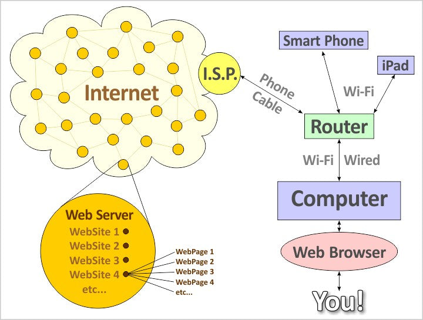

<h1 align="center">Web Development Basic Knowledge</h1>

আমরা যারা **Web Development** শিখতে চাইছি বা **Web Development** এ আমাদের Career গঠন করতে চাইছি, আমরা কিন্তু জানি না এই **Web Development** এ আমাদের কি কি বিষয়গুলো শিখতে হতে পারে বা শিখতে হবে। Web Development শেখার Journey(দক্ষতা ভ্রমণ) টাকে আমরা একটা সমুদ্রের নামার মত চিন্তা করতে পারি। কারণ Web Development কিন্তু ছোটখাট কোন বিষয় না যে আমরা নির্দিষ্ট একটা সময়(৩মাস বা ৬মাস বা ১ বছর বা আরও বেশি) ব্যয় করে এটা আয়ত্ত করতে পারব। এটা Spreadable(প্রসারণশীল) একটা বিষয় যেটা প্রতিনিয়ত প্রসারিত হতেই আছে। অর্থাৎ প্রতিনিয়ত এটার মধ্যে নতুন নতুন বিষয় যুক্ত হচ্ছে। তাই এটাকে আমরা একটা সমুদ্রের সাথে তুলনা করতে পারি। একটা সমুদ্র যদিও অনেক বিশাল কিন্তু সেটাতে নামার আগে যদি সমুদ্রে চলাচলের জ্ঞান এবং চলাচলের জন্য সঠিক একটা মানচিত্র থাকে তাহলে মূল লক্ষ্যে পৌছানো আমাদের জন্য অনেক সহজ হয়ে যায়। ঠিক তেমনি আমাদেরকে Web Development Journey(দক্ষতা ভ্রমণ) তে নামার আগে সেটার বিষয়ে ভালভাবে জেনে নিতে হবে। যেমন কোন কোন বিষয়গুলো আমরা এই Journey তে শিখব বা শিখতে হবে, কোন বিষয়গুলো আগে শিখতে হবে আর কোন বিষয়গুলো পরে শিখতে হবে, কোন বিষয়গুলোর প্রতি প্রাথমিকভাবে হালকা ধারণা থাকলে চলবে আর কোন বিষয়গুলো ভালভাবে শিখতে হবে তা না হলে সামনের বিষয়গুলো বুঝতে অসুবিধা হবে, এইসকল বিষয় আগে থেকে জানা থাকলে আমাদের মূল লক্ষ্যে পৌছাতে সহজ হবে। যদি আমরা এগুলো না জেনে বা এই বিষয়গুলো সম্পর্কে চিন্তা করে Web Development Journey তে নেমে পড়ি থাহলে আমাদের অনেক সময় ও টাকা নষ্ট হবে এবং আমরা কখনো মূল লক্ষ্যে পৌছাতেও পারব না যার ফলে এক সময় আমরা হতাশায় ভুগব। যেহেতু এটা একটা লম্বা সময়ের ব্যাপার এবং আমাদের Career এর বিষয় তাই আমাদের উচিত হবে এই বিষয়টা নিয়ে আগে একটু পড়াশোনা করা। যেটার মাধ্যমে আমরা Web Development এর বিষয়গুলো সম্পর্কে একটা ধারণা পাব। তারপর আমরা আমাদের মূল Journey তে কোমরে গামাছা পেছিয়ে নেমে পড়ব। Web Development শেখার আগে আমাদের যেসকল বিষয়ের ধারণা থাকা প্রয়োজন তা নিয়ে এখানে আলোচনা করব। এখানে প্রতিটা বিষয় আমরা মুখস্ত করব ব্যাপার তেমন না বা প্রতিটা বিষয় আমাদের কেন প্রয়োজন আমরা এখনই তা বুঝতে পারব তেমনও না। এই বিষয়গুলোর ধারণা আমরা কেন নিয়েছি তখনই ভালভাবে বুঝতে পারব যখন এইবিষয়গুলোর প্রয়োজনীতা আমাদের সামনে আসবে। বিষয়গুলো যখন আমাদের সামনে আসবে তখন আগে ধারণা থাকার ফলে আমরা খুব দ্রুতই সেগুলো শিখে ফেলতে পারব। তাই চলুন দেরি না করে Web Development এর মৌলিক বিষয়গুলো সম্পর্কে একটা সম্পূর্ণ ধারণা নিয়ে নিই।

## Table of Contents
- [Internet কি? এটার মূল উপাদানগুলো কি কি?](#internet-কি-এটার-মূল-উপাদানগুলো-কি-কি)
- [Internet কিভাবে কাজ করে?](#internet-কিভাবে-কাজ-করে)
- [Web কি? Web এর মূল উপাদান গুলো কি কি? Web কিভাবে কাজ করে? Web কয় ধরণের হয়ে থাকে?](#web-কি-web-এর-মূল-উপাদান-গুলো-কি-কি-web-কিভাবে-কাজ-করে-web-কয়-ধরণের-হয়ে-থাকে)
- [Protocol কি? এর কাজগুলো কি কি? Computer Network এ ব্যবহার করা গুরুত্বপূর্ণ Protocol গুলো কি কি?](#protocol-কি-এর-কাজগুলো-কি-কি-computer-network-এ-ব্যবহার-করা-গুরুত্বপূর্ণ-protocol-গুলো-কি-কি)
- [Browser কি? Browser এর Main Component গুলো কি কি?](#browser-কি-browser-এর-main-component-গুলো-কি-কি)
- [চলুন জেনে নিই Browser এর কি কি Features থাকে?](#চলুন-জেনে-নিই-browser-এর-কি-কি-features-থাকে)
- [চলুন জেনে নিই Browser কিভাবে কাজ করে থাকে?](#চলুন-জেনে-নিই-browser-কিভাবে-কাজ-করে-থাকে)
- [চলুন আরও ভালভাবে জেনে নিই Browser Engine কিভাবে কাজ করে থাকে?](#চলুন-আরও-ভালভাবে-জেনে-নিই-browser-engine-কিভাবে-কাজ-করে-থাকে)
- [Web Server কি? Web Server এর উপাদান ও ধরণ গুলো কি কি? এর প্রধান কাজগুলো কি কি?](#web-server-কি-web-server-এর-উপাদান-ও-ধরণ-গুলো-কি-কি-এর-প্রধান-কাজগুলো-কি-কি)
- [চলুন জেনে নিই Web Server আমাদের জন্য কেন গুরুত্বপূর্ণ?](#চলুন-জেনে-নিই-web-server-আমাদের-জন্য-কেন-গুরুত্বপূর্ণ)
- [চলুন জেনে নিই বিখ্যাত কিছু Web Server Software এর নাম ও কাজ।](#চলুন-জেনে-নিই-বিখ্যাত-কিছু-web-server-software-এর-নাম-ও-কাজ)
- [Web Hosting কি? কেন ব্যবহার করা হয়? এটা কিভাবে কাজ করে? ](#web-hosting-কি-কেন-ব্যবহার-করা-হয়-এটা-কিভাবে-কাজ-করে)
- [চলুন জেনে নিই Web Hosting কয় ধরণের ও কি কি?](#চলুন-জেনে-নিই-web-hosting-কয়-ধরণের-ও-কি-কি)
- [চলুন জেনে নিই Web Hosting এর সুবিধাগুলো কি কি? ](#চলুন-জেনে-নিই-web-hosting-এর-সুবিধাগুলো-কি-কি)
- [চলুন জেনে নিই Web Hosting এর উপাদানগুলো কি কি?](#চলুন-জেনে-নিই-web-hosting-এর-উপাদানগুলো-কি-কি)
- [PORT কি? এর কাজ কী? PORT কয় ধরণের ও কি কি? PORT কেন ব্যবহার হয়?](#port-কি-এর-কাজ-কী-port-কয়-ধরণের-ও-কি-কি-port-কেন-ব্যবহার-হয়)
- [HTTP কি? HTTP এর বৈশিষ্টগুলো কি কি?](#http-কি-http-এর-বৈশিষ্টগুলো-কি-কি)
- [HTTP Verb বা Method গুলো কি কি?](#http-verb-বা-method-গুলো-কি-কি)
- [HTTP Status Code কি? এটা কয় ধরণের হয়ে থাকে?](#http-status-code-কি-এটা-কয়-ধরণের-হয়ে-থাকে)
- [Git কি? Git কেন ব্যবহার করা হয়? এটা কিভাবে কাজ করে?](#git-কি-git-কেন-ব্যবহার-করা-হয়-এটা-কিভাবে-কাজ-করে)
- [GitHub কি? GitHub কেন ব্যবহার করা হয়? এটা কিভাবে কাজ করে?](#github-কি-github-কেন-ব্যবহার-করা-হয়-এটা-কিভাবে-কাজ-করে)
- [Frontend Development কি? এর মূল উপাদানগুলো কি কি? এর কাজগুলো কি কি?](#frontend-development-কি-এর-মূল-উপাদানগুলো-কি-কি-এর-কাজগুলো-কি-কি)
- [চলুন জেনে নিই একজন Frontend Developer এর কি কি দক্ষতা থাকা প্রয়োজন?](#চলুন-জেনে-নিই-একজন-frontend-developer-এর-কি-কি-দক্ষতা-থাকা-প্রয়োজন)
- [চলুন জেনে নিই একজন Frontend Developer এর কি কি গুরুত্বপূর্ণ Tools এবং Framework সম্পর্কে দক্ষতা থাকা প্রয়োজন?](#চলুন-জেনে-নিই-একজন-frontend-developer-এর-কি-কি-গুরুত্বপূর্ণ-tools-এবং-framework-সম্পর্কে-দক্ষতা-থাকা-প্রয়োজন)
- [Backend Development কি? এর মূল উপাদানগুলো কি কি? এর কাজগুলো কি কি?](#backend-development-কি-এর-মূল-উপাদানগুলো-কি-কি-এর-কাজগুলো-কি-কি)
- [চলুন জেনে নিই সাধারণভাবে একজন Backend Developer এর কি কি দক্ষতা থাকা প্রয়োজন?](#চলুন-জেনে-নিই-সাধারণভাবে-একজন-backend-developer-এর-কি-কি-দক্ষতা-থাকা-প্রয়োজন)
- [Full Stack Development কি? এর মূল উপাদানগুলো কি কি? এর কাজগুলো কি কি?](#full-stack-development-কি-এর-মূল-উপাদানগুলো-কি-কি-এর-কাজগুলো-কি-কি)
- [চলুন জেনে নিই একজন Full Stack Developer এর কি কি গুরুত্বপূর্ণ Tools এবং Framework সম্পর্কে দক্ষতা থাকা প্রয়োজন।](#চলুন-জেনে-নিই-একজন-full-stack-developer-এর-কি-কি-গুরুত্বপূর্ণ-tools-এবং-framework-সম্পর্কে-দক্ষতা-থাকা-প্রয়োজন)
- [Library কি? এর বৈশিষ্ট্যগুলো কি কি?](#library-কি-এর-বৈশিষ্ট্যগুলো-কি-কি)
- [Framework কি? এর বৈশিষ্ট্যগুলো কি কি?](#framework-কি-এর-বৈশিষ্ট্যগুলো-কি-কি)
- [Single Page Application(SPA) কি? এর মূল বৈশিষ্ট্যগুলো কি কি?](#single-page-applicationspa-কি-এর-মূল-বৈশিষ্ট্যগুলো-কি-কি)
- [Single Page Application(SPA) এর সুবিধা ও অসুবিধাগুলো কি কি?](#single-page-applicationspa-এর-সুবিধা-ও-অসুবিধাগুলো-কি-কি)
- [Progressive Web Application(PWA) কি? এর বৈশিষ্টগুলো কি কি?](#progressive-web-applicationpwa-কি-এর-বৈশিষ্টগুলো-কি-কি)
- [Progressive Web Application(PWA) এটা কিভাবে কাজ করে?](#progressive-web-applicationpwa-এটা-কিভাবে-কাজ-করে)
- [Representational State Transfer(REST) কি? এর বৈশিষ্ট্যগুলো কি কি?](#representational-state-transferrest-কি-এর-বৈশিষ্ট্যগুলো-কি-কি)
- [Application Programming Interface(API) কি? এর বৈশিষ্ট্যগুলো কি কি? এটা কোথায় ব্যবহার হয়?](#application-programming-interfaceapi-কি-এর-বৈশিষ্ট্যগুলো-কি-কি-এটা-কোথায়-ব্যবহার-হয়)
- [ফুলস্ট্যাক ডেভেলপমেন্ট কানেকটিং দ্য ডটস](#ফুলস্ট্যাক-ডেভেলপমেন্ট-কানেকটিং-দ্য-ডটস)


- ## Internet কি? এটার মূল উপাদানগুলো কি কি?
    
    Internet হল একটি World-Wide(বিশ্বব্যাপী) Network যা Computer এবং অন্যান্য Device গুলিকে সংযুক্ত করে। এটি ব্যবহারকারীদের Information Share করতে, যোগাযোগ করতে, এবং বিভিন্ন ধরনের সেবা ব্যবহার করতে সাহায্য করে। Internet এর মাধ্যমে আমরা Website Browse করা, Email পাঠানো, Video Call করা এবং আরও অনেক কিছু করতে পারি।
    
    
    
    **Internet এর মূল উপাদান:**
    
    - **ISP (Internet Service Provider):** Internet পরিষেবা প্রদানকারী।
    - **Router:** Device গুলোর মধ্যে Network সংযোগ নিশ্চিত করে।
    - **Server:** তথ্য সংরক্ষণ এবং সরবরাহ করার জন্য।
    - **DNS:** Domain Name কে IP Address এ রূপান্তর করে।
    - **Protocols:** যোগাযোগের নিয়ম নির্ধারণ করে।
    
    সুতারাং Internet একটি World Network System যা Protocol, Hardware এবং Software এর সমন্বয়ে তৈরি। এটি আমাদেরকে বিশ্বের যেকোনো প্রান্ত থেকে Data আদান-প্রদানের সুযোগ করে দেয়।
    
    ---
    
- ## Internet কিভাবে কাজ করে?
    
    Internet এর কাজ করার প্রক্রিয়াটি কয়েকটি ধাপে বিভক্ত:
    
    1. **Device Connection:**
        - আমাদের Computer, Smartphone বা Others Device Internet এ Connect করতে একটি ISP(Internet Service Provider)  ব্যবহার করা হয়ে থাকে।
        - ISP হলো একটি সংস্থা, যা ইন্টারনেট পরিষেবা প্রদান করে (যেমন: Airtel, BTCL, Grameenphone ইত্যাদি)।
    2. **IP Address and Domain Name**:
        - প্রতিটি Device এবং Website এর একটি নির্দিষ্ট **IP Address** থাকে। যেমন: 192.168.1.1
        - আমরা  সহজে Website Access করতে Domain Name ব্যবহার করি। যেমন: www.google.com
        - DNS (Domain Name System) এই Domain Name কে সংশ্লিষ্ট IP Address এ রূপান্তর করে থাকে।
    3. **Data Transmission:** 
        - Internet এ তথ্য আদান-প্রদানের জন্য **Packet Switching** প্রযুক্তি ব্যবহার করা হয়ে থাকে।
        - যখন আমরা একটি File বা Webpage এর জন্য Request করি, তখন সেই Data টি ছোট ছোট Packet এ বিভক্ত হয় এবং এগুলোকে Internet এর মাধ্যমে গন্তব্যে পাঠানো হয়।
        - এই Packet গুলো **Router** এবং **Switch** ব্যবহার করে নির্ধারিত পথ ধরে গন্তব্যে পৌঁছায়।
    4. **Protocol:** 
        - Internet এ যোগাযোগের জন্য কিছু নির্দিষ্ট নিয়ম বা Protocol ব্যবহার করে। যেমন:
            - **HTTP/HTTPS:** Webpage Load করতে ব্যবহৃত হয়।
            - **FTP:** File Transfer করতে ব্যবহৃত হয়।
            - **SMTP এবং POP3:** Email আদান-প্রদানের জন্য ব্যবহৃত হয়।
            - **TCP/IP:** Data Transmission এর মূল Protocol.
    5. **Web Server and Client**
        - আমরা যখন Browser এ একটি URL টাইপ করি, তখন Browser আমার Device(Client) থেকে একটি Request, Web Server এর কাছে পাঠায়।
        - Server সেই Request অনুসারে Data প্রক্রিয়া করে প্রয়োজনীয় Information বা Webpage পাঠায়, যা আমাদের Browser এ Display(প্রদর্শিত) হয়।
    6. **Internet Backbone:**
        - Internet এর Backbone হলো উচ্চ-গতির Fiber Optic Cable যা মহাদেশ ও দেশের মধ্যে সংযোগ স্থাপন করে।
        - বড় বড় Data Center এবং Server গুলোর মাধ্যমে এই Backbone Data স্থানান্তর নিশ্চিত করে।
        
        ---
        
- ## Web কি? Web এর মূল উপাদান গুলো কি কি? Web কিভাবে কাজ করে? Web কয় ধরণের হয়ে থাকে?
    
    Web হলো Internet এর একটি প্রধান অংশ, যা একে অন্যের সাথে সংযুক্ত Document, Media এবং Services এর সমষ্টি। এটি World Wide Web (WWW) নামেও পরিচিত। Web এর মাধ্যমে আমরা Website, Image, Video এবং বিভিন্ন Online Service ব্যবহার করতে পারি। এটি মূলত Internet এর উপর ভিত্তি করে কাজ করে এবং ব্যবহারকারীর জন্য তথ্য Access এর একটি সহজ মাধ্যম হিসেবে কাজ করে। সহজ ভাষার Internet হচ্ছে Device এর সাথে Device এর সংযোগ করে আর Web হচ্ছে মানুষের সাথে মানুষের সংযোগ করে দেয়। 
    
    **Web এর মূল উপাদান গুলো হল:**
    
    - **Web Page** ⇒ একটি Website এর একক পৃষ্ঠা। এটি HTML, CSS, এবং JavaScript ব্যবহার করে তৈরি হয়।
    - **Website** ⇒  একটি বা একাধিক Web Page এর সমষ্টি।
    - **Web Browser** ⇒ এটি ব্যবহারকারীদের Web Page দেখতে সাহায্য করে। Example: Google Chrome, Mozilla Firefox, Safari.
    - **Web Server** ⇒ Website এর Data সংরক্ষণ এবং সরবরাহ করার জন্য ব্যবহার করা হয়। Example: Apache, Nginx ইত্যাদি।
    - **URL(Uniform Resource Locator**) ⇒ Web Page Access করার Address(ঠিকানা)।
    - **HTTP/HTTPS Protocol** ⇒  Web Browser এবং Web Server এর মধ্যে যোগাযোগের জন্য ব্যবহৃত নিয়ম।
    
    **Web এর কাজ করার পদ্ধতি:**
    
    - প্রথমে ব্যবহারকারী Browser এর Address বারে একটি URL টাইপ করেন। Example www.google.com
    - দ্বিতীয়ত Browser ISP এর মাধ্যম DNS থেকে URL এর সাথে সংশ্লিষ্ট IP অ্যাড্রেস খুঁজে বের করে।
    - তৃতীয়ত Browser সেই IP Address দিয়ে HTTP/HTTPS Protocol এর সাহায্যে Web Server এ একটি Request পাঠায়।
    - চতুর্থত Web Server সবকিছু Check করে Request অনুসারে Response হিসেবে HTML, CSS, JavaScript বা Data পাঠিয়ে থাকে।
    - পঞ্চমত Browser এই Files গুলোকে Process করে Web Page টি ব্যবহারকারীর Screen এ প্রদর্শন করে।
    
    **Web এর বিভিন্ন ধরণ হতে পারেঃ**
    
    - **Static Web** ⇒ Static  HTML Page, যেখানে ব্যবহারকারী শুধুমাত্র তথ্য দেখতে পারেন। Example: Sample Blog বা Information Website ইত্যাদি।
    - **Dynamic Web** ⇒ তথ্য ব্যবহারকারীর Input এর উপর ভিত্তি করে পরিবর্তিত হয়। Example: Facebook, Gmail.
    - **Deep Web** ⇒ যেসব Website Search Engine এ Accessible নয়। Example: Private Database.
    - **Dark Web** ⇒ Secret(গোপন) Network, যা বিশেষ Software (যেমন Tor) দিয়ে Access করতে হয়।
    
    ---
    
- ## Protocol কি? এর কাজগুলো কি কি? Computer Network এ ব্যবহার করা গুরুত্বপূর্ণ Protocol গুলো কি কি?
    
    Protocol হলো Computer বা Device গুলোর মধ্যে তথ্য আদান-প্রদানের জন্য নির্ধারিত নিয়মাবলী বা নির্দেশনার একটি সেট। এটি একটি মান নির্ধারণ করে, যা নিশ্চিত করে যে দুটি বা ততোধিক Device কীভাবে Data Send, Receive এবং Processing করবে। Protocol ছাড়া Computer বা Network Device একে অপরকে বুঝতে পারে না।
    
    **Protocol এর কাজ গুলো হল :**
    
    - Data কীভাবে আদান-প্রদান হবে তা নিয়ন্ত্রণ করা।
    - Device এর মধ্যে সঠিক যোগাযোগ নিশ্চিত করা।
    - Data পাঠানোর সময় সঠিক গন্তব্যে পৌঁছানো এবং নির্ভুল থাকা।
    - Data সুরক্ষা ও অখণ্ডতা বজায় রাখা।
    
    **Computer Network এ ব্যবহৃত গুরুত্বপূর্ণ Protocol গুলো হল:**
    
    - **HTTP(Hypertext Transfer Protocol)** ⇒ HTTP (Hypertext Transfer Protocol) হল একটি Protocol যা Web Browser এবং Web Server এর মধ্যে ডেটা আদান প্রদানের জন্য ব্যবহৃত হয়।। উদাহরণ: আমরা যখন একটি Website Access করি তখন Browser HTTP Protocol ব্যবহার করে Server থেকে Data ডেটা নিয়ে আসে।
    - **HTTPS(Hypertext Transfer Protocol Secure)** ⇒ HTTPS (Hypertext Transfer Protocol Secure) হল HTTP এর একটি Secure সংস্করণ যা Web Server এবং Web Browser এর মধ্যে Data Encrypt  করে পাঠায়। এটি Data এর নিরাপত্তা ও গোপনীয়তা নিশ্চিত করে, যাতে তথ্য সুরক্ষিতভাবে Transfer হয়। উদাহরণ: অনলাইন ব্যাংকিং বা ই-কমার্স সাইটে ব্যবহৃত হয়।
    - **FTP(File Transfer Protocol)** ⇒ FTP হল একটি Standard Network Protocol যা দুটি Computer এর মধ্যে File Transfer করতে ব্যবহৃত হয়। এটি Client-Server Architecture এর উপর ভিত্তি করে কাজ করে।
    - **TCP/IP(Transmission Control Protocol/Internet Protocol)** ⇒ TCP/IP হল একটি সেট Protocol যা Internet এবং অন্যান্য Network এর মাধ্যমে ডেটা আদানপ্রদানের জন্য ব্যবহৃত হয়। এটি Internet এর মৌলিক Protocol এবং Computer Networking এর ভিত্তি। TCP Data প্যাকেটগুলিকে ছোট টুকরায় বিভক্ত করে এবং IP সেগুলো সঠিক গন্তব্যে পৌঁছানোর জন্য একটি ঠিকানা দেয়।
    - **SMTP(Simple Mail Transfer Protocol)** ⇒ SMTP হল একটি Protocol যা Email বার্তা পাঠানোর জন্য ব্যবহৃত হয়। এটি Email বার্তা Internet এর মাধ্যমে এক Computer থেকে অন্য Computer এ প্রেরণ করতে সাহায্য করে। SMTP মূলত Client এবং Server এর মধ্যে Mail Transfer নিশ্চিত করে। উদাহরণ: Gmail বা Yahoo মেইল।
    - **POP3/IMAP(Post Office Protocol v3/Internet Message Access Protocol)** ⇒ POP3 একটি Protocol যা Email Server থেকে Client এর কাছে Email Download করতে ব্যবহৃত হয়। এটি মূলত Email পড়া এবং Manage করার জন্য ব্যবহৃত হয়।
    - **DNS (Domain Name System)** ⇒ DNS হল একটি Protocol যা Domain Name কে IP ঠিকানায় অনুবাদ করে। এটি Internet এর Phonebook এর মতো কাজ করে, যেখানে Domain Name যেমন `www.example.com` IP ঠিকানায় পরিবর্তিত হয় যেমন `192.0.2.1`
    - **DHCP(Dynamic Host Configuration Protocol)** ⇒ DHCP হল একটি Network Protocol যা একটি Network এ Device গুলিকে স্বয়ংক্রিয়ভাবে IP ঠিকানা এবং অন্যান্য Network Configuration প্রদান করতে ব্যবহৃত হয়। এটি Network Administrator এর জন্য Device এর Manual IP Assignment এর প্রয়োজনীয়তা দূর করে।
    - **SSH(Secure Shell)** ⇒ SSH হল একটি Network Protocol যা একটি অনিরাপদ Network এর মাধ্যমে নিরাপদভাবে Data Transfer এবং Remote System Management এ ব্যবহৃত হয়। এটি Data Encrypt করে এবং Secure Authentication নিশ্চিত করে, যা Password Sniffing, Man-In-The-Middle-Attack এবং Data Interception থেকে রক্ষা করে।
    - **VoIP(Voice over Internet Protocol)** ⇒ VoIP হল একটি প্রযুক্তি যা Internet এর মাধ্যমে Voice Communication সক্ষম করে। এটি Traditional Telephone Line ছাড়াই Data প্যাকেটের আকারে Voice Information Transmit করে। উদাহরণ: Zoom, Skype.
    
     সুতারাং Protocol হলো একটি মানসম্মত নিয়মাবলী যা Internet এর সাথে যুক্ত থাকা Device গুলোর মধ্যে তথ্য আদান-প্রদান সহজ, নিরাপদ এবং নির্ভুল করে তোলে। এটি আমাদের Internet এবং অন্যান্য Network এর কার্যক্রম চালাতে সাহায্য করে।
    
    ---
    
- ## Browser কি? Browser এর Main Component গুলো কি কি?
    
    **Browser** হলো একটি Software Application যা ব্যবহারকারীদের Internet থেকে তথ্য অনুসন্ধান এবং প্রদর্শন করতে সাহায্য করে। এটি Website, Image, Video এবং অন্যান্য Online Content Access করতে ব্যবহৃত হয়। সাধারণত ব্যবহৃত Browser গুলোর মধ্যে রয়েছে Google Chrome, Mozilla Firefox, Microsoft Edge, Safari, এবং Opera.
    
    **Browser এর Main Component গুলো হল:**
    
    1. **UI (User Interface):**
        - একটি Browser Open করলে আমরা যা দেখতে পায়। যেমন Search Bar, Back ও Forward Button, Bookmark ইত্যাদি।
    2. **Rendering Engine:**
        - Website Render করার জন্য ব্যবহৃত হয়। (যেমন: Blink, WebKit)।
    3. **JavaScript Engine:**
        - **JavaScript Code Execution ⇒** JavaScript Code কে Execute করে Dynamic Content তৈরি করে। উদাহরণ: V8 Engine(Chrome এবং Node.js এ ব্যবহৃত)।
        - **Garbage Collection:** অব্যবহৃত Memory সংগ্রহ করে প্রোগ্রামের কার্যকারিতা বজায় রাখে।
    4. **UI Backend:**
        - Browser এর UI Element গুলি পরিচালনা করে। যেমন Address Bar, Toolbar ইত্যাদি পরিচালনা করে।
        - User এর Interaction Handle করে।
    5. **Networking:**
        - Server এর সাথে যোগাযোগ করতে Protocol ব্যবহার করে।
    6. **Data Storage:**
        - Cookie, Local Storage, Session Storage ইত্যাদি Data সংরক্ষণ করতে ব্যবহৃত হয়।
        - User এর Preference এবং Information  সংরক্ষণ করে।
    
    Browser এর কাজের প্রক্রিয়াটি দ্রুত এবং অত্যন্ত জটিল হলেও ব্যবহারকারীর জন্য এটি খুব সহজ এবং ব্যবহার উপযোগী করে তৈরি করা হয়েছে।
    
    ---
    
- ## চলুন জেনে নিই Browser এর কি কি Features থাকে?
    
    একটি Browser অনেক Features(বৈশিষ্ট্য) নিয়ে গঠিত হয়ে থাকে যা মিলে এটি Webpage গুলো Display, Navigate এবং বিভিন্ন Web Application চালানোর জন্য কার্যকরী করে তোলে। সাধারণত একটি Browser এর যে Features গুলো থেকে থাকে তা নিচে দেওয়া হল:
    
    1. **User Interface:**
        
        এটি Browser এর Graphical অংশ, যেখানে ব্যবহারকারী Browser এর সাথে Interact করেন। এর মধ্যে থাকে:
        
        - Address Bar এর মাধ্যমে URL(Uniform Resource Locator) টাইপ করা।
        - Navigation Button যেমন 'Back', 'Forward', 'Refresh', 'Home' ইত্যাদি।
        - Tabs সিস্টেম যা একাধিক Page পেজ খুলতে সহায়তা করে।
    2. **Rendering Engine:**
        
        এটি Webpage গুলো প্রদর্শন করার জন্য কাজ করে। Browser টি যখন একটি Webpage Load করে, তখন Rendering Engine HTML, CSS, JavaScript ইত্যাদি Code গুলো বিশ্লেষণ করে এবং ব্যবহারকারীর Screen এ একটি সম্পূর্ণ Page তৈরি করে। উদাহরণস্বরূপ:
        
        - Chrome-এ এটি **Blink** ইঞ্জিন।
        - Firefox-এ এটি **Gecko** ইঞ্জিন।
    3. **Display Engine:**
        
        এটি Rendering Engine এর একটি অংশ, যা প্রাপ্ত Data যেমন HTML, CSS, Image এবং Video গুলি Screen এ ঠিকভাবে প্রদর্শন করে।
        
    4. **JavaScript Engine:**
        
        Webpage এর Interactive অংশগুলো বা Client-Side Scripting চালানোর জন্য JavaScript Engine প্রয়োজন। এটি Webpage এ ব্যবহৃত JavaScript Code গুলো কার্যকরী করে তোলে। উদাহরণস্বরূপ:
        
        - Chrome-এ **V8** JavaScript Engine.
        - Firefox-এ **SpiderMonkey** Engine.
    5. **Network Module:**
        
        এটি Web Server এর সাথে সংযোগ স্থাপন এবং Data আদান-প্রদান করার জন্য দায়ী। Webpage লোড করার সময় এটি HTTP/HTTPS Request পাঠায় এবং Server থেকে Response নেয়। 
        
    6. **Data Storage**:
        
        Browser গুলি Cookie, Session Storage, Local Storage ইত্যাদি ব্যবহার করে বিভিন্ন Website এর Data এবং User Information Save করে রাখে। এদের মাধ্যমে User আবার আগের অবস্থায় ফিরে আসতে পারে।
        
    7. **Caching:**
        
        Caching হল এমন একটি প্রক্রিয়া যেখানে Browser গতকাল বা আগের দিনে দেখা Webpage বা তার কিছু Element(যেমন Image, CSS, JavaScript File) Save করে রাখে, যাতে পরবর্তীতে সেই Page টি পুনরায় Load করার সময় আরও দ্রুত পাওয়া যায়। এটি Webpage Loading এর সময় সঞ্চিত তথ্য ব্যবহার করে এবং Network এ কম Traffic তৈরি করে।
        
    8. **Developer Tools:**
        
        বেশিরভাগ আধুনিক Browser এ একটি Developer Tools Add করা থাকে, যা ডেভেলপারদের Webpage এর Code পরীক্ষা, Error শনাক্তকরণ এবং কার্যকারিতা উন্নত করার জন্য ব্যবহৃত হয়। এই Tools এর মধ্যে রয়েছে:
        
        - **Console** ⇒ Code এর Error বা Loo দেখতে।
        - **Network Tab** ⇒ Server এর সাথে যোগাযোগ দেখার জন্য।
        - **Elements Inspector** ⇒ HTML এবং CSS Code দেখতে ও পরিবর্তন করতে।
        - **Performance** ⇒ Page এর Loading Speed এবং Optimization Track করতে।
    9. **Security and Privacy Modules:**
        
        Browser এর নিরাপত্তা ব্যবস্থা, যেমন HTTPS (SSL/TLS), Firewall, Pop-up Blocker, এবং Tracking Protection এই মডিউলের মধ্যে অন্তর্ভুক্ত। এটি ব্যবহারকারীর গোপনীয়তা এবং নিরাপত্তা সুরক্ষিত রাখে।
        
    10. **Certificate Manager:**
        
        এটি Browser এর Security System এর অংশ, যা HTTPS সাইটে নিরাপত্তা সনদপত্র (SSL/TLS certificates) যাচাই করে। Browser টি যাচাই করে যে Website টি বৈধ এবং নিরাপদ, এবং তারপরই সেই Website এর সাথে সংযোগ স্থাপন করে।
        
    11. **Web Request Manager:**
        
        এটি Browser এর এমন একটি অংশ যা Website এর সাথে HTTP বা HTTPS Protocol এর মাধ্যমে Request পাঠানোর কাজ করে। Browser যখন একটি Page Load করতে চায়, তখন এই Manager টি Server এর কাছে Request পাঠায় এবং Server থেকে তথ্য গ্রহণ করে।
        
    12. **History Manager**
        
        Browser এ আমরা যেসব Website পরিদর্শন করি, সেগুলোর তথ্য Save থাকে Browser এর History Manager এর মধ্যে। এটি আমাদেরকে আগে দেখা Website গুলো পুনরায় সহজেই খুঁজে পেতে সাহায্য করে এবং পূর্বের Page গুলোতে ফিরে যেতে সাহায্য করে।
        
    13. **Encryption এবং Privacy Features**
        
        Browser এ Privacy এবং Security সংক্রান্ত বিভিন্ন Feature থাকে, যেমন:
        
        - **Incognito Mode** ⇒ Browsing History, Cookie এবং Cache না রেখে গোপনে Browse করার সুবিধা।
        - **Tracking Protection** ⇒ Browser টি তৃতীয় পক্ষের Tracking Script গুলো Block করে।
    14. **URL Parser**
        
        Browser এর URL Parser একটি গুরুত্বপূর্ণ উপাদান, যা URL কে বিশ্লেষণ করে এবং সেটির বিভিন্ন অংশে ভাগ করে দেয়। যেমন, স্কিমা (http://), Domain ([example.com](http://example.com/)), Path(/about), Query Parameter (search?q=example) ইত্যাদি। এটি Browser এর জন্য নির্দেশনা সরবরাহ করে যে, Webpage এর কোন অংশগুলি Load করতে হবে এবং কোথায় Request পাঠাতে হবে।
        
    15. **Protocol Manager**
        
        Protocol Manager হল Browser এর সেই অংশ যা বিভিন্ন নেটওয়ার্ক Protocol এর (যেমন HTTP, HTTPS, FTP, WebSocket) মধ্যে সঠিক Protocol বেছে নিয়ে যোগাযোগ সম্পন্ন করে। এটি নিশ্চিত করে যে Webpage টি সঠিকভাবে Load হবে এবং ডেটা সুরক্ষিতভাবে স্থানান্তরিত হবে।
        
    16. **Background Thread**
        
        Browser Webpage এর বিভিন্ন কাজ (যেমন Script চালানো, File Download, অথবা Webpage Load করা) একাধিক Thread এ ভাগ করে করে থাকে, যাতে মূল Browsing Interface এর কার্যক্ষমতা বজায় থাকে। Background Thread ব্যবহারের মাধ্যমে ব্রাউজার বিভিন্ন কাজ সমান্তরালভাবে (parallel) চালাতে সক্ষম হয়, ফলে Page Loading বা Script Execution দ্রুত হয়ে থাকে।
        
    17. **Cookie Manager**
        
        Cookie Manager Browser এ Store করা Cookie File গুলি পরিচালনা করে। Cookie গুলি হল ছোট File যা Website ব্যবহারকারীর Browser এ সংরক্ষণ করে এবং পরবর্তীতে Website টি পুনরায় Visit করার সময় একই ব্যবহারকারীকে চিহ্নিত করতে সাহায্য করে। Cookie Manager নিশ্চিত করে যে এই কুকি গুলোর সঠিকভাবে ব্যবহার এবং মুছে ফেলা হয়।
        
    18. **Session Manager**
        
        Browser Session Manager ব্যবহারকারীর বর্তমান Browsing Session সংরক্ষণ করে রাখে। এটি যখন আমরা Browser এর মধ্যে কোনও Webpage এ কাজ করছি, তখন Session টি সেই সময়ের মধ্যে প্রাসঙ্গিক Cookie, Login Information এবং Scroll অবস্থান ইত্যাদি মনে রাখে। এর ফলে আমরা পরবর্তীতে সেই Page এ ফিরে গিয়ে অব্যাহতভাবে কাজ চালিয়ে যেতে পারি।
        
    19. **Memory Manager**
        
        Browser এর Memory Manager একটি অত্যন্ত গুরুত্বপূর্ণ উপাদান, যা Browser এর Extension, Script, Image এবং অন্যান্য মিডিয়া উপাদানগুলি থেকে ব্যবহৃত Memory পরিচালনা করে। এটি নিশ্চিত করে যে Browser Optimize এবং সুষ্ঠভাবে কাজ করছে, এবং Memory Lick এড়ানো হচ্ছে।
        
    20. **Viewport**
        
        Viewport হল সেই এলাকা যেখানে Webpage এর Content Browser এ প্রদর্শিত হয়। এটি ব্যবহারকারীকে একটি নির্দিষ্ট Screen Size এ Page দেখার অভিজ্ঞতা দেয়। Browser Responsive Design এর জন্য এই Viewport এর আকারের ওপর ভিত্তি করে Webpage কে ঠিকভাবে উপস্থাপন করতে পারে।
        
    21. **PPM - Pixels Per Meter**
        
        ব্রাউজারে PPM হলো Display Device এর Pixel Density বা Resolution এর পরিমাণ, যা Browser কে Display Rendering করার সময় Screen এর সঠিক আকার এবং স্পষ্টতা বুঝতে সাহায্য করে। এটি গুরুত্বপূর্ণ যখন Browser Retina বা High-Resolution Screen এ Webpage দেখায়।
        
    22. **WebAssembly**
        
        WebAssembly এমন একটি প্রযুক্তি যা Browser এ High Performance Computational কাজ চালানোর জন্য ব্যবহৃত হয়। এটি মূলত C, C++, Rust অথবা অন্যান্য Complied Language এর লেখা Code Browser এ Run করানোর সুযোগ দেয়। এর ফলে, Web Application গুলো আরও দ্রুত এবং কার্যকরীভাবে কাজ করতে পারে। উদাহরণস্বরূপ, Gaming এবং Video Rendering Web Application গুলো WebAssembly  ব্যবহার করে High Performance অর্জন করে।
        
    23. **Link Prevalidation**
        
        Browser Link Prevalidation ব্যবহার করে Webpage এর Link গুলো আগে থেকেই যাচাই করে নেয়, যাতে যখন ব্যবহারকারী সেই Link এ Click করবে, তখন সঠিকভাবে Page Load হয়। এটি Web Page এর Visiting Link গুলোর মধ্যে Dead Link বা ভুল Link গুলো Block করে থাকে। 
        
    24. **Clipboard Manager**
        
        Clipboard Manager ****হল একটি Browser Feature যা ব্যবহারকারীর Copy এবং Paste এর তথ্য সংরক্ষণ করে। এটি ব্যবহারকারীকে Webpage এ Copy করা বা Paste করা তথ্য আরও সঠিকভাবে এবং দ্রুত ব্যবহার করতে সাহায্য করে।
        
    25. **RTC - Real-Time Communication প্রযুক্তি**
        
        RTC প্রযুক্তি Browser এ ব্যবহারকারীদের মধ্যে সরাসরি যোগাযোগের সুযোগ দেয়। এটি মূলত **WebRTC** (Web Real-Time Communication) প্রযুক্তির মাধ্যমে কাজ করে, যা Voice, Video এবং Data Communication সরাসরি Browser এর মাধ্যমে পরিচালনা করে, বিশেষভাবে ব্যবহারকারীর Interface এর বাইরে কোন Software বা Plugin ছাড়াই।
        
    26. **In-Page Navigation**
        
        In-Page Navigation ব্যবস্থাটি Browser এর সাহায্যে ব্যবহারকারীকে দ্রুত Page এর একটি নির্দিষ্ট অংশে নিয়ে যেতে সাহায্য করে। এটি মূলত Scrolling এবং Jump Link এর মাধ্যমে কাজ করে, যেখানে কোন এক নির্দিষ্ট জায়গায় দ্রুত পৌঁছানো যায়, যেমন FAQ সেকশন বা Table of Content.
        
    27. **Plugin and Extension Support**
        
        Browser গুলি Plugin এবং Extension Support করে, যা ব্যবহারকারীদের Browser কে Customize এবং Functional করতে সাহায্য করে। Extension যেমন Ad-Blocker, Password Manager, Productivity Tools ইত্যাদি Browser কে আরও শক্তিশালী করে তোলে।
        
    28. **Screen Reader & Accessibility Features**
        
        Browser এ Screen Reader এবং অন্যান্য Accessibility Feature অন্তর্ভুক্ত থাকে, যা Browsing অভিজ্ঞতাকে সকলের জন্য Access যোগ্য করে তোলে, বিশেষত যারা দৃষ্টিহীন বা শারীরিকভাবে প্রতিবন্ধী তাদের জন্য।
        
    29. **Responsive Design Support**
        
        Responsive Design Support প্রযুক্তি Browser এ সঠিকভাবে Webpage Render করার জন্য ব্যবহৃত হয়, যাতে Page টি Mobile, Tablet, Desktop এবং অন্যান্য Device এর জন্য উপযুক্ত হয়ে থাকে। এটি Browser কে Device এর Screen Size অনুযায়ী Content Display করতে সক্ষম করে।
        
    30. **Third-Party Cookie Blocking**
        
        আজকাল Browser গুলিতে Third-Party Cookie Blocking সাপোর্ট রয়েছে, যা Webpage গুলির মধ্যে Third-Party Cookie Save ও Tracking বন্ধ করে। এটি ব্যবহারকারীর গোপনীয়তা সুরক্ষিত রাখতে সাহায্য করে এবং Tracking প্রতিরোধ করে।
        
    31. **Smart Tab Management**
        
        আজকালকার Browser গুলির মধ্যে Smart Tab Management থাকে, যা অনেকগুলো Tab Open থাকা সত্ত্বেও Browser এর Performance এর ক্ষতি করে না। এই System টি অতিরিক্ত Tab গুলিকে Sleep Mode এ রাখে, যাতে তারা কার্যকরীভাবে কার্যকর হয় না যতক্ষণ না সেগুলি পুনরায় Activate না করা হয়।
        
    32. **Lazy Loading Mechanism**
        
        Lazy Loading Mechanism ****হল একটি প্রযুক্তি যা শুধুমাত্র Webpage এর দৃশ্যমান অংশগুলো লোড করে এবং Scrolling এর মাধ্যমে নতুন অংশ Load করতে থাকে। এটি Browser এর Performance বাড়াতে সহায়তা করে এবং Page Load এর সময়কে কমিয়ে আনে।
        
    33. **Smart Scrolling**
        
        অনেক আধুনিক Browser এ Smart Scrolling প্রযুক্তি রয়েছে, যা ব্যবহারকারীর Scrolling এর গতির ওপর ভিত্তি করে Content Load করার সময় পরিবর্তন ঘটায়। এটি ব্যবহারকারীকে Smooth Scrolling অভিজ্ঞতা প্রদান করে এবং কেবলমাত্র দৃশ্যমান Content গুলিকে Load করে, যার ফলে Loading Speed বাড়ে।
        
    34. **Data Sync**
        
        আধুনিক Browser গুলির মধ্যে Data Syncing প্রযুক্তি থাকে, যা ব্যবহারকারীর Browsing Data (যেমন Bookmark, Password, Browsing History) বিভিন্ন Device এ Sync করার সুবিধা প্রদান করে। উদাহরণস্বরূপ, আমরা যদি একটি Bookmark একটি Device এ Save করে রাখি, তবে তা আমাদের  অন্যান্য Device এ স্বয়ংক্রিয়ভাবে Update হয়ে যাবে। এটি Browsing অভিজ্ঞতা অনেক বেশি Customize এবং ব্যবহারকারী-বান্ধব করে তোলে।
        
    35. **Service Worker**
        
        Service Worker হল একটি Script যা Browser এর Background এ চলে এবং এটি Webpage এর Page Request, Data Local Storage এবং Push Notification Handling এর জন্য ব্যবহৃত হয়। Service Worker সাধারণত Offline Browsing সুবিধা প্রদান করে, যেখানে ব্যবহারকারীর Internet না থাকলেও Webpage টি সঠিকভাবে কাজ করতে পারে। এটি Progressive Web Apps**(PWA)** তৈরি করার জন্য অত্যন্ত গুরুত্বপূর্ণ।
        
    
    উপরে বর্ণিত এগুলো ছাড়াও আরও অনেক Features আছে এবং ভবিষ্যতে আরও আসবে। এই সমস্ত Feature গুলি একত্রে Browser কে শক্তিশালী, দ্রুত, নিরাপদ এবং ব্যবহারকারী-বান্ধব করে তোলে। এই Feature গুলি ব্যবহারকারীকে আরও কার্যকরভাবে Webpage গুলি Browse করার সুযোগ দেয় এবং সম্পূর্ণ Browsing অভিজ্ঞতাকে আরও উন্নত করে।
    
    ---
    
- ## চলুন জেনে নিই Browser কিভাবে কাজ করে থাকে?
    
    **Browser যেভাবে কাজ করে থাকে তা নিচে দেওয়া হলঃ**
    
    1. **User Input**
    
        আমরা যখন Browser এর Address বারে একটি URL টাইপ করি বা একটি Link এ Click করি, তখন Browser সেই URL কে বিভিন্ন অংশে ভাগ করে:
    
        - **Protocol:** যেমন `http` বা `https`
        - **Domain Name:** যেমন `www.example.com`
        - **Path:** যেমন `/index.html`
        - **Query Parameter:** যেমন `?search=query`
    2. **DNS Resolution** 
    
        DNS Resolution হল একটি প্রক্রিয়া যা Domain Name IP Address এ অনুবাদ করে। আসুন, বিস্তারিতভাবে ধাপে ধাপে দেখি কিভাবে DNS Resolution কাজ করে:
    
        **ধাপ ১: লোকাল DNS ক্যাশ চেক**
    
        - প্রথমে Browser আমাদের Computer এর `hosts` File Check করে এই `www.example.com` Domain Name এর জন্য কোনো IP ঠিকানা আছে কি না। উদাহরণস্বরূপ, `C:\Windows\System32\drivers\etc\hosts` (Windows-এ) বা `/etc/hosts` (Linux-এ)।
        - যদি Browser Local hosts এ কোন IP না পায় তখন Browser তার নিজস্ব DNS ক্যাশে Check করে, যেখানে পূর্ববর্তী Request গুলির Result সংরক্ষিত থাকে।
        - Local ক্যাশে এবং Browser DNS ক্যাশে Domain Name টি পাওয়া না গেলে, Browser DNS Resolver(সাধারণত ISP দ্বারা পরিচালিত) এর কাছে রিকোয়েস্ট পাঠায়। ISP হচ্ছে Internet Service Provider যাদের কাছ থেকে আমরা Internet সংযোগ নিয়ে থাকি।
    
        **ধাপ ২: DNS Resolver Server Request**
    
        - Local ISP প্রথমে তার ক্যাশে Domain Name টির জন্য কোন IP Address আছে কিনা সেটা Check করে দেখে।
        - Local ISP তার ক্যাশে Domain Name টির জন্য কোন IP না পেলে DNS Resolver এর মাধ্যমে Root Name Server এ Request পাঠায়।
    
        **ধাপ ৩: Root Name Server Request**
    
        - Root Name Server গুলি Internet এর শীর্ষ স্তরে থাকে এবং এটি `.com`, `.org`, `.net` ইত্যাদি TLD(Top-Level Domain)  Server এর Address সরবরাহ করে। উদাহরণস্বরূপ, `www.example.com` এর জন্য Root Name Server `.com` TLD Server এর Address প্রদান করবে।
        - DNS Resolver এরপর এই Address দিয়ে TLD Name Server এ Request পাঠায়।
    
        **ধাপ ৪: TLD Name Server Request**
    
        - TLD Name Server টি নির্দিষ্ট Domain এর Authoritative Name Server এর Address প্রদান করে। উদাহরণস্বরূপ, `example.com` এর Authoritative Name Server এর Address.
        - DNS Resolver অবশেষে এই Address দিয়ে Authoritative Name Server এ Request পাঠায়।
    
        **ধাপ ৫: Authoritative Name Server Request**
    
        - এই Server টি Domain টির জন্য নির্দিষ্ট IP Address প্রদান করে। উদাহরণস্বরূপ, `www.example.com` এর IP Address `192.0.2.1` হতে পারে।
    
        **ধাপ ৬: IP Address প্রদান**
    
        - DNS Resolver IP ঠিকানা Browser এর কাছে পাঠায়, এবং Browser এটি সংরক্ষণ করে পরবর্তী ব্যবহারের জন্য।
    3. **TCP(Transmission Control Protocol) সংযোগ স্থাপন**
        
        Browser প্রাপ্ত IP Address এর মাধ্যমে Web Server এর সাথে TCP/IP সংযোগ স্থাপন করে, যা Data Transmission এর একটি Channel তৈরি করে।
        
        **TCP 3-Way Handshake:**
        
        
        
        TCP সংযোগ স্থাপন একটি তিন-পর্যায়ের প্রক্রিয়া, যা Three-Way Handshake নামে পরিচিত। এই প্রক্রিয়াটি নিশ্চিত করে যে, উভয় পক্ষ (যেমন, ক্লায়েন্ট এবং সার্ভার) প্রস্তুত এবং সক্রিয় TCP সংযোগ স্থাপন করতে সক্ষম।
        
        TCP সংযোগ স্থাপনের তিনটি প্রধান ধাপ:
        
        1. **SYN (Synchronize) - প্রথম পর্যায়:**
            - Client, Server এর সঙ্গে সংযোগ স্থাপন করতে চায় এবং সে প্রথমে একটি `SYN` (synchronize) প্যাকেট পাঠায়।
            - এই প্যাকেটের মধ্যে Client এর Sequence Number থাকে, যা পরবর্তী Data Transfer এর জন্য ব্যবহৃত হবে।
        2. **SYN-ACK (Synchronize-Acknowledgement) - দ্বিতীয় পর্যায়:**
            - Server Client এর `SYN` প্যাকেট গ্রহণ করার পর, সে একটি `SYN-ACK` প্যাকেট পাঠায়।
            - এই প্যাকেটে Server এর  Sequence  Number ও থাকে এবং একযোগে ক্লায়েন্টের পাঠানো `SYN` প্যাকেটের প্রতি `ACK` (acknowledgement) প্রদান করা হয়।
        3. **ACK (Acknowledgement) - তৃতীয় পর্যায়:**
            - Client, Server এর `SYN-ACK` প্যাকেট গ্রহণ করার পর, সে একটি `ACK` প্যাকেট পাঠায়, যাতে Server নিশ্চিত হতে পারে যে Client সংযোগ প্রতিষ্ঠা করতে প্রস্তুত।
            - এই প্যাকেটের মধ্যে Client এর Sequence  Number এবং Server এর পাঠানো প্যাকেটের ACK নম্বর থাকে।
        
        এই তিনটি ধাপ সম্পন্ন হওয়ার পর TCP সংযোগ স্থাপন সফলভাবে সম্পন্ন হয় এবং উভয় পক্ষ থেকে ডেটা পাঠানো শুরু করা যায়।
        
        তবে যদি এটা **HTTPS(Hyper Text Transfer Protocol Secure)** হয় তাহলে TCP সংযোগ স্থাপন করার পর, একটি অতিরিক্ত ধাপ থাকে যাকে **TLS handshake** বলে। এই ধাপে ক্লায়েন্ট এবং সার্ভার একে অপরের সাথে সার্টিফিকেট বিনিময় করে এবং একটি নিরাপদ এনক্রিপশন চ্যানেল তৈরি করে। এটি HTTPS সংযোগে ব্যবহার করা হয় এবং উদ্দেশ্য হলো উভয় পক্ষের মধ্যে একটি সুরক্ষিত চ্যানেল প্রতিষ্ঠা করা।
        
        **SSL/TLS Handshake প্রক্রিয়া:**
        
        
        
        SSL/TLS Handshake টি সাধারণত Client এবং Server এর মধ্যে ৭টি প্রধান ধাপে ঘটে। এই প্রক্রিয়ায় Encryption Key গুলি Exchange করা হয় এবং সংযোগের নিরাপত্তা নিশ্চিত করা হয়।
        
        **ধাপ ১: Client Hello**
        
        - Client প্রথমে একটি `Client Hello` বার্তা সার্ভারে পাঠায়।
        - এই বার্তাটি সাধারণত নিম্নলিখিত তথ্য ধারণ করে:
            - **SSL/TLS Protocol Version ⇒** যেমন, TLS 1.2, TLS 1.3 ইত্যাদি।
            - **Client Supported Cipher Suite ⇒**  Encryption Key গুলি কীভাবে জেনারেট হবে তা নির্ধারণ করার জন্য Client বিভিন্ন Encryption  Algorithm এর একটি তালিকা পাঠায়।
            - **Client Random Number ⇒** এটি পরবর্তী Encryption Key  গুলির জন্য ব্যবহার হবে।
        
        **ধাপ ২: Server Hello**
        
        - Server, Client এর `Client Hello` বার্তা গ্রহণ করার পর, সে একটি `Server Hello` বার্তা পাঠায়।
        - Server এই বার্তায় অন্তর্ভুক্ত করে:
            - **Server Supported SSL/TLS Protocol Version ⇒**  যা Client এর দেওয়া Version এর মধ্যে সবচেয়ে ভালো মিল পাওয়া যায়।
            - **Server Selected Cipher Suite ⇒** Client এর পাঠানো Cipher Suite থেকে Server একটি Select করে, যা উভয় পক্ষেই সমর্থিত।
            - **Server Random Number ⇒** এটি Client এর Random Number এর সাথে যুক্ত হয়ে নতুন একটি সুরক্ষিত Chanel তৈরির জন্য ব্যবহৃত হবে।
            - **Server Digital Certificate ⇒**  Server তার Private Key দিয়ে Sign করা একটি Digital Certificate পাঠায়। এটি সাধারণত একটি Public Key Pair ধারণ করে এবং Client এটি যাচাই করতে পারে। এই Certificate সাধারণত একটি Trusted Certificate Authority (CA) দ্বারা Sign করা থাকে।
        
        **ধাপ ৩: Checking Certificate**
        
        - Client, Server এর Digital Certificate টি যাচাই করে। এটি নিশ্চিত করে যে Server টি আসল এবং এটি একটি Trusted CA দ্বারা Sign করা।
        - যদি Certificate বৈধ হয়, Client Server এর Public Key গ্রহণ করে এবং এই Key গুলির মাধ্যমে Data Encrypt করার জন্য প্রস্তুত হয়।
        
        **ধাপ ৪: Make Pre-master Secret & Encrypting Keys Exchange**
        
        - Client তার **Pre-master Secret** তৈরি করে। এটি একটি Random Value যা Client এবং Server উভয়েই তৈরি করবে।
        - Client তার **Pre-master Secret** Server এর Public Key দিয়ে Encrypt করে পাঠায়। এটি শুধুমাত্র Server তার Private Key দিয়ে Decrypt করতে পারবে।
        
        **ধাপ ৫: Make Session Keys** 
        
        - এখন উভয় পক্ষেই (Client এবং Server) একই **Pre-master Secret** রয়েছে। এই **Pre-master Secret** থেকে উভয় পক্ষই বিভিন্ন **Session Keys** তৈরি করে।
            - **Session Key** হল একটি Semantic Key যা Data Encrypt এবং Decrypt করতে ব্যবহৃত হবে। এটি দ্রুত এবং কার্যকরী।
        - Session Key গুলি উভয় পক্ষের মধ্যে নিরাপদ যোগাযোগ স্থাপন করতে ব্যবহার করা হবে।
        
        **ধাপ ৬: Finished Messages** 
        
        - Client এবং Server উভয়েই তাদের নিজ নিজ Session Key ব্যবহার করে একটি **Finished** বার্তা পাঠায়, যা পুরো Handshake এর সফলতা নিশ্চিত করে। এই বার্তাগুলি Encrypt করা থাকে, এবং তা নিশ্চিত করে যে Session এর মধ্যে কোনো তৃতীয় পক্ষ Data পড়তে বা পরিবর্তন করতে পারেনি।
        
        **ধাপ ৭: Secure Communication**
        
        - এখন, Client এবং Server এর মধ্যে একটি Secure Channel তৈরি হয়ে গেছে এবং তারা Encrypted Data আদান-প্রদান করতে পারে।
        - এই Channel এর মাধ্যমে সমস্ত Transferred Data Encrypted থাকে এবং সুরক্ষিত থাকে।
    4. **HTTP/HTTPS Request**
        
        সংযোগ স্থাপনের পরে, Browser Web Server এ HTTP বা HTTPS Request পাঠায়:
        
        1. **Request Line:** Request Method (যেমন GET, POST), URL এবং HTTP ভার্শন উল্লেখ করা হয়। উদাহরণ: `GET /index.html HTTP/1.1`
        - **Request Headers:** বিভিন্ন তথ্য প্রদান করা হয়, যেমন `Host`, `User-Agent`, `Accepted Language`, `Cookie` ইত্যাদি। উদাহরণ:
            
            ```json
            Host: www.example.com
            User-Agent: Mozilla/5.0 (Windows NT 10.0; Win64; x64) AppleWebKit/537.36 (KHTML, like Gecko) Chrome/86.0.4240.183 Safari/537.36
            Accept: text/html,application/xhtml+xml,application/xml;q=0.9,image/webp,*/*;q=0.8
            ```
            
        - **Request Body:** (প্রয়োজন অনুযায়ী) Form Data বা অন্যান্য তথ্য প্রেরণ করতে ব্যবহৃত হয়, বিশেষ করে POST Request এর ক্ষেত্রে।
    5. **Server Response**
        
        Client(Browser) যখন একটি HTTP বা HTTPS Request পাঠায়, তখন Web Server একটি TCP সংযোগের মাধ্যমে এই Request গ্রহণ করে এবং Response প্রদান করে। Response টি সাধারণত নিম্নলিখিত প্রক্রিয়ার প্রধান করা হয়:
        
        **ধাপ ১: Server Request প্রক্রিয়া করা**
        
        Server Request টি গ্রহণ করার পর নিম্নলিখিত কাজগুলো করে:
        
        1. **Request Parsing ⇒** Server Request এর প্রতিটি অংশ Parse করে, Request Line, Request Headers এবং Request Body. 
        2. **Authentication ও Authorization ⇒** Server যাচাই করে Request টি **Authenticate** এবং অনুমোদিত কিনা। যদি কোনো নিরাপত্তা Token বা Cookie থাকে, তা যাচাই করা হয়। Server যদি Request টি **Authenticated** না পায়, তখন এটি একটি 401 Unauthorized Status Code পাঠাতে পারে। 
        3. **Resource সনাক্তকরণ ⇒**  Server Request করা Resource টি সনাক্ত করে, যেমন HTML File, API Endpoint, বা Database Resource.
        
        **ধাপ ২: Resource প্রক্রিয়া করা**
        
        যখন Request করা Resource টি সনাক্ত করা হয়, তখন Server এটি প্রক্রিয়া করে:
        
        1. **Static Resource ⇒**  Server File System থেকে Static Resource গুলি (যেমন HTML, CSS, Image) পড়ে।
        2. **Dynamic Resource ⇒**  Dynamic Resource এর জন্য, Server Server-Side কোড (যেমন PHP, Node.js, Python) Execute করে এবং প্রয়োজনীয় Data Query করে  Database থেকে নেয়।
        
        **ধাপ ৩: Response তৈরি করা**
        
        Resource প্রক্রিয়া করা হলে, Server একটি HTTP Response তৈরি করে:
        
        1. **Status Line ⇒** Server HTTP Status Code এবং Status Message প্রদান করে। উদাহরণ: `HTTP/1.1 200 OK`
        2. **Response Headers ⇒** Response এর Meta Data প্রদান করে, যেমন `Content-Type`, `Content-Length`, `Set-Cookie` `Cache Control` ইত্যাদি তথ্য থাকে। এগুলো ক্লায়েন্টকে রিসোর্সটি কিভাবে প্রক্রিয়া করতে হবে তা জানায়। উদাহরণ:
            
            ```json
            Content-Type: text/html; charset=UTF-8
            Content-Length: 3056
            Set-Cookie: sessionId=abc123; Path=/; HttpOnly
            ```
            
        3. **Response Body ⇒** HTML, CSS, JavaScript File, বা JSON ডেটা ইত্যাদি প্রদান করে।
        
        **ধাপ ৪: Response প্রেরণ করা**
        
        Response তৈরি করার পরে, Server এটি Client এর কাছে পাঠায়:
        
        1. **Encryption (HTTPS ক্ষেত্রে) ⇒** যদি Request টি HTTPS হয়, Server এবং Client SSL/TLS Handshake সম্পন্ন করে এবং Encrypt করা সংযোগ স্থাপন করে, যাতে সমস্ত Data নিরাপদে প্রেরণ এবং গ্রহণ করা যায়।
        2. **Response পাঠানো ⇒** Server তৈরি হওয়া TCP সংযোগের মাধ্যমে Response টি Client(Browser) এর  কাছে পাঠায়।
        
        **ধাপ ৫: সংযোগ বন্ধ করা**
        
        Response প্রেরণের পর, Server সংযোগ বন্ধ করে দেয়:
        
        
        
        1. **Finish প্যাকেট (FIN) ⇒** Server TCP Finish(FIN) প্যাকেট পাঠায় সংযোগ বন্ধ করার জন্য।
        2. **ACK এবং FIN প্যাকেট ⇒** Client ACK এবং FIN প্যাকেট পাঠিয়ে সংযোগ বন্ধ করে।
    6. **Browser Render Engine** 
        
        Server থেকে Response পাওয়ার পর Browser Engine যেভাবে কাজ করে তা নিচে দেওয়া হলঃ 
        
        - **HTML পার্সিং ⇒** HTML কোড পড়ে এবং DOM (Document Object Model) তৈরি করে।
        - **CSS পার্সিং ⇒** CSS ফাইল পড়ে এবং স্টাইলিং তথ্যসমূহ DOM-এ প্রয়োগ করে।
        - **JavaScript Execution ⇒** JavaScript Engine (যেমন V8, SpiderMonkey) JavaScript Code Run করে Dynamic Content যোগ করে।
        - **Layout ⇒** Browser প্রতিটি HTML Element এর Size ও Position নির্ধারণ করে।
        - **Painting ⇒** Layout অনুযায়ী প্রতিটি Element  Screen এ Paint করা হয়।
        - **Compositing ⇒** Paint করা Element গুলোকে চূড়ান্ত পেজে Composite করা হয়।
    7. **Resource Loading ও Caching**
        
        Browser প্রাপ্ত তথ্যগুলো Cache এ সংরক্ষণ করে যাতে ভবিষ্যতে পুনরায় একই  Resource Load করার সময় এটি দ্রুততর হয়।
        
    8. **User Interaction** 
        
        Browser ব্যবহারকারীর Interaction এর জন্য প্রস্তুত হয়:
        
        - **Event Handling ⇒** Click, Scroll, Keyboard Input ইত্যাদি Event গুলি Handle করে।
        - **DOM Update ⇒** ব্যবহারকারীর Interaction উপর ভিত্তি করে DOM Update করে এবং প্রয়োজন হলে Page পুনরায় Render করে।
    
    ---
    
- ## চলুন আরও ভালভাবে জেনে নিই Browser Engine কিভাবে কাজ করে থাকে?
    
    Browser Engine বলতে সেই সম্পূর্ণ System কে বোঝানো হয় যা Browser কে কার্যক্ষম করে তোলে, অর্থাৎ এটি সেই **Engine** যা Webpage এর **সমস্ত Processing** এবং **Navigation** পরিচালনা করে।
    Browser Engine কে সাধারণত চারটি প্রধান ভাগে ভাগ করা যায়: 
    
    - **Rendering Engine.**
    - **JavaScript Engine(JavaScript Interpreter).**
    - **Networking Layer.**
    - **UI Backend.**
    
    
    
    ### **Rendering  Engine:**
    
    Browser Render Engine মূলত Browser এর সেই অংশকে বোঝায় যা **HTML, CSS** এবং **JavaScript** বিশ্লেষণ করে এবং Document Content কে Visual(দৃশ্যমান) আকারে Render বা Display করে।
    এটি Webpage এর Content এর Establishment, Design এবং Presentation নিয়ে কাজ করে। **Render Engine** শুধুমাত্র Page এর Content Render বা Display করার জন্য কাজ করে থাকে। এটি **HTML**, **CSS**, এবং **JavaScript** থেকে Information নিয়ে **DOM** এবং **CSSOM** তৈরি করে এবং তারপর Webpage টির Layout, Design এবং Painting সম্পন্ন করে।
    নিচে Render Engine এর কাজগুলো ধাপে ধাপে ব্যাখ্যা করা হল:
    
    1. **Parsing**
        - **HTML Parsing এবং DOM Tree তৈরি প্রক্রিয়া**:
            
            সার্ভার থেকে পাওয়া HTML Document Browser **Parsing Algorithm** ব্যবহার করে পড়ে।
            
            - **Tokenization:** HTML কোডকে Token এ বিভক্ত করা হয়। প্রতিটি Token HTML Document এর বিভিন্ন অংশকে প্রকাশ করে, যেমন Tag, Attribute, Text ইত্যাদি।
            - **Tree Construction:** Token গুলো DOM (Document Object Model) Tree তৈরিতে ব্যবহার করা হয়। DOM Tree হল একটি Tree Structure যা HTML এর সকল Element এর Hierarchy(অনুক্রম) Display করে।
            
            Example: 
            
            HTML কোড:
            
            ```html
            <html>
              <head>
                <title>My Page</title>
              </head>
              <body>
                <h1>Hello World</h1>
                <p>This is a paragraph.</p>
              </body>
            </html>
            ```
            
            DOM Tree:
            
            ```markdown
            - html
              - head
                - title: "My Page"
              - body
                - h1: "Hello World"
                - p: "This is a paragraph."
            ```
            
        - **CSS Parsing এবং CSSOM Tree তৈরি করা:**
            - Browser HTML Document এ উল্লেখিত **CSS File** বা **Style** Tag খুঁজে বের করে।
            - **Tokenization:** CSS Code কে Token এ বিভক্ত করা হয়, যেমন Selector, Properties, Values ইত্যাদি।
            - **Tree Construction:** CSSOM (CSS Object Model) Tree গঠনের জন্য Token গুলো ব্যবহার করা হয়।
            
            Example:
            
            CSS কোড:
            
            ```css
            body {
              background-color: white;
            }
            h1 {
              color: blue;
            }
            p {
              display: none;
            }
            ```
            
            CSSOM Tree:
            
            ```markdown
            - body
              - background-color: white
            - h1
              - color: blue
            - p
              - display: none
            ```
            
    2. **Render Tree Construction**
        
        DOM Tree এবং CSSOM Tree তৈরি হওয়ার পর সেগুলো একসাথে Marge করে Render Tree তৈরি করা। Render Tree তৈরি হওয়ার সময় শুধুমাত্র সেই উপাদান গুলো অন্তর্ভুক্ত করে যেগুলো স্ক্রিনে দৃশ্যমান হবে। অর্থাৎ CSS এ যদি `display: none;` দেওয়া থাকে, তাহলে সেই উপাদান Render Tree তে যোগ হবে না।
        Example:
        
        Render Tree:
        
        ```markdown
        - body
          - h1: "Hello World" (color: blue)
        ```
        
    3. **Layout(Reflow) Calculation এবং Construction**
        
        Render Tree এর প্রতিটি Element এর জন্য Position, Size, এবং অন্যান্য বৈশিষ্ট্য নির্ধারণ করা হয়। 
        CSS এর Box Model ব্যবহার করে Element গুলোর Position নির্ধারণ করা হয়। Block-level Element গুলো (যেমন div, p) স্বাভাবিকভাবে উল্লম্বভাবে(নিচে নিচে) Display হয়। Inline-level Element গুলো (যেমন span, a) স্বাভাবিকভাবে অনুভূমিকভাবে(পাশাপাশি) Display হয়। Layer Construction এর জন্য Browser প্রথমে প্রতিটি Element এর জন্য একটি Base Layer তৈরি করে। Render Tree এর Element গুলোকে বিভিন্ন Layer এ ভাগ করা হয়। জটিল Overlapping এবং Animation Support করতে Browser অতিরিক্ত Layer তৈরি করে।
        
    4. **Painting**
        
        Layout Process এর পর প্রতিটি Element কে Pixel এ রূপান্তর করে Screen এ আঁকা হয়। এই ধাপে প্রতিটি Element এর Color, Shade, Image ইত্যাদি Screen এ Render করা হয়। যেমন আমাদের উদাহারণ অনুসারে `h1` ট্যাগ নীল রঙে **(blue)** প্রদর্শিত হবে। Browser Painting এর একটি নির্দিষ্ট Order অনুসরণ করে, যেমন প্রথমে Background তারপর Border এরপর Text ইত্যাদি। Browser শুধুমাত্র প্রয়োজনীয় Element গুলো পুনরায় Paint করে পরিবর্তনের সময়।
        
    5. **Scripting**
        
        Browser যখন Script Tag দেখতে পায় তখন JavaScript Code Execute করার জন্য JavaScript Engine এর কাছে পাঠিয়ে দেয়। JavaScript Engine JavaScript Code Execute করে থাকে।      JavaScript ইঞ্জিন এই পর্যায়ে আসে এবং Webpage এর সাথে Interact করতে পারে। JavaScript Code DOM Tree কে পরিবর্তন করতে পারে, যার ফলে Render Tree আবার তৈরি হয় এবং Painting প্রক্রিয়া পুনরায় ঘটে থাকে। 
        
    6. **Compositing**
        
        একাধিক Layer এ থাকা Element গুলিকে একত্রিত করে একটি **Final Frame** তৈরি করা হয়। এটি **GPU (Graphics Processing Unit)** ব্যবহার করে প্রক্রিয়াজাত করা হয়। যেমন, যদি Page এ একটি **Background Image** এবং উপর একটি Text থাকে, তাহলে Image এবং Text আলাদা Layer এ Render হবে এবং Compositing এর মাধ্যমে একত্রিত হবে। কিছু Browser GPU Acceleration ব্যবহার করে Layer Compositing দ্রুত করতে। পরিশেষে, সমস্ত Layer এর Painting সম্পূর্ণ Screen এ Display হয়।
        
    
    ### **JavaScript Engine(JavaScript Interpreter):**
    
    JavaScript Engine ও একটি গুরুত্বপূর্ণ অংশ যা Browser এর মধ্যে JavaScript Code Execute করার জন্য দায়ী। এটি মূলত JavaScript Code কে Tokenize, Parse, এবং Execute করে থাকে। JavaScript Engine Code এর Logic প্রক্রিয়া করে এবং Webpage এর ওয়েব পেজের ইন্টারঅ্যাকটিভিটি নিশ্চিত করে। এটি কোডের কার্যকারিতা সঠিকভাবে এবং দ্রুত এক্সিকিউট করার জন্য বিভিন্ন প্রযুক্তি ব্যবহার করে, যেমন JIT কম্পাইলেশন, গারবেজ কালেকশন, ইত্যাদি।
    
    JavaScript Engine-এর কিছু উদাহরণ
    
    - **V8 Engine** (এটা Google Chrome এবং Node.js ব্যবহার করে JavaScript Code Execute করার জন্য।)
    - **SpiderMonkey** (এটা Mozilla Firefox ব্যবহার করে JavaScript Code Execute করার জন্য।)
    - **JavaScriptCore (Nitro)** (এটা Safari ব্যবহার করে JavaScript Code Execute করার জন্য।)
    
   > 💡 ***Note***: JavaScript Engine নিয়ে আরও বিস্তারিত আমরা JavaScript শেখার সময় শিখব। তাই এখানে আর বিস্তারিত লিখব না। 

    
    ### **Networking Layer:**
    
    Browser Engine এর Networking Layer মূলত Web Browser এর Networking সংক্রান্ত কাজগুলো পরিচালনা করে। এটি Browser Engine এর আরও একটি অত্যন্ত গুরুত্বপূর্ণ অংশ, যেটি HTTP বা HTTPS Protocol এর মাধ্যমে Server এর সাথে যোগাযোগ তৈরি এবং ডেটা স্থানান্তরের জন্য দায়িত্বশীল।
    
    Network Layer এর কিছু মূল বিষয় উল্লেখ করা হল:
    
    1. **Request Handling**
        - যখন আমরা Browser এ কোনো URL টাইপ করি, তখন Browser Networking Layer এর মাধ্যমে ওই URL-এর জন্য একটি HTTP(S) Request তৈরি করে।
        - Request এ Web Server এর IP Address নির্ধারণ করতে **DNS (Domain Name System)** ব্যবহার করা হয়, যেখানে Domain Name যেমন `example.com` কে সঠিক IP Address এ রূপান্তরিত করা হয়।
    2. **TCP Connection Establishment**
        - Browser Engine TCP (Transmission Control Protocol) ব্যবহার করে Server এর সাথে সংযোগ স্থাপন করে। এটি 3-Way Handshake এর মাধ্যমে ঘটে, যেখানে Client(Browser) এবং Server একে অপরকে প্যাকেট পাঠায় ও গ্রহণ করে সংযোগ নিশ্চিত করে।
    3. **Sending HTTP Request**
        - TCP Connection প্রতিষ্ঠিত হলে, Browser HTTP (বা HTTPS) Request Server এ পাঠায়। এতে প্রাসঙ্গিক তথ্য যেমন `GET` বা `POST` Method, URL, Header এবং Cookie অন্তর্ভুক্ত থাকে।
        - HTTPS Protocol এ অতিরিক্ত সুরক্ষা থাকে, যেখানে SSL/TLS Encryption ব্যবহার করা হয়।
    4. **Response Handling**
        - Server Browser এর Request গ্রহণ করে এবং এর বিপরীতে একটি HTTP Response পাঠায়। এটি সাধারণত HTML, CSS, JavaScript বা অন্যান্য Resource হতে পারে।
        - Browser Engine Response Header এবং Content পেয়ে, সেই Content কে Render Layer এ প্রক্রিয়া করতে শুরু করে।
    5. **Connection Management**
        - একাধিক HTTP Request প্রক্রিয়া করার জন্য Browser একাধিক TCP Connection ব্যবহার করতে পারে। **HTTP/2** এবং **HTTP/3** এর মত নতুন Protocol গুলি একাধিক Request কে একই TCP Connection এ পাঠানোর সুবিধা দেয়, যা Network Traffic এর কার্যকারিতা বৃদ্ধি করে।
    6. **Caching**
        - Networking Layer Data Cache এ (যেমন Image, Script, Style Sheet) সংরক্ষণ করে। এর ফলে, পরবর্তী সময়ে একই Resource এর জন্য আবার Server এ Request না পাঠিয়ে, Local Cache থেকে Data সরবরাহ করা যায়, যা Webpage Loading এর সময় কমায়।
    7. **Error Handling** 
        - যদি কোনো সমস্যা (যেমন DNS সমস্যা, Server Down, Timeout ইত্যাদি) ঘটে, তবে Browser Networking Layer Error Message পাঠায় এবং ব্যবহারকারীকে Error Information Display করে (যেমন "404 Not Found", "500 Internal Server Error" ইত্যাদি)।
    8. **Protocol Support**
        - Networking Layer বিভিন্ন Protocol যেমন HTTP, HTTPS, FTP, WebSocket ইত্যাদির জন্য সমর্থন দেয়। এর মাধ্যমে Web Browser বিভিন্ন ধরনের সংযোগ ও Data আদান প্রদান করতে সক্ষম হয়।
    
    ### **UI Backend:**
    
    **UI Backend** হল Browser Engine এর আরও একটি গুরুত্বপূর্ণ অংশ যা UI উপাদানগুলো কিভাবে Display হবে তা পরিচালনা করে। এটি Browser এর Visual Element এবং Graphics Rendering এর  জন্য দায়ী। UI Backend মূলত Graphics Rendering, Input Handling এবং Visual Element গুলোর Display নিয়ন্ত্রণ করে। এটি বিশেষত **HTML, CSS, এবং JavaScript** দ্বারা নির্মিত Webpage গুলিকে Display করার জন্য Graphics Layer এর সাথে সম্পর্কিত থাকে। এটি মূলত **Rendering Engine** এবং **Platform Graphics Library** (যেমন OpenGL, DirectX, Metal) এর সাথে Interaction করে। 
    
    যেমন, যখন আমরা কোনো Webpage এ Scroll করি, UI Backend Handle করে সেই Scroll Effect, ফলে Page এর Content Screen এ Load এবং স্থানান্তরিত হয়। এছাড়াও একটি Webpage এ যদি Animation চলতে থাকে, UI Backend সেই Animation কে GPU-এর সাহায্যে Render করে। যেমন, CSS `transform` বা `transition` ব্যবহার করে একটি Button কে Hover করলে বা Mouse এর সাথে Underline Effect হবে।
    
    UI Backend-এর প্রধান কাজগুলি নিম্নরূপ:
    
    1. **Rendering UI Components**
        - **HTML Elements Rendering:** UI Backend HTML, CSS, এবং JavaScript-এর মাধ্যমে তৈরি Element গুলি Screen এ Display করতে Rendering করে। যেমন, Paragraph, Image, Table, Button, Form ইত্যাদি।
        - **CSS Styling:** CSS Code এর মাধ্যমে Webpage এর Design তৈরি করা হয় (যেমন Text এর Color, Background, Margin, Padding). UI Backend এই Style গুলি Screen এ সঠিকভাবে Display করে।
        - **Layouts and Reflows:** Browser Page Layout (যেমন Grid, Flexbox, Position) নিয়ে কাজ করে। যদি Page এর কোনো অংশে পরিবর্তন হয় (যেমন Document এ নতুন Element যোগ হওয়া), UI Backend Page এর Layout পুনরায় Reflows করে।
    2. **Graphics Rendering**
        - UI Backend Graphics (যেমন Image, Video, Sample Shape) Display করতে কাজ করে। Webpage এ ব্যবহৃত Graphics, Logo, Image এবং Vector Graphics(SVG) Screen এ Render করা হয়।
        - এটি GPU (Graphics Processing Unit) ব্যবহার করে Graphics Rendering এর জন্য দ্রুত গতি প্রদান করে।
    3. **Handling Input Events**
        - User Interactions যেমন ****User যখন Webpage এ কোনো Button এ Click করে বা Scroll করে, তখন UI Backend সেই Input Event গুলো ধরতে এবং সেগুলি Browser এর অন্যান্য অংশে পাঠানোর জন্য প্রস্তুত থাকে।
        - এটি Keyboard, Mouse, Touch Screen অথবা অন্যান্য Input Device এর মাধ্যমে User এর Interactions Handle করে।
    4. **Compositing and Layering**
        - Browser সাধারণত একাধিক Layer ব্যবহার করে (যেমন Page Content, Graphics, Text). UI Backend এই Layer গুলিকে একত্রিত (composite) করে এবং একসাথে Screen এ Display করে।
        - যখন Webpage এ নানা ধরনের Element(Animation, Media, Scrolling) থাকে, তখন এই Layer গুলো একত্রিত করা হয়, যাতে কোনো Element অন্য Element এর ওপর না চলে যায়।
    5. **JavaScript and UI Updates**
        - যখন JavaScript কোড চলতে থাকে, তা UI এর অনেক পরিবর্তন আনতে পারে, যেমন Page এর Content পরিবর্তন, Form Submit, Animation ইত্যাদি।
        - UI Backend এই পরিবর্তনগুলিকে সঠিকভাবে Screen এ প্রতিফলিত করার জন্য **Repaint** এবং **Reflow** কার্যক্রম পরিচালনা করে।
    6. **Hardware Acceleration**
        - অধিকাংশ Browser UI Backend GPU তে হালকা কাজের জন্য Hardware Acceleration ব্যবহার করে। এতে, Page Loading এবং Graphics Rendering এর সময় অধিক Performance পাওয়া যায়।
        - UI Backend GPU এর সাহায্যে Graphics এর প্রক্রিয়া সম্পাদন করে, যেমন 2D/3D Graphics, Animation এবং Special Effect.
    7. **Cross-platform Support**
        - UI Backend বিভিন্ন Platform এ (যেমন Windows, macOS, Linux) Execute হতে পারে, তবে প্রতিটি Platform এর জন্য ভিন্ন Graphics Library ব্যবহার করে।
        - Browser Engine এর UI Backend Platform Specific Graphics Library(যেমন **Direct2D** Windows এ, **Quartz** macOS এ, **Skia** Cross-Platform এ) দিয়ে কাজ করে থাকে।
    8. **Managing Layers (3D and 2D Transforms)**
        - 3D বা 2D Transformation যেমন Scale, Rotate, Translate, People-off-set, এবং Zoom Handle করার জন্য UI Backend খুব গুরুত্বপূর্ণ ভূমিকা পালন করে।
    
    ---
    
- ## Web Server কি? Web Server এর উপাদান ও ধরণ গুলো কি কি? এর প্রধান কাজগুলো কি কি?
    
    **Web Server** হলো একটি বিশেষ ধরনের Software বা Hardware যা ব্যবহারকারীর Request অনুযায়ী Webpage বা Web Content সরবরাহ করে। এটি HTTP বা HTTPS Protocol ব্যবহার করে Client এবং Server এর মধ্যে Information আদান-প্রদানের প্রক্রিয়া সম্পন্ন করে। এটি Internet এর মেরুদণ্ড হিসেবে কাজ করে, কারণ সমস্ত Website এর Information এখানে সংরক্ষিত থাকে এবং ব্যবহারকারীদের কাছে পৌঁছে দেয়।
    
    **Web Server এর Element গুলো হচ্ছে :**
    
    - **Hardware ⇒** একটি শক্তিশালী Computer বা Device, যেখানে Server Software Run করে এবং Data সংরক্ষিত থাকে।
    - **Software ⇒ Server** পরিচালনার জন্য ব্যবহৃত Software. এটি HTTP/HTTPS Protocol অনুযায়ী Request Process করে। উদাহরণ: Apache, Nginx, Microsoft IIS।
    
    **Web Server এর ধরনগুলো হল:**
    
    - **Static Web Server:**
        - কেবল Static File (HTML, CSS, Image) সরবরাহ করে।
        - কোনো Data প্রক্রিয়া বা পরিবর্তন করে না।
        - উদাহরণ: একটি সাধারণ তথ্যভিত্তিক Website.
    - **Dynamic Web Server:**
        - Server-Side Script(যেমন: PHP, Python, Node.js) ব্যবহার করে Data প্রক্রিয়া করে এবং ব্যবহারকারীর Request অনুযায়ী Data সরবরাহ করে।
        - উদাহরণ: ফেসবুক, ইউটিউব।
    
    **Web Server এর প্রধান কাজগুলো সংক্ষেপে নিচে দেওয়া হলঃ**
    
    1. **User Request Accept:**
        - ব্যবহারকারী যখন একটি URL টাইপ করে বা কোনো Link এ Click করে, তখন Browser একটি HTTP/HTTPS Request Web Server এ পাঠায়। Web Server HTTP/HTTPS Protocol এর মাধ্যমে Client(যেমন ব্রাউজার) থেকে আসা Request Accept করে।
    2. **Process User Request:**
        - Web Server প্রাপ্ত Request বিশ্লেষণ করে এবং সিদ্ধান্ত নেয় যে এটি কোন Resource বা File প্রদান করতে হবে। Web Server প্রয়োজনীয় Resource বা File টি Server এর File System এ অনুসন্ধান করে। যেমন, Server এর Directory তে `index.html` File টি পাওয়া গেলে, সেটি প্রস্তুত করা হয় পাঠানোর জন্য।
    3. **Provide Response:**
        - প্রয়োজনীয় Resource সংগ্রহের পর, Web Server HTTP/HTTPS Protocol এর মাধ্যমে Client কে Response প্রদান করে।
        - Web Server মূলত HTML, CSS, JavaScript, Image, Video ইত্যাদি File গুলো Client এর কাছে পাঠায়।
        - Web Server Requested Resource টি একটি `HTTP/HTTPS` Response হিসেবে Client এর কাছে পাঠায়। এই Response এ Status Code (যেমন 200, 404) এবং Content(যেমন HTML Page) অন্তর্ভুক্ত থাকে।
    4. **Logging and Security:**
        - Web Server Log File তৈরি করে এবং Security নিশ্চিত করার জন্য বিভিন্ন পদক্ষেপ গ্রহণ করে।
        - Web Server সাধারণত প্রতিটি Request ও Response এর Log তৈরি করে। এটি ভবিষ্যতে সমস্যা নির্ণয়ের জন্য সহায়ক হয়। এছাড়াও, Server Security নিশ্চিত করার জন্য বিভিন্ন পদক্ষেপ গ্রহণ করে, যেমন Access Control, Encryption এবং DDOS Protection ইত্যাদি।
    
    এটি মূলত একটি Client Server Model যেখানে Client Request করে এবং সার্ভার সেই Request এর উপর ভিত্তি করে Response দেয়। এই System এর মাধ্যমে Webpage বা অন্যান্য Web Resource গুলো Internet এর মাধ্যমে সরবরাহ করা হয়।
    
    ---
    
- ## **চলুন জেনে নিই** **Web Server আমাদের জন্য কেন গুরুত্বপূর্ণ?**
    
    Web Server-এর গুরুত্ব বিভিন্ন কারণে রয়েছে, এবং এর কাজের মধ্যে মূলত ওয়েব ব্রাউজার থেকে আসা অনুরোধ গ্রহণ এবং সেগুলির জন্য প্রাসঙ্গিক কনটেন্ট (অথবা রিসোর্স) প্রদান করা অন্তর্ভুক্ত।
    **Web Server এর গুরুত্ব :** 
    
    - **Provide Webpage:**
    Web Server Internet এ থাকা Webpage গুলি Client এর Browser এ সরবরাহ করে। যখন আমরা  একটি Webpage(যেমন www.example.com) Access করি, Web Server সেই Page এর Information (যেমন, HTML, CSS, JavaScript) আমাদের Browser এর কাছে পাঠায়।
    - **Application Hosting:**
    Web Server Dynamic Web Application Host করতে ব্যবহৃত হয়। অনেক Web Application যেমন E-commerce Site, Blog বা Social Media Platform, Server থেকে Data Processing এবং Display জন্য নির্ভরশীল থাকে। Web Server Data সংরক্ষণ, প্রক্রিয়াকরণ এবং Browser এ পাঠানোর দায়িত্ব পালন করে।
    - **User Request Processing:**
    Web Server যখন একটি Client(যেমন, Browser) থেকে HTTP বা HTTPS Request পায়, তখন এটি সেই Request প্রক্রিয়া করে। এর মধ্যে, যদি কোনো HTML File এর জন্য Request থাকে, তবে সেই HTML File টি Web Server পাঠিয়ে দেয়। যদি Database থেকে Information এর জন্য Request থাকে, তবে Web Server Application কে Data সংক্রান্ত Request পাঠায়।
    - **Security And Encryption:**
    Web Server গুলি Security Mechanism যেমন SSL/TLS Encryption সরবরাহ করে, যা HTTPS Protocol ব্যবহার করে Website এর Security নিশ্চিত করে। এটি ব্যবহারকারীর ব্যক্তিগত ডেটা সুরক্ষিত রাখতে সাহায্য করে।
    - **Increase Ability and Virtual Hosting:**
    Web Server একাধিক Website Host করতে পারে। একাধিক Domains অথবা Subdomains একই Server এ Host করা যায়। এটি ব্যবসা বা ব্যক্তি প্রতিষ্ঠানগুলিকে একাধিক Website এক জায়গায় পরিচালনা করার সুবিধা দেয়।
    - **Load Balancing and Scaling:**
    Web Server গুলি সাধারণত Load Balancing এর মাধ্যমে Web Traffic এর চাপ সামাল দেয়। একাধিক Server ব্যবহার করে High traffic এর ক্ষেত্রে তারা একে অপরের মধ্যে কাজ ভাগ করে নেয় এবং Website এর Performance নিশ্চিত করে।
    - **SEO (Search Engine Optimization):**
    সঠিকভাবে Configure করা Web Server, SEO এর জন্য গুরুত্বপূর্ণ, কারণ এটি Search Engine Bot গুলিকে সঠিকভাবে Webpage Scan এবং Indexing করতে সহায়তা করে।
    - **Social Media and Mobile Application Support:**
    Web Server গুলি Mobile Application, Third-Party API এবং Social Media Platform গুলির জন্য Data এবং অন্যান্য Resource সরবরাহের দায়িত্ব পালন করে, যা বর্তমান সময়ে Internet ব্যবহারকারীদের জন্য অপরিহার্য।
    
    সুতারাং Web Server হচ্ছে Website বা Application এর চালিকা শক্তি হিসেবে কাজ করে, যাতে ব্যবহারকারীরা Internet এ সহজেই Information Access করতে পারে। এটি Web Content সরবরাহ, Data সুরক্ষা, Scaling এবং Performance সহ বিভিন্ন গুরুত্বপূর্ণ কাজের জন্য অপরিহার্য।
    
    ---
    
- ## চলুন জেনে নিই বিখ্যাত কিছু Web Server Software এর নাম ও কাজ?
    
    বিখ্যাত Web Server Software গুলি Internet এ Webpage গুলি সরবরাহ এবং Web Application পরিচালনায় গুরুত্বপূর্ণ ভূমিকা পালন করে। যখন Web Server তৈরি হয়ে যায়, তখন Web Server Software টি Configure করা, Manage এবং Monitor করার জন্য ব্যবহৃত হয়। এটি Server এর বিভিন্ন Settings (যেমন, Security, Performance Optimization, Load Balancing, Error Logging) নিয়ন্ত্রণ করতে সহায়তা করে।
    
    এখানে কিছু বিখ্যাত Web Server Software এর নাম এবং তাদের কাজ ব্যাখ্যা করা হলো:
    
    1. **Apache HTTP Server (Apache)**
        - **কাজ**:
        Apache HTTP Server (অথবা শুধু Apache) সবচেয়ে জনপ্রিয় এবং পুরনো Web Server Software. এটি একটি Open Source Server যা মূলত HTTP Protocol ব্যবহার করে Webpage সরবরাহ করে। Apache Configuration অত্যন্ত নমনীয় এবং এটি অনেক ধরনের Module এবং Plugin সমর্থন করে, যা বিশেষভাবে Web Application পরিচালনার জন্য উপযোগী।
        - **বিশেষত্ব**:
            - এটি খুবই Customizable এবং বিভিন্ন প্রকারের Application চালানোর জন্য Plugin যোগ করা যায়।
            - Linux, Windows এবং Mac Operating System এ চলে।
            - Security এবং Scaling এর জন্য অনেক সুবিধা প্রদান করে।
    2. **Nginx**
        - **কাজ**:
        Nginx (প্রকৃত নাম "Engine-X") একটি হালকা ও দ্রুত Web Server Software যা Webpage Hosting, Reverse Proxy Server এবং Load Balancing এর জন্য ব্যবহৃত হয়। এটি উচ্চ ট্রাফিক Website এর জন্য অত্যন্ত কার্যকর, কারণ এটি খুব কম Resource ব্যবহার করে এবং High Performance প্রদান করে।
        - **বিশেষত্ব**:
            - High Traffic এবং Scaling জন্য খুবই উপযোগী।
            - একাধিক Client এর জন্য একই সময় Service প্রদান করতে পারে (Asynchronous Architecture).
            - এটি প্রধানত Linux এ ব্যবহৃত হলেও অন্যান্য Operating System এর মধ্যেও চলতে সক্ষম।
    3. **LiteSpeed Web Server**
        - **কাজ**:
        LiteSpeed Web Server একটি হালকা ও দ্রুত Web Server যা PHP, HTTP/2 এবং SSL Technology এর জন্য উন্নত সমর্থন প্রদান করে। এটি একটি Premium(Paid) Software, তবে এর একটি Open Source সংস্করণও আছে।
        - **বিশেষত্ব**:
            - এটি High Performance এবং Security প্রদান করে।
            - এটি WordPress, Joomla এবং অন্যান্য Content Management System এর জন্য Optimize.
            - Hacker এর থেকে সুরক্ষা নিশ্চিত করতে অনেক উন্নত Security Features রয়েছে।
    4. **Microsoft Internet Information Services (IIS)**
        - **কাজ**:
        Microsoft IIS একটি Professional Web Server Software যা Windows Operating System এর জন্য তৈরি করা হয়েছে। এটি সাধারণত ASP.NET Application এবং অন্যান্য Microsoft প্রযুক্তি চালানোর জন্য ব্যবহৃত হয়।
        - **বিশেষত্ব**:
            - এটি Microsoft এর একটি পণ্য, তাই Windows Server পরিবেশে খুব ভাল কাজ করে।
            - এটি একাধিক Web Application এবং Site Hosting সমর্থন করে।
            - এতে রয়েছে User Friendly Interface এবং Automatic Configuration Features.
    5. **Cherokee**
        - **কাজ**:
        Cherokee একটি Speed, Light এবং Open Source Web Server. এটি সাধারণত Developer দের জন্য উপযোগী, যারা খুব দ্রুত Webpage Serve করতে চান।
        - **বিশেষত্ব**:
            - এটি একটি সহজ Configuration প্রদান করে এবং ভাল Performance প্রদান করে।
            - এটি প্রধানত Linux, Unix এবং অন্যান্য Operating System কাজ করে।
            - সঠিক Configuration এর মাধ্যমে অনেক দ্রুত Web Response প্রদান করতে পারে।
    6. **Tomcat (Apache Tomcat)**
        - **কাজ:**
        Apache Tomcat মূলত একটি Java Server যা JSP (JavaServer Pages) এবং Servlets Run করার জন্য ব্যবহৃত হয়। এটি Web Application Host করার জন্য ব্যবহৃত হয়, বিশেষ করে Java Based Application.
        - **বিশেষত্ব**:
            - এটি একটি Open Source Web Server যা Java Web Application পরিচালনা করতে সক্ষম।
            - সেসকল Programmer এর জন্য খুব উপকারী, যারা Java, JSP এবং Servlets নিয়ে কাজ করে।
            - এটি Java EE (Enterprise Edition) প্রযুক্তির সমর্থন প্রদান করে।
    7. **Caddy**
        - **কাজ**:
        Caddy একটি Modern এবং Automatically HTTPS Encryption Setup করার ক্ষমতাসম্পন্ন Web Server. এটি ব্যবহারকারীদের জন্য SSL/TLS Certificate Automatically প্রদান এবং Configure করার সুবিধা দেয়।
        - **বিশেষত্ব**:
            - এটি খুব সহজে Configure করা যায়।
            - একাধিক Website এবং Application কে এক জায়গায় Host করার জন্য এটি উপযোগী।
            - Caddy Automatically HTTPS Setup করে, যা Security নিশ্চিত করতে সাহায্য করে।
    
    পরিশেষে বুঝা যাচ্ছে যে,  এই সমস্ত Web Server গুলি বিভিন্ন কাজে ব্যবহৃত হয় এবং তাদের নিজস্ব বিশেষত্ব রয়েছে। তারা একে অপরের সাথে প্রতিযোগিতা না করে, বরং বিভিন্ন পরিস্থিতিতে বিভিন্ন প্রকারের ব্যবহারকারীদের জন্য উপযুক্ত। যেমন, **Apache** সাধারণত ব্যবহৃত হলেও, **Nginx** এবং **LiteSpeed** Traffic(application user) ও Performance এর জন্য উপযুক্ত। **Microsoft IIS** সাধারণত Windows পরিবেশে ব্যবহৃত হয়, এবং **Tomcat** প্রধানত Java Web Application এর জন্য।
    
    ---
    
- ## Web Hosting কি? কেন ব্যবহার করা হয়? এটা কিভাবে কাজ করে?
    
    Web Hosting হলো একটি পরিষেবা যা আমাদেরকে  আমাদের তৈরি করা Website বা Web Application টি Internet এ প্রকাশ করার জন্য প্রয়োজনীয় Space এবং Technology সরবরাহ করে। সহজভাবে বলতে, Web Hosting একটি System যা আমাদের Website এর সকল File (যেমন HTML, CSS, Image, Video ইত্যাদি) Server এ সংরক্ষণ করে এবং Internet ব্যবহারকারীরা আমাদের Website এ 24/7 Hours প্রবেশ করতে পারবে এবং এটি Access করতে পারে। 
    
    ### **Web Hosting ব্যবহার করা হয় কারণ:**
    
    - **Website কে Internet এ Access যোগ্য করার জন্য ⇒** আমাদের File গুলো Server এ Upload করা হলে Internet এর মাধ্যমে বিশ্বব্যাপী ব্যবহারকারীরা আমাদের Website দেখতে পারবে।
    - **Data Save ও Secure করার জন্য ⇒** Web Hosting Provider আমার Data Secure রাখে এবং Backup সেবা প্রদান করে।
    - **Fast Loading ও Optimize নিশ্চিত করতে ⇒** ভালো Hosting Service এর মাধ্যমে আমাদের Website দ্রুত Load হবে এবং সর্বদা Online থাকবে।
    
    আমারা যখন একটা Website তৈরি করি তখন এটা আমাদের Personal Computer(PC) এ Run করে থাকে। এটা শুধুমাত্র আমরা নিজেরাই Access করতে পারি অন্য কেউ এটা Access করতে পারবে না। কিন্তু আমরা Website তৈরি করি শুধুমাত্র আমরা নিজেরা ব্যবহার করার জন্য না এটা তৈরি করি যারা এটার ব্যবহারকারী থাকবে তাদের সকলের জন্য। এখন আমরা চাইলে আমাদের Personal Computer কে Web Server এ রুপান্তর করতে পারি। এটা করলে আমরা বেশ কয়েকটা সমস্যার মুখমুখি হব। যেমন 
    
    - আমাদের PC Configuration কম হতে পারে এতে করে ব্যবহারকারীরা তেমন ভাল সেবা পাবে না।
    - আমাদের PC আমরা সবসময় Open রাখব না। যার কারণে আমাদের ব্যবহারকারীরা সবসময় এটা ব্যবহার করতে পারবে না।
    - যেহেতু আমাদের PC কে আমরা Server বানিয়েছি সেহেতু এটার Security, Data Backup ইত্যাদি সবকিছু আমাদেরকে Handle করতে হবে।
    
    এই রকম আরও নানা প্রকারের সমস্যার মুখমুখি হতে থাকব আমরা। এখন এই সব কিছু সমস্যার সমাধান দিচ্ছে এই Web Hosting পরিষেবা। একটি Website তৈরি করার পর সেই Website টি Internet এ দেখা যাবে কিনা, তা নির্ভর করে Web Hosting পরিষেবার উপর। Web Hosting সেবা প্রদানকারী কোম্পানির Server গুলোই এই Website এর Data, Content এবং Code গুলি সংরক্ষণ করে এবং তা Internet ব্যবহারকারীদের কাছে পৌঁছে দেয়। 
    
    ### **Web Hosting এর কাজ:**
    
    Web Hosting মূলত Server, Internet, এবং Domain Name, File Upload, Security এর মধ্যে সমন্বিত কাজ। এখানে প্রতিটি ধাপ বিশদভাবে ব্যাখ্যা করা হলো:
    
    - **Server** ⇒ Web Hosting Company এর Server এ আপনার Website এর File Save করা হয়। Server একটি শক্তিশালী Computer যা সারাক্ষণ (24/7) Online থাকে। একটি Server এ যা থাকেঃ
        - আমাদের Website এর File (HTML, CSS, JavaScript, Image, Video ইত্যাদি)।
        - Database (যেখানে Dynamic Content Save করা হয়)।
        - Server Software (যেমন: Apache, Nginx)।
    - **Domain Name** ⇒ Website এর File গুলোর অবস্থান Server এ থাকে, কিন্তু ব্যবহারকারীরা সহজে Browser থেকে সেই File Access করতে পারে Domain Name এর মাধ্যমে। এখানে DNS এর ভূমিকা হচ্ছেঃ
        - **Domain Name** ⇒ Website এর ঠিকানা (যেমন: www.example.com)।
        - **DNS Server ⇒**  এটি Domain Name কে Server এর IP ঠিকানায় (যেমন: 192.168.1.1) রূপান্তর করে।
    - **Internet Connection** ⇒ ব্যবহারকারীরা Internet এর মাধ্যমে আমাদের Domain Name ব্যবহার করে Server থেকে File গুলো দেখতে পায়।
    - **Website এ File Upload** ⇒ Website তৈরি করার পরে সেই File গুলো Hosting Server এ Upload করতে হয়। এর জন্য বিভিন্ন পদ্ধতি ব্যবহার করা হয়:
        - File Transfer Protocol(FTP)⇒ এটি একটি জনপ্রিয় পদ্ধতি, যার মাধ্যমে আমরা Website এর File Server এ Upload করতে পারি।
            - FTP Client Software (যেমন: FileZilla) ব্যবহার করে File Upload করা হয়।
            - FTP Protocol নিরাপদ এবং দ্রুত Data Transfer নিশ্চিত করে।
        - Control Panel(cPanel) ⇒ অনেক Hosting Provider তাদের ব্যবহারকারীদের জন্য cPanel প্রদান করে, যার মাধ্যমে আমরা সরাসরি File Upload ও Manage করতে পারি।
    - **Website Security প্রধা**ন ⇒  Web Hosting Provider সাধারণত নিচের নিরাপত্তা সুবিধা প্রদান করে:
        - **SSL Certificate ⇒** Data Encrypted রাখে।
        - **Firewall সেবা ⇒**  Hacking প্রতিরোধ করে।
        - **রেগুলার Backup ⇒** Data হারানোর ঝুঁকি কমায়।
        - **DDoS Protection ⇒** অতিরিক্ত Traffic কের আক্রমণ থেকে রক্ষা করে।
    
    পরিশেষে, আমরা বলতে পারি একটি Website তৈরি করার পর সেটি  যখন Internet এ প্রকাশ করতে চায়, তখন আমাদেরকে একটি Hosting Service নির্বাচন করতে হয়। এই Service টি এমন একটি Space প্রদান করে, যেখানে আমরা আমাদের Website এর সমস্ত File সংরক্ষণ করতে পারি। এরপর আমরা একটি Domain Name (যেমন www.yoursite.com) কিনে সেটি Hosting Service এর সাথে যুক্ত করি, এবং এই Domain Name টি ব্যবহার করে ব্যবহারকারীরা আমাদের Website Internet এর মাধ্যমে যে কোনো জায়গা থেকে ব্যবহার করতে পারে।
    
    ---
    
- ## চলুন জেনে নিই Web Hosting কয় ধরণের ও কি কি?
    
    Web Hosting বিভিন্ন ধরনের হতে পারে, যা ব্যবহারকারীর প্রয়োজন এবং বাজেটের উপর নির্ভর করে। প্রতিটি Hosting এর নির্দিষ্ট সুবিধা এবং অসুবিধা রয়েছে। নিচে বিভিন্ন ধরণের Web Hosting, তাদের সুবিধা এবং অসুবিধাগুলো ব্যাখ্যা করা হলো:
    
    1. **Shared Hosting**:
        
        Shared Hosting এ একাধিক Website একটি Server এর Resource(CPU, RAM, Storage) Share করে। তাই এটি সবচেয়ে কম খরচের Hosting Options.  
        
        **সুবিধা:**
        
        - সাশ্রয়ী মূল্য।
        - Setup সহজ এবং ব্যবহার উপযোগী।
        - Management এর জন্য cPanel বা Plesk-এর মতো Control Panel সরবরাহ করা হয়।
        - কম প্রযুক্তিগত দক্ষতা প্রয়োজন।
        
        **অসুবিধা:**
        
        - অন্যান্য Website এর কারণে Performance এ প্রভাব পড়তে পারে।
        - Configuration সীমাবদ্ধতা আছে।
        - বেশি Traffic বা Resource চাহিদা থাকলে Server Slow হয়ে যেতে পারে।
        
        **উপযুক্ত কার জন্য:**
        
        - ছোট ব্যবসা, ব্যক্তিগত ব্লগ, বা নতুন Website এর জন্য।
        
        **Operating System:** 
        
        - Linux অথবা Windows.
        
        **Web Server:** 
        
        - Apache (Linux), IIS (Windows)
        
        **Software:** 
        
        - PHP, MySQL (Linux), ASP.NET (Windows)
        
        **Platform:** 
        
        - WordPress, Joomla, Magento, Drupal
    2. **VPS Hosting**:
        
        VPS Hosting এ একটি Physical Server কে Virtual অংশে ভাগ করা হয়, এবং প্রতিটি অংশ স্বাধীনভাবে কাজ করে। এটি Shared এবং Dedicated Hosting এর মধ্যবর্তী ধাপ।
        
        **সুবিধা:**
        
        - আলাদা এবং নির্ধারিত Resource পাওয়া যায়।
        - Customization এবং Configuration এর সুযোগ থাকে।
        - অন্যান্য ব্যবহারকারীর কার্যক্রমের উপর নির্ভর করে না।
        - উচ্চ Traffic পরিচালনার জন্য সক্ষম।
        
        **অসুবিধা:**
        
        - Shared Hosting এর তুলনায় খরচ বেশি।
        - Management এর জন্য কিছু প্রযুক্তিগত দক্ষতা প্রয়োজন।
        - ভুলভাবে Configure করলে নিরাপত্তা ঝুঁকি হতে পারে।
        
        **উপযুক্ত কার জন্য:**
        
        - মাঝারি ব্যবসা, ই-কমার্স সাইট, এবং উচ্চ ট্রাফিকযুক্ত ওয়েবসাইট।
        
        **Operating System:** 
        
        - Linux অথবা Windows.
        
        **Web Server:** 
        
        - Apache, Nginx (Linux), IIS (Windows).
        
        **Software:** 
        
        - PHP, MySQL, Python (Linux), ASP.NET, MS SQL Server (Windows)
        
        **Platform:** 
        
        - WordPress, Magento, OpenCart, Custom Web Applications
    3. **Dedicated Hosting**:
        
        Dedicated Hosting একটি সম্পূর্ণ Server শুধুমাত্র একটি Website এর জন্য বরাদ্দ করা হয়। এটি সম্পূর্ণ নিয়ন্ত্রণ এবং High Performance এর জন্য ব্যবহৃত হয়।
        
        **সুবিধা:**
        
        - সম্পূর্ণ Server এর Resource ব্যবহার করা যায়।
        - সর্বোচ্চ Customization এবং Configuration করা যায়।
        - উচ্চ নিরাপত্তা।
        - বড় ব্যবসা এবং উচ্চ Traffic পরিচালনার জন্য আদর্শ।
        
        **অসুবিধা:**
        
        - অনেক বেশি ব্যয়বহুল।(কারণ সম্পূর্ণ Server এককভাবে ব্যবহৃত হয়)
        - পরিচালনার জন্য উচ্চ প্রযুক্তিগত দক্ষতা প্রয়োজন।
        - ছোট বা মাঝারি ব্যবসার জন্য অপ্রয়োজনীয়।
        
        **উপযুক্ত কার জন্য:**
        
        - বড় ব্যবসা, বড় E-commerce Platform, উচ্চ Traffic Website এবং Mission-Critical Website অথবা যাদের সম্পূর্ণ Server Control দরকার।
        
        **Operating System:** 
        
        - Linux অথবা Windows.
        
        **Web Server:** 
        
        - Apache, Nginx (Linux), IIS (Windows)
        
        **Software:** 
        
        - PHP, MySQL, Python (Linux), ASP.NET, MS SQL Server (Windows)
        
        **Platform:** 
        
        - Custom Web Applications, Enterprise Websites
    4. **Cloud Hosting**:
        
        Cloud Hosting একটি Network এ থাকা একাধিক Server ব্যবহার করে Data সংরক্ষণ এবং সরবরাহ করে। এটি নির্ভরযোগ্য এবং Scalable সেবা প্রদান করে।
        
        **সুবিধা:**
        
        - Resource Scale করার সুযোগ। আমরা আমাদের মন মত RAM, SSD ব্যবহার করতে পারব।
        - উচ্চ Uptime এবং নির্ভরযোগ্যতা।
        - Traffic বেড়ে গেলে Server এর উপর চাপ কমায়।
        - Data Loss এর ঝুঁকি কম।
        
        **অসুবিধা:**
        
        - অনেক ব্যয়বহুল হতে পারে।
        - কিছু ক্ষেত্রে Management জটিল।
        - Data সুরক্ষায় অতিরিক্ত মনোযোগ প্রয়োজন।
        
        **উপযুক্ত কার জন্য:**
        
        - Traffic অপ্রত্যাশিতভাবে বেড়ে যায় এমন Website, News Portal বা বড় E-commerce Platform. বিশেষত সেই সকল Website গুলোর জন্য যা বড় ধরনের Traffic বা দ্রুত পরিবর্তনশীল চাহিদা রাখে।
        
        **Operating System:** 
        
        - Linux অথবা Windows (Cloud Environment).
        
        **Web Server:** 
        
        - Apache, Nginx (Linux), IIS (Windows)
        
        **Software:** 
        
        - PHP, MySQL, Python (Linux), ASP.NET, MS SQL Server (Windows)
        
        **Platform:** 
        
        - Custom Web Applications, Large Scale Websites, SaaS Applications
    5. **Enterprise Hosting:**
        
        Enterprise Hosting সাধারণত বড় প্রতিষ্ঠান এবং সংস্থাগুলোর জন্য Customize সেবা প্রদান করে। এটি Dedicated এবং Cloud Hosting এর সমন্বয়ে তৈরি।
        
        **সুবিধা:**
        
        - সম্পূর্ণভাবে Customize করা যায়।
        - উচ্চমানের Security এবং Backup ব্যবস্থা।
        - নিরবচ্ছিন্ন Uptime.
        
        **অসুবিধা:**
        
        - খরচ অনেক বেশি।
        - ছোট বা মাঝারি ব্যবসার জন্য **অপ্রয়োজনীয়**।
        
        **উপযুক্ত কার জন্য:**
        
        - বড় Corporate প্রতিষ্ঠান এবং Global Company.
    6. **Managed Hosting:**
        
        Managed Hosting এ Server Management, Update, Backup, এবং Security দেওয়ার দায়িত্ব Hosting Provider গ্রহণ করে।
        
        **সুবিধা:**
        
        - Server Management সহজ।
        - Backup, Update, এবং Security Automatically.
        - প্রযুক্তিগত দক্ষতা ছাড়াই ব্যবহার করা যায়।
        
        **অসুবিধা:**
        
        - অন্যান্য Hosting এর তুলনায় বেশি ব্যয়বহুল।
        - সম্পূর্ণ নিয়ন্ত্রণ পাওয়া যায় না।
        
        **উপযুক্ত কার জন্য:**
        
        - ছোট দল বা ব্যক্তিগত উদ্যোক্তা যারা Technology Management নিয়ে চিন্তিত নয়।
    7. **Reseller Hosting:**
        
        Reseller Hosting হলো এমন একটি সেবা যেখানে মূল Hosting কিনে তা অন্যদের কাছে পুনরায় বিক্রি করা হয়। এটি Hosting ব্যবসার জন্য উপযুক্ত।
        
        **সুবিধা:**
        
        - ব্যবসা শুরু করার সুযোগ।
        - নিজের Brand এর নামে Hosting বিক্রি করা যায়।
        - Management Tool এবং Billing Software প্রদান করা হয়।
        
        **অসুবিধা:**
        
        - মূল Provider এর Server এর উপর নির্ভরশীল।
        - অধিক Customization এর সুযোগ কম।
        - উচ্চ Traffic হলে সমস্যার সম্মুখীন হতে পারে।
        
        **উপযুক্ত কার জন্য:**
        
        - যারা Hosting সেবা পুনরায় বিক্রি করতে চায়।
    8. **Free Hosting:**
        
        Free Hosting Providers Website Hosting এর জন্য বিনামূল্যে সেবা প্রদান করে, কিন্তু অনেক সীমাবদ্ধতা থাকে।
        
        **সুবিধা:**
        
        - খরচ নেই।
        - ছোট প্রজেক্ট বা পরীক্ষামূলক Website এর জন্য উপযুক্ত।
        
        **অসুবিধা:**
        
        - সীমিত Resource এবং Storage.
        - বিজ্ঞাপন প্রদর্শন করতে পারে।
        - নির্ভরযোগ্য নয় এবং Support এর অভাব।
        
        **উপযুক্ত কার জন্য:**
        
        - যারা শখের বা শিক্ষামূলক Project এর জন্য Website তৈরি করছেন।
    9. **Colocation Hosting**
        
        Colocation Hosting এ, ব্যবহারকারী তাদের নিজস্ব Server কিনে বা তৈরি করে একটি Data Center এ সংরক্ষণ করেন। Data Center টিতে Internet সংযোগ, বিদ্যুৎ, এবং নিরাপত্তা সরবরাহ করতে হয়।
        
        **সুবিধা:**
        
        - সম্পূর্ণ Hardware এবং Software এর উপর নিয়ন্ত্রণ থাকবে।
        - Data Center এর উচ্চমানের বিদ্যুৎ এবং Cooling System থাকবে।
        - সর্বোচ্চ Customization এবং স্বাধীনতা আছে।
        
        **অসুবিধা:**
        
        - প্রথমবার Setup খরচ বেশি।
        - নিজস্ব Hardware Maintain করার দায়িত্ব ব্যবহারকারীর।
        - প্রযুক্তিগত জ্ঞানের প্রয়োজন।
        
        **উপযুক্ত কার জন্য:**
        
        - বড় প্রতিষ্ঠান এবং কর্পোরেট সেগমেন্ট, যেখানে সর্বোচ্চ Customization দরকার।
    10. **Managed Cloud Hosting**
        
        এটি Cloud Hosting এর একটি উন্নত রূপ, যেখানে ব্যবহারকারী নিজে কিছুই পরিচালনা করতে হয় না। Server এর Management(Setup, Optimization, Security) Hosting Provider কর্তৃক পরিচালিত হয়।
        
        **সুবিধা:**
        
        - Automatically Backup এবং Scaling পাওয়া যায়।
        - Server সম্পর্কিত যেকোনো সমস্যার সমাধান প্রদান করে থাকে।
        - উচ্চ Performance এবং দ্রুত সমর্থন পাওয়া যায়।
        
        **অসুবিধা:**
        
        - খরচ তুলনামূলক বেশি।
        - সম্পূর্ণ নিয়ন্ত্রণ ব্যবহারকারী পান না।
        
        **উপযুক্ত কার জন্য:**
        
        - মাঝারি এবং বড় ব্যবসা, যাদের প্রযুক্তিগত দক্ষতা কম।
    11. **Domain Hosting:**
        
        Domain Hosting হলো এমন একটি পরিষেবা যা কেবলমাত্র Domain Name Management এবং Registration এর জন্য ব্যবহৃত হয়।
        
        **সুবিধা:**
        
        - Domain সংরক্ষণ ও পরিচালনা সহজ।
        - Domain রুটিং এবং DNS Management সেবা।
        - তুলনামূলকভাবে সাশ্রয়ী।
        
        **অসুবিধা:**
        
        - শুধুমাত্র Domain Management এর জন্য প্রযোজ্য, Website Hosting এর জন্য নয়।
        
        **উপযুক্ত কার জন্য:**
        
        - যারা তাদের Domain Name Register এবং সংরক্ষণ করতে চায়।
    12. **Specific Application Hosting:**
        
        এটি নির্দিষ্ট Application (যেমন: WordPress, Magento, Joomla)-এর জন্য তৈরি করা হয়েছে।
        
        **সুবিধা:**
        
        - Application ভিত্তিক Optimization করা যায়।
        - Pre Installed Template এবং Plugin Support পাওয়া যায়।
        - উচ্চ Performance এবং দ্রুত Load Time পাওয়া যায়।
        
        **অসুবিধা:**
        
        - একাধিক Application এর জন্য উপযুক্ত নয়।
        - কিছু ক্ষেত্রে Customization সীমিত।
        
        **উপযুক্ত কার জন্য:**
        
        - WordPress Blogger বা নির্দিষ্ট Application ভিত্তিক সাইট।
    13. **Fog Hosting:**
        
        Fog Hosting একটি আধুনিক প্রযুক্তি যেখানে Data Processing ব্যবহারকারীর নিকটবর্তী Device বা Server এ পরিচালিত হয়।
        
        **সুবিধা:**
        
        - দ্রুত Data Processing করা যায়।
        - IOT (Internet of Things) এর জন্য কার্যকর।
        - Low Latency.
        
        **অসুবিধা:**
        
        - তুলনামূলকভাবে জটিল।
        - উচ্চ প্রযুক্তিগত দক্ষতা প্রয়োজন।
        
        **উপযুক্ত কার জন্য:**
        
        - IOT এবং Real Time Data Processing এর Project.
    14. **Self-Hosting**
        
        সেলফ-হোস্টিংয়ে, ব্যবহারকারী নিজের হার্ডওয়্যার এবং নেটওয়ার্ক ব্যবহার করে নিজেই সার্ভার পরিচালনা করেন।
        
        **সুবিধা:**
        
        - সম্পূর্ণ নিয়ন্ত্রণ এবং কাস্টমাইজেশন।
        - কোনো হোস্টিং প্রোভাইডারের উপর নির্ভরশীল নয়।
        - খরচের উপর নিয়ন্ত্রণ থাকে।
        
        **অসুবিধা:**
        
        - প্রযুক্তিগত দক্ষতা এবং ইনফ্রাস্ট্রাকচারের প্রয়োজন।
        - বিদ্যুৎ এবং ইন্টারনেট সংযোগের উপর নির্ভরশীল।
        - স্কেল করা কঠিন।
        
        **উপযুক্ত কার জন্য:**
        
        - প্রযুক্তি জ্ঞানসম্পন্ন ব্যক্তিবর্গ বা ব্যক্তিগত প্রজেক্ট।
    15. **Cluster Hosting**
        
        ক্লাস্টার হোস্টিংয়ে একাধিক সার্ভার একত্রে কাজ করে একটি সাইট হোস্টিং করে, যা উচ্চমানের ট্রাফিক এবং রিডান্ডেন্সির জন্য ব্যবহৃত হয়।
        
        **সুবিধা:**
        
        - উচ্চমানের আপটাইম।
        - লোড ব্যালান্সিং।
        - স্কেলযোগ্য এবং নির্ভরযোগ্য।
        
        **অসুবিধা:**
        
        - খরচ বেশি।
        - পরিচালনা জটিল।
        
        **উপযুক্ত কার জন্য:**
        
        - বড় ই-কমার্স সাইট এবং মিশন-ক্রিটিক্যাল অ্যাপ্লিকেশন।
    16. **Dev Hosting**
        
        ডেভ হোস্টিং ডেভেলপারদের জন্য তৈরি একটি বিশেষ হোস্টিং পদ্ধতি, যেখানে ডেভেলপমেন্ট টুল এবং পরিবেশ (CI/CD, Git, Staging Environment) অন্তর্ভুক্ত থাকে।
        
        **সুবিধা:**
        
        - ডেভেলপমেন্ট এবং টেস্টিং সহজ।
        - প্রি-ইনস্টলড টুলস এবং লাইব্রেরি।
        - স্টেজিং এবং লাইভ সাইট পরিচালনা।
        
        **অসুবিধা:**
        
        - বড় প্রকল্পের জন্য সীমাবদ্ধ হতে পারে।
        - তুলনামূলক ব্যয়বহুল।
        
        **উপযুক্ত কার জন্য:**
        
        - ডেভেলপার এবং প্রোগ্রামিং টিম।
    17. **Pear to Pear (P2P) Hosting:** 
        
        এটি একটি Decentralized Hosting সেবা, যেখানে File এবং Data সরাসরি Pear(ব্যবহারকারী ডিভাইস)-এর মধ্যে ভাগ করা হয়। এটি Torrent  এবং Blockchain ভিত্তিক System এ বেশি ব্যবহৃত হয়।
        
        **সুবিধা:**
        
        - ডেটা Decentralized হওয়ায় Data Loss এর সম্ভাবনা কম।
        - কম খরচে কাজ করে।
        - উচ্চমানের Scaling করা যায়।
        
        **অসুবিধা:**
        
        - Data নিরাপত্তার ঝুঁকি বেশি।
        - আইনি সমস্যার সম্মুখীন হতে পারে।
        - নির্ভরযোগ্যতা কম।
        
        **উপযুক্ত কার জন্য:**
        
        - Blockchain Project, Torrent, বা Decentralized Data Sharing প্রয়োজন এমন Project।
    18. **Edge Hosting**
        
        Edge Hosting একটি বিশেষ প্রযুক্তি, যেখানে Data Processing কেন্দ্রীয় Server এর পরিবর্তে ব্যবহারকারীর নিকটবর্তী Device বা Edge Location এ ঘটে।
        
        **সুবিধা:**
        
        - দ্রুত Data Processing করা যায়।
        - Real-time Application(যেমন IoT এবং Smart Device) পরিচালনা।
        - Low Latency(দ্রুত সময়ের মধ্যে Data পাঠানো যায়).
        
        **অসুবিধা:**
        
        - উচ্চ প্রযুক্তিগত Infrastructure প্রয়োজন।
        - Management জটিল।
        
        **উপযুক্ত কার জন্য:**
        
        - IoT Device বা Smart City Project.
    19. **Decentralized Hosting**
        
        Decentralized Hosting Blockchain ****প্রযুক্তি ব্যবহার করে পরিচালিত হয়, যেখানে Data একক কেন্দ্রের পরিবর্তে Network এ ছড়িয়ে থাকে।
        
        **সুবিধা:**
        
        - ডেটা Security এবং Privacy নিশ্চিত থাকে।
        - কোনো কেন্দ্রীয় নিয়ন্ত্রণ নেই।
        - Scale করা সহজ।
        
        **অসুবিধা:**
        
        - প্রযুক্তি জটিল এবং ব্যয়বহুল হতে পারে।
        - নতুন প্রযুক্তি হওয়ায় এখনও স্থিতিশীল নয়।
        
        **উপযুক্ত কার জন্য:**
        
        - Blockchain ****Project এবং Decentralized Application।
    20. **Virtual Dedicated Server(VDS) Hosting:**
        
        VDS Hosting, VPS-এর মতোই, তবে এটি আরও বেশি Dedicated এবং পৃথক Resource সরবরাহ করে। এটি Dedicated Server এর বিকল্প হিসেবে কাজ করে। 
        
        **সুবিধা:**
        
        - আরও উন্নত Performance পাওয়া যায়।
        - নির্ভরযোগ্য এবং স্থিতিশীল।
        - স্বাধীন Configuration।
        
        **অসুবিধা:**
        
        - VPS-এর তুলনায় ব্যয়বহুল।
        - উচ্চ প্রযুক্তিগত জ্ঞানের প্রয়োজন।
        
        **উপযুক্ত কার জন্য:**
        
        - মাঝারি ও বড় ব্যবসা বা উচ্চ Traffic Website।
    
    Web Hosting প্রযুক্তি প্রতিনিয়ত উন্নত হচ্ছে, এবং এর নতুন নতুন ধরন তৈরি হচ্ছে। আমাদের প্রকল্পের প্রয়োজন অনুযায়ী এগুলো নির্বাচন করা উচিত। বিশেষায়িত Hosting যেমন **Edge Hosting**, **Decentralized Hosting**, এবং **P2P Hosting** ভবিষ্যতের জন্য আরও গুরুত্বপূর্ণ হতে পারে, বিশেষ করে নতুন প্রযুক্তির জন্য। 
    
    ---
    
- ## চলুন জেনে নিই Web Hosting এর সুবিধাগুলো কি কি?
    
    Web Hosting একটি Website কে Internet এ সক্রিয় এবং সহজলভ্য রাখার জন্য অপরিহার্য। এটি শুধু File সংরক্ষণই নয়, বরং Website পরিচালনা, সুরক্ষা, এবং নির্ভরযোগ্যতা নিশ্চিত করে। নিচে এর সুবিধাগুলো বিস্তারিতভাবে তুলে ধরা হলো:
    
    1. **Website Online এ Accessible করা:** 
        
        Website Internet এ প্রকাশ করতে হলে File গুলো একটি Server এ রাখতে হয় যা সবসময় Online এ থাকে। Web Hosting এটি নিশ্চিত করে যে ব্যবহারকারীরা যে কোনো সময় Website টি Access করতে পারবে। Web Hosting নিশ্চিত করে যে আমাদের Website 24/7 Online এ থাকবে।
        
    2. **দ্রুত Loading এবং ভালো Performance**:
        
        একটি ভাল Hosting Server আমাদের Website এর File দ্রুত Load করতে সাহায্য করে। উচ্চ ক্ষমতাসম্পন্ন Hosting Server ব্যবহার করলে Website এর Loading Time কমে, যা ব্যবহারকারীর অভিজ্ঞতা উন্নত করে এবং SEO Ranking বৃদ্ধি করে।
        
    3. **Data সুরক্ষা:**
        
        Hosting Provide, Backup এবং Cyber Security সেবা প্রদান করে। এরা SSL Certificate এবং Firewall System, Malwares Scanning ব্যবহার করে Data চুরি বা Hacking থেকে সুরক্ষা দেয়।
        
    4. **Email এবং অন্যান্য সুবিধা**:
        
        অনেক Hosting Provider, Custom Domain Email সেবা প্রদান করে (যেমন: info@yourwebsite.com) যা ব্যবসায়িক যোগাযোগে পেশাদারিত্ব আনে। বেশিরভাগ Hosting Paln Database, SSL সেবাসহ অন্যান্য বিভিন্ন Feature প্রদান করে, যা Website পরিচালনার জন্য গুরুত্বপূর্ণ।
        
    5. **Reliability ও Uptime নিশ্চিত করা**:
        
        Web Hosting Provider, 99.99% Uptime নিশ্চিত করে, যা Website সর্বদা Online এ রাখে। Server Down হলে বা কোনো সমস্যা হলে দ্রুত সমাধান দেয়।
        
    6. **Scalability:**
        
        Web Hosting ব্যবহার করলে ব্যবসার বৃদ্ধি অনুযায়ী Hosting Plan Upgrade করা যায়। আমাদের Website এ Traffic(ব্যবহারকারীর সংখ্যা) বেড়ে গেলে Shared Hosting থেকে VPS বা Dedicated Server এ স্থানান্তর করা সম্ভব।
        
    7. **Data Backup সুবিধা:**
        
        Hosting Server নিয়মিত Backup সেবা প্রদান করে। ফলে Data হারানোর ঝুঁকি কমে এবং প্রয়োজনে পুরোনো Data পুনরুদ্ধার করা যায়।
        
    8. **Website এর সহজ পরিচালনা:**
        
        Web Hosting Provider রা বেশিরভাগই Control Panel (যেমন: cPanel, Plesk) সরবরাহ করে, যা Website পরিচালনা সহজ করে। File Upload, Database Management, Email Setup এবং Domain Management সহজে করা যায়।
        
    9. **SEO Ranking উন্নত করা:**
        
        দ্রুত এবং নির্ভরযোগ্য Hosting Server Website এর Loading Speed উন্নত করে, যা Search Engine Optimization(SEO) এ গুরুত্বপূর্ণ ভূমিকা পালন করে। Server এর অবস্থান ব্যবহারকারীর কাছাকাছি হলে Load Time কমে যায়, যা Search Engine Ranking এ ইতিবাচক প্রভাব ফেলে।
        
    10. **Cloud এবং Scaled Hosting সুবিধা:**
        
        Cloud Hosting System আমাদের Data কে একাধিক Server এ সংরক্ষণ করে, যা একটি Server Down হলে বা ব্যস্ত থাকলে অন্য Server থেকে Data সরবরাহ করে। এটি Data Security এবং Server এর স্থায়িত্ব নিশ্চিত করে।
        
    11. **Customization ও Extension এর সুবিধা**:
        
        আমরা আমাদের প্রয়োজন অনুযায়ী বিভিন্ন Hosting Plan এবং Server Configuration Customize করতে পারি। অতিরিক্ত Features (যেমন: CDN, Web Application Firewall) যুক্ত করা সম্ভব।
        
    12. **Global উপস্থিতি নিশ্চিত করা:**
        
        Web Hosting Server বিশ্বব্যাপী অবস্থিত। এর মাধ্যমে আমরা বিভিন্ন অঞ্চল থেকে ব্যবহারকারীদের দ্রুত পরিষেবা দিতে পারি। Content Delivery Network (CDN) এর মাধ্যমে Global User এর জন্য দ্রুত Loading Speed নিশ্চিত করতে পারি।
        
    13. **Paid এবং Free Options:**
        
        বিভিন্ন ধরণের Web Hosting Package রয়েছে যা বিভিন্ন বাজেটের জন্য উপযুক্ত। আমরা চাইলে Free Hosting ও ব্যবহার করতে পারি, তবে তার Performance এবং Features(বৈশিষ্ট্য) সীমিত হতে পারে।
        
    14. **Multiple Web Hosting**:
        
        অনেক Hosting Provider একাধিক Website Host করার সুবিধা দেয়, যা ব্যক্তিগত ও ব্যবসায়িক Project এর জন্য কার্যকর।
        
    15. **Customer Support:**
        
        Hosting Provider 24/7 Technical Support প্রদান করে। সমস্যার দ্রুত সমাধান পেতে Live Chat, Email, বা Telephone Support এর সুবিধা থাকে।
        
    16. **Resource Management সুবিধা:**
        
        Sheard Hosting এ কম খরচে Hosting করা যায়। VPS বা Dedicated Hosting এ অধিক Resource বরাদ্দ পাওয়া যায় যা Traffic বেশি থাকলেও Performance বজায় রাখে।
        
    
    Web Hosting একটি অপরিহার্য সেবা যা Website চালু করার জন্য প্রয়োজনীয়। Web Hosting শুধু একটি Website কে Internet এ উপস্থিত রাখে না, এটি Secure, Speed, এবং Management এর ক্ষেত্রে অনেক সুবিধা প্রদান করে। ব্যক্তিগত Blog থেকে শুরু করে বৃহৎ E-Commerce Website পর্যন্ত, প্রত্যেক ধরণের Website এর জন্য Web Hosting অপরিহার্য। সঠিক Web Hosting পরিষেবা নির্বাচন করা আমাদের Website এর Performance, Security এবং ব্যাবহারকারীর অভিজ্ঞতা নিশ্চিত করতে সাহায্য করবে।
    
    ---
    
- ## চলুন জেনে নিই Web Hosting এর উপাদানগুলো কি কি?
    1. **Server**
        
        Web Hosting Server হলো একটি শক্তিশালী Computer যা সার্বক্ষণিক চালু থাকে এবং Internet এর মাধ্যমে Website এর Data সরবরাহ করে।
        
        **Server এর অংশসমূহ:**
        
        - **CPU (Processor) ⇒**  Server এর ****মস্তিষ্ক যা Request প্রক্রিয়া করে। Server এ সাধারণত High Performance Processor(যেমন Intel Xeon বা AMD EPYC) ব্যবহার করা হয়।
        - **RAM (Random Access Memory) ⇒**  অস্থায়ী Data সংরক্ষণ করে। RAM যত বেশি হবে, Server তত দ্রুত কাজ করতে পারবে।
        - **Storage ⇒**  Server এর Hard Drive বা SSD-তে Data Save থাকে।
        - **Network Interface ⇒** Internet এর সাথে সংযোগ স্থাপন করতে সাহায্য করে।
        
        **কাজ:**
        
        - Website এর File সংরক্ষণ করা।
        - ব্যবহারকারীর Request অনুযায়ী সঠিক Page বা Data সরবরাহ করা।
        - একাধিক ব্যবহারকারীর Request একসাথে Handle করা।
        
        **উদাহরণ:**
        
        যদি একজন ব্যবহারকারী `example.com` Browse করেন, Server সেই Domain এর সাথে সম্পর্কিত Files(HTML, CSS, JavaScript) ব্যবহারকারীর Browser এ পাঠিয়ে থাকে। 
        
    2. **Storage**
        
        Website এর সমস্ত File, যেমন HTML, CSS, Image, Video, এবং Database সংরক্ষণ করার জন্য Storage ব্যবহার করা হয়।
        
        **ধরন:**
        
        1. **HDD (Hard Disk Drive):**
            - কম খরচে বেশি Storage পাওয়া যায়।
            - তুলনামূলকভাবে ধীরগতি হয়।
        2. **SSD (Solid State Drive):**
            - দ্রুত Data Read/Write হয়ে থাকে।
            - ব্যয়বহুল কিন্তু Website এর গতি বাড়ায়।
        3. **Cloud Storage:**
            - দূরবর্তী Server এ Data সংরক্ষণ করে থাকে।
            - Scalable এবং Secure হয়ে থাকে।
        
        **কাজ:**
        
        - Website এর সমস্ত Content দ্রুত Access নিশ্চিত করা।
        - Database এবং অন্যান্য Media File সংরক্ষণ করা।
        
        **উদাহরণ:**
        
        E-commerce Website এ Product এর ছবি এবং বিবরণ SSD Storage এ সংরক্ষিত থাকে, যাতে ব্যবহারকারী দ্রুত Access করতে পারে।
        
    3. **Bandwidth**
        
        Bandwidth একটি Website এ প্রবেশ করা ব্যবহারকারীদের Data Transfer এর সর্বোচ্চ সীমা হয়ে থাকে। Bandwidth নির্ধারণ করে কত Data আমাদের Website থেকে Transfer হতে পারে। Bandwidth হল একটি পরিমাপ যা নির্ধারণ করে একটি নির্দিষ্ট সময়ে কত Data আমাদের Website থেকে আমাদের ভিজিটরদের কাছে Transfer হতে পারে। এটি সাধারণত প্রতি Second এ বিট বা প্রতি মাসে Gigabyte(GB) বা Terabyte(TB) হিসেবে মাপা হয়।
        
        **ধরন:**
        
        1. **Shared Bandwidth:**
            - একাধিক Website মিলে Bandwidth শেয়ার করে।
            - ছোট Website এর জন্য উপযুক্ত।
        2. **Dedicated Bandwidth:**
            - নির্দিষ্ট Website এর জন্য সংরক্ষিত।
            - High Volume Website এর জন্য উপযুক্ত।
        3. **Metered Bandwidth:** 
            - নির্দিষ্ট পরিমাণ Bandwidth সরবরাহ করে
            - অতিরিক্ত ব্যবহারের জন্য চার্জ করে।
        4. **Unlimited Bandwidth:** 
            - Unlimited Bandwidth ****অফার করে।
            - যা সীমাবদ্ধতা ছাড়া Data Transfer করতে দেয়।
        
        **কাজ:**
        
        - ব্যবহারকারীর Request এ দ্রুত Data সরবরাহ করা।
        - Website এ একসঙ্গে অনেক Visitor(ব্যবহারকারীরা) Handle করা।
        
        **উদাহরণ:**
        
        যদি আমাদের Website এ প্রতিদিন ১০,০০০ ব্যবহারকারী আসে, তাহলে High Bandwidth এর প্রয়োজন হবে। একটি Video Streaming Website এ বেশি Bandwidth এর প্রয়োজন হয়ে থাকে। 
        
    4. **Operating System**
        
        Web Server পরিচালনার জন্য ব্যবহৃত Software. Server Management এর জন্য Operating System ব্যবহার করা হয়। 
        
        **ধরন:**
        
        1. **Linux OS:** CentOS, Ubuntu, Debian.
        2. **Windows OS:** Windows Server।
        
        **কাজ:**
        
        - Server এর সমস্ত Software পরিচালনা।
        - Linux OS ব্যবহার করে LAMP (Linux, Apache, MySQL, PHP) Stack তৈরি।
        
        **উদাহরণ:**
        
        PHP ভিত্তিক Website পরিচালনার জন্য Linux ব্যবহৃত হয়।
        
    5. **Domain Name**
        
        Domain Name এর মূল কাজ হল আমাদের Website কে একটি Unique পরিচয় প্রদান করা। আমাদের host করা File গুলোকে একটা নিদির্ষ্ট Address দেওয়ার জন্য এবং ব্যবহারকারী যাতে সেই Address টি খুব সহজে মনে রাখতে পারে সেজন্য এই DNS ব্যবহার করা হয়। 
        
        - **উদাহরণ ⇒**  www.example.com
        - **ডোমেন রেজিস্ট্রেশন ⇒** Domain Name Register(যেমন GoDaddy, Namecheap) এর মাধ্যমে নিবন্ধিত করা হয়।
        - **Domain System ⇒** ডিএনএস (DNS) ডোমেন নামকে আইপি ঠিকানার সাথে ম্যাপ করে।
    6. **Control Panel**
        
        Control Panel হলো একটি Application Software যা Hosting পরিষেবা পরিচালনায় সহায়তা করে। Control Panel Website Management কে সহজ করে তোলে। এই Software টি মূলত আমাদেরকে এমন একটি UI(User Interface) দিয়ে থাকে যেটার মাধ্যমে আমরা খুব সহজে Hosting পরিষেবা পরিচালনা করতে পারি। যেমন এটার মাধ্যমে আমরা খুব সহজে Website Host করা, File Upload করা, Database Manage করা, Email Setup করা, Domain এবং Subdomain Setup করা, Backup এবং Restore পরিচালনা করা ইত্যাদি আরও অনেক কাজ খুব সহজেই করতে পারি। 
        
        **জনপ্রিয় Control Panel:**
        
        - cPanel.
        - Plesk.
        - DirectAdmin.
        
        **কাজ:**
        
        - Domain , Subdomain এবং Email Setup করা।
        - Backup পরিচালনা।
        - File Upload এবং Database পরিচালনা করা।
    7. **Database**
        
        Database হলো একটি Structured System যা Dynamic Content সংরক্ষণ এবং পরিচালনার জন্য ব্যবহৃত হয়। Database Dynamic Website এর মেরুদণ্ড হিসেবে কাজ করে।
        
        **ধরন:**
        
        1. **Relational Database:**
            - MySQL, MariaDB, PostgreSQL।
        2. **NoSQL Database:**
            - MongoDB, Cassandra।
        
        **কাজ:**
        
        - Dynamic Data সংরক্ষণ।
        - দ্রুত Data Read/Write প্রক্রিয়া।
        
        **উদাহরণ:**
        
        E-commerce Website এর Product Information, Order Details, এবং User Information,  Database এ সংরক্ষিত থাকে।
        
    8. **Email Hosting**
        
        Domain Name ব্যবহার করে Professional Email ID তৈরি এবং পরিচালনা করতে সাহায্য করে। Email Hosting Website এর Domain Name ব্যবহার করে Email Service প্রদান করে (যেমন: info@example.com)।
        
        **কাজ:**
        
        - Professional Email ID তৈরি এবং পরিচালনা(যেমন you@yourdomain.com)।
        - Spam Filtering এবং Email সংরক্ষণ।
    9. **Security Services**
        
        Website এবং ব্যবহারকারীর Data সুরক্ষিত রাখার জন্য প্রয়োজনীয় বিভিন্ন নিরাপত্তা ব্যবস্থা অন্তর্ভুক্ত করে থাকে।
        
        **প্রধান সেবা:**
        
        1. **SSL/TLS Certificate:**
            - Encrypted যোগাযোগ নিশ্চিত করা।
        2. **Firewall:**
            - Cyber Attack প্রতিহত করা।
            - অননুমোদিত(Unauthorized) প্রবেশ থেকে Website কে রক্ষা করে।
        3. **Malware Protection:**
            - ক্ষতিকারক Code সনাক্ত এবং সরানো।
        4. **DDoS Protection:**
            - Server এ অতিরিক্ত Load এড়ানো।
        
        **উদাহরণ:**
        
        Online Payment সুরক্ষার জন্য SSL সার্টিফিকেট ব্যবহার।
        
    10. **Backup and Recovery**
        
        Website Data সংরক্ষণ করার জন্য Hosting Providers আমাদেরকে Backup পরিষেবা দিয়ে থাকে। Hosting Providers নিয়মিত Backup এবং Recovery Option সরবরাহ করে থাকে।
        
        **ধরন:**
        
        1. Daily Backup.
        2. Weekly Backup.
        
        **কাজ:**
        
        - Data হারানোর ঝুঁকি কমানো।
        - জরুরি অবস্থায় Data পুনরুদ্ধার।
        
        **উদাহরণ:**
        
        আমাদের কোন ত্রুটির কারণে যদি Website Hack হয়ে যায়, Hacking এর পর Backup থেকে Website Data Restore করতে পারব।
        
    11. **Technical Support**
        
        Server সম্পর্কিত যেকোনো সমস্যা সমাধানের জন্য Technical Support প্রদান করা হয়ে থাকে।
        
        **কাজ:**
        
        - Server Down হলে দ্রুত সমাধান।
        - Software Update এবং Maintenance করা।
        - 24/7 Support, Live Chat, Email Support দেওয়া।
    
    Web Hosting-এর উপাদানসমূহ একসাথে কাজ করে একটি Website কে Internet এ দৃশ্যমান করে। প্রতিটি উপাদান, যেমন Server, Bandwidth, Storage, Database এবং Security সেবা Website পরিচালনায় অত্যন্ত গুরুত্বপূর্ণ। এই উপাদানগুলির সমন্বয় সঠিকভাবে না হলে Website স্থিতিশীলতা এবং Performance ব্যাহত হতে পারে। সুতরাং, প্রয়োজন অনুযায়ী Hosting Plan নির্বাচন করা উচিত।
    
    ---
    
- ## PORT কি? এর কাজ কী? PORT কয় ধরণের ও কি কি? PORT কেন ব্যবহার হয়?
    
    PORT বলতে বোঝানো হয় একটি Software যোগাযোগের Point বা ঠিকানা, যা Computer এর System এ বিভিন্ন Program বা Service এর মধ্যে যোগাযোগ করতে ব্যবহৃত হয়। এটি একটি **সংখ্যা** যা নির্দিষ্ট Application বা সেবা (যেমন HTTP, FTP) সনাক্ত করে। উদাহরণস্বরূপ, HTTP এর জন্য Port নম্বর 80, HTTPS এর জন্য 443।
    
    **PORT** **এর কাজঃ**
    
    Computer Networking এ, Port গুলি একটি System এর Application বা Service এর জন্য নির্দিষ্ট ঠিকানা হিসেবে কাজ করে। এটি Data Transfer এর সময় System কে বলে দেয় কোন Application বা Service এর সাথে যোগাযোগ করা উচিত। যখন দুটি Device (যেমন দুটি কম্পিউটার) Network এর মাধ্যমে সংযুক্ত হয়, তখন তারা একটি Port নম্বর ব্যবহার করে যোগাযোগ করতে পারে। ধরা যাক, আমরা একটি Website এ প্রবেশ করতে চায়। তখন আমাদের Browser HTTP Protocol এর মাধ্যমে PORT 80 এ একটি Request পাঠায়, এবং Server সেই PORT এ তার Response পাঠায়। এর ফলে, Browser টি Webpage টি Load করতে পারে।
    
    **PORT** **গুলিকে প্রধানত তিনটি শ্রেণিতে ভাগ করা যায়:**
    
    - **Well-Known Ports (0–1023)**:
    এই Port নম্বরগুলি বিশেষভাবে নির্ধারিত এবং বিভিন্ন জনপ্রিয় Protocol বা পরিষেবার জন্য সংরক্ষিত থাকে। উদাহরণ:
        - **HTTP (HyperText Transfer Protocol)**: PORT 80
        - **HTTPS (Secure HTTP)**: PORT 443
        - **FTP (File Transfer Protocol)**: PORT 21
        - **SMTP (Simple Mail Transfer Protocol)**: PORT 25
        - **Telnet** - PORT 23
        - **DNS** (Domain Name System) - PORT 53
    - **Registered Ports (1024–49151)**:
        
        এই PORT গুলি এমন Application বা System এর জন্য নিবন্ধিত, যারা কিছু নির্দিষ্ট কাজের জন্য এই PORT গুলি ব্যবহার করতে চায়। এগুলি সাধারণত বিশেষ Application বা পরিষেবার জন্য ব্যবহৃত হয়, কিন্তু কোনো নির্দিষ্ট Protocol দ্বারা Reserve করা নয়।
        
    - **Dynamic or Private Ports (49152–65535)**:
    এই PORT গুলি সাধারণত Application দ্বারা Dynamic ভাবে নির্ধারিত হয় এবং Client-Server Communication এর জন্য অস্থায়ীভাবে ব্যবহৃত হয়। এগুলোর ব্যবহারের ক্ষেত্র সাধারণত Browser, Script বা অন্যান্য Client Service এর মধ্যে।
    
    **PORT এর ব্যবহারঃ**
    
    - **Data Transfer**: যখন দুটি Device (যেমন দুটি কম্পিউটার) একে অপরের সাথে যোগাযোগ করে, তারা একটি নির্দিষ্ট PORT নম্বরের মাধ্যমে Data আদান-প্রদান করে।
    - **Network সেবা**: বিভিন্ন সেবা যেমন Web Browsing (HTTP), Email (SMTP), File Transfer (FTP) PORT নম্বরের মাধ্যমে কাজ করে।
    - **Service Verification**: প্রতিটি PORT নম্বর একটি নির্দিষ্ট Protocol বা Service কে চিহ্নিত করে, যা Computer এর মধ্যে চলমান Application বা পরিষেবা বুঝতে সাহায্য করে।
    
    সুতরাং, PORT Computer Networking এর একটি গুরুত্বপূর্ণ অংশ, যা নির্দিষ্ট পরিষেবা ও Application গুলির জন্য Communication বা যোগাযোগের পথ তৈরি করে।
    
    ---
    
- ## HTTP কি? HTTP এর বৈশিষ্টগুলো কি কি?
    
    HTTP হলো একটি Protocol যা Internet এর মাধ্যমে Data আদান-প্রদানের জন্য ব্যবহার করা হয়। এটি Text ভিত্তিক এবং Client-Server Architecture এর ওপর ভিত্তি করে কাজ করে।
    
    - **HyperText**: এর অর্থ হলো, এমন Text যা অন্য Document এর সাথে Link থাকতে পারে (যেমন HTML ডকুমেন্ট)।
    - **Transfer Protocol**: Data কীভাবে পাঠানো এবং গ্রহণ করা হবে, তার নিয়মাবলী নির্ধারণ করে।
    
    **HTTP এর বৈশিষ্ট্য গুলো হলো:**
    
    1. **Stateless:**
        
        HTTP একটি Stateless Protocol. এর মানে হলো যে, একবার একটি Request এবং Response প্রক্রিয়া শেষ হলে Server, Client এর কোনো তথ্য বা State(অবস্থা) মনে রাখে না। উদাহরণস্বরূপ, Client প্রথমে একটি HTTP Request পাঠায় এবং Server তার Response পাঠায়। পরবর্তী Request  এর সময়, Server পূর্ববর্তী Request সম্পর্কে কোনো ধারণা রাখে না। এটি একটি সুবিধা এবং সমস্যাও সৃষ্টি করতে পারে (যেমন: Session Management প্রয়োজন হলে)।
        
    2. **Text-based(**টেক্সট-ভিত্তিক**)**
        
        HTTP একটি Text-based Protocol. HTTP Request এবং Response দুইটি Text Format এ হয়ে থাকে। এতে, Request Header, Response Header, Status Code, এবং Body, Text আকারে Transfer হয়। এটি মানুষের কাছে বুঝতে সহজ এবং System এর Debugging বা সমস্যার সমাধান করতে সহায়ক হয়।
        
    3. **Reliable(নির্ভরযোগ্য)**
        
        HTTP TCP (Transmission Control Protocol) এর উপরে কাজ করে, যা একটি নির্ভরযোগ্য Protocol. এর মানে হলো, HTTP Request এবং Response এর মধ্যে যদি কোনো সমস্যা হয় (যেমন, প্যাকেট হারানো), তাহলে TCP নিজেই তা পুনরায় পাঠানোর চেষ্টা করবে। এটি Data সঠিকভাবে Transfer হওয়ার নিশ্চয়তা দেয়।
        
    4. **PORT 80 তে কাজ করে:**
        
        HTTP Protocol সাধারণত PORT ৮০ তে কাজ করে। Server যখন HTTP Protocol এ যোগাযোগ করে, তখন এটি PORT ৮০ ব্যবহার করে Client এর কাছ থেকে Request গ্রহণ করে। HTTPS (যা HTTP এর সুরক্ষিত সংস্করণ) PORT ৪৪৩ ব্যবহার করে। 
        
    5. **Client-Server Architecture:**
        
        HTTP একটি Client-Server Architecture অনুসরণ করে। অর্থাৎ, Client (যেমন একটি Web Browser) Server এর কাছে Request পাঠায় এবং Server সেই Request প্রক্রিয়া করে Response পাঠায়। Client Server এর সাথে সম্পর্ক স্থাপন করে এবং Server শুধুমাত্র Client এর Request অনুযায়ী তথ্য সরবরাহ করে। Server এর কাছে কোনো State বা Information সংরক্ষণ করার প্রয়োজন হয় না।
        
    6. **Methods**
        
        HTTP বিভিন্ন Method ব্যবহার করে Data আদান-প্রদান করতে। প্রতিটি HTTP Request একটি নির্দিষ্ট Method এর মাধ্যমে Server এর কাছে পাঠানো হয়। কিছু সাধারণ HTTP Method হল:
        
        - **GET**: Resource (যেমন Webpage, Image ইত্যাদি) Server থেকে গ্রহণ করার জন্য ব্যবহার করা হয়।
        - **POST**: Server এ নতুন তথ্য পাঠানোর জন্য ব্যবহার হয়, যেমন Form ডাটা পাঠানো।
        - **PUT**: Server এ বিদ্যমান কোনো Resource Update বা পরিবর্তন করতে ব্যবহৃত হয়।
        - **DELETE**: Server থেকে কোনো Resource মুছে ফেলতে ব্যবহৃত হয়।
        - **PATCH**: Resource এর অংশবিশেষ Update করতে ব্যবহৃত হয়।
    7. **Response Codes**
        
        HTTP Server Response পাঠানোর সময় Status Code ব্যবহার করে তার অবস্থান বা স্থিতি জানায়। HTTP Response  Code গুলো প্রধানত তিনটি ক্যাটাগরিতে বিভক্ত:
        
        - **2xx (Success)**: সফল(Success) Request এর জন্য (যেমন: 200 OK, 201 Created)।
        - **3xx (Redirection)**: Request এর জন্য Redirection প্রয়োজন (যেমন: 301 Moved Permanently)।
        - **4xx (Client Error)**: Client এর Error(ত্রুটি) বা ভুল (যেমন: 404 Not Found, 400 Bad Request)।
        - **5xx (Server Error)**: Server এর Error(ত্রুটি) (যেমন: 500 Internal Server Error)।
    8. **URL**
        
        HTTP Request URL (Uniform Resource Locator) ব্যবহার করে Webpage বা Resource চিহ্নিত করে। URL মূলত তিনটি অংশে বিভক্ত:
        
        - **Scheme** (যেমন: http:// বা https://)
        - **Domain Name বা IP Address** (যেমন: www.example.com)
        - **Path** (যেমন: /products/item1)
    9. **Cookie Support**
        
        HTTP Cookie ব্যবহারের মাধ্যমে Session(একটি নির্দিষ্ট সময়কাল) পরিচালনা করতে পারি। Cookie হলো ছোট তথ্য যা Web Browser এ সংরক্ষিত থাকে এবং তা Server এ প্রতি Request এর সময় পাঠানো হয়। Cookie ব্যবহার করে Server ব্যবহারকারীর Session এবং Preference Save করে রাখতে পারে। যেমন, Login Information সংরক্ষণ, Website এর Language নির্বাচন ইত্যাদি।
        
    10. **Asynchronous Request**
        
        HTTP Protocol Asynchronous Request সমর্থন করে। এর মাধ্যমে Client একাধিক Request পাঠাতে পারে এবং প্রতিটি Request এর Response আলাদাভাবে পেতে পারে। এর ফলে Web Application গুলি আরো কার্যকরী হয়। উদাহরণস্বরূপ, **AJAX** (Asynchronous JavaScript and XML) এর মাধ্যমে HTTP Request পাঠানো হয় এবং Page Refresh না করেই নতুন Data Load করা যায়।
        
    11. **Authentication** **এবং Authorization:**
        
        HTTP Protocol প্রাথমিক Authentication এবং Authorization Mechanism যেমন Basic Authentication এবং Bearer Tokens সমর্থন করে। এটির মাধ্যমে Client, Server এর কাছে সুরক্ষিত Resource Access এর জন্য অনুমতি পেতে পারে।
        
    12. **HTTPS (Secure HTTP)**
        
        HTTP-এর নিরাপদ সংস্করণ হলো **HTTPS** (HyperText Transfer Protocol Secure)। এটি **SSL/TLS** (Secure Sockets Layer / Transport Layer Security) Protocol ব্যবহার করে Server এবং Client এর মধ্যে Transfer করা Data Encrypt করে, যা Data এর Privacy(গোপনীয়তা) এবং Security(নিরাপত্তা) নিশ্চিত করে। HTTPS Website গুলোতে একটি "Lock" Icon প্রদর্শিত হয়, যা নিরাপদ সংযোগের প্রতীক।
        
    13. **Header Information**
        
        HTTP Request এবং Response Header থাকে, যা অতিরিক্ত তথ্য প্রদান করে। Header এর মাধ্যমে Client এবং Server বিভিন্ন ধরণের তথ্য আদান-প্রদান করতে পারে, যেমন:
        
        - **Content-Type**: Request বা Response এর মধ্যে থাকা Data এর ধরণ জানায় (যেমন: text/html, application/json)।
        - **User-Agent**: Client এর Software বা Browser এর তথ্য।
        - **Accept**: Client জানায় যে, কোন ধরনের Data সে গ্রহণ করতে চায়।
        - **Authorization**: Client এর মাধ্যমে প্রমাণীকরণ তথ্য পাঠানো হয়। যেমন Bearer Tokens.
        - **Accept-Encoding**: Client, Server কে বলে কোন ধরনের Data Encoding গ্রহণ করবে (যেমন gzip, deflate)।
        - **Content-Length**: Body এর Size নির্ধারণ করে।
        - **Location**: Redirection Status Code এর ক্ষেত্রে নতুন Resource এর অবস্থান জানায়।
        
        এই Header গুলি বিভিন্ন ধরনের Configuration  এবং Data প্রক্রিয়াকরণে সাহায্য করে।
        
    14. **Proxy and Caching**
        
        HTTP Protocol Proxy Server এবং Caching সমর্থন করে:
        
        - Proxy : Client এবং Server এর মধ্যে একটি মধ্যবর্তী Server থাকে, যা Client এর Request সরাসরি Server এ পাঠানোর বদলে প্রক্রিয়াকরণ করতে পারে। এটি Security এবং Load Balancing এর জন্য ব্যবহৃত হয়।
        - Caching : HTTP Response Cache করা যেতে পারে, অর্থাৎ একবার Resource, Server থেকে গ্রহন করলে তা Client এর কাছেও সংরক্ষিত থাকতে পারে। পরবর্তী Request এর সময় Cache থেকে দ্রুত Resource প্রদান করা হয়।
    15. **Permission এবং Rate Limiting(**সীমাবদ্ধতা**)**
        
        HTTP Protocol ব্যবহারকারীদের এবং Client এর মাঝে নির্দিষ্ট অনুমতি এবং সীমাবদ্ধতা নির্ধারণ করতে সহায়ক। HTTP 2.0 এবং পরবর্তী Version এ, Server Client এর Request এর সংখ্যা বা নির্দিষ্ট সীমার মধ্যে Request এর পরিমাণ সীমাবদ্ধ করতে পারে। এটি System এর প্রতি অতিরিক্ত চাপ এড়িয়ে সুরক্ষা নিশ্চিত করতে সাহায্য করে।
        
    16. **Browser Caching Policies(ব্রাউজার ক্যাশিং নীতিমালা)**
        
        HTTP Protocol এ Browser Caching নীতিমালা ও Configuration পদ্ধতি রয়েছে যা Server থেকে পাওয়া Resource গুলোকে নির্দিষ্ট সময় ধরে Browser এ রাখতে সহায়তা করে। এর মাধ্যমে Server এর উপর Load কমানো যায় এবং Client দ্রুত Data Access করতে পারে।
        
    17. **Transfer-Encoding**
        
        HTTP Protocol Transfer-Encoding সমর্থন করে, যা Data Compression বা Transfer এর সময় তথ্য পরিবর্তন করতে ব্যবহৃত হয়। উদাহরণস্বরূপ, `chunked` Encoding ব্যবহৃত হয় যখন Data বড় আকারে পাঠানো হয় এবং তা অংশে ভাগ করা হয়। এই ধরনের Encoding Transfer এর সময় Client এবং Server কে সাহায্য করে যাতে পুরো Data একসাথে না পাঠিয়ে ধাপে ধাপে পাঠানো যায়।
        
    18. **Browser Hijacking Prevention(প্রতিরোধ)**
        
        HTTP Protocol সুরক্ষিত Browsing এর জন্য কিছু নিরাপত্তা বৈশিষ্ট্য যেমন **Strict-Transport-Security (HSTS)** সমর্থন করে। এটি Browser কে নির্দেশ দেয় যে শুধুমাত্র HTTPS Page এ যোগাযোগ করতে হবে, যাতে Man-in-the-Middle (MITM) Attack প্রতিরোধ করা যায়।
        
    19. **Internationalization**
        
        HTTP Protocol বিভিন্ন ভাষা ও দেশভিত্তিক Content Support করে। এর মাধ্যমে Server এবং Client বিশেষভাবে তাদের Language Setting এবং Location অনুযায়ী Content প্রক্রিয়া করতে পারে। উদাহরণস্বরূপ, HTTP Header এ `Accept-Language` Field ব্যবহার করে Client এর Language পছন্দ জানানো হয়, যা Server তার Language ভিত্তিক Content পাঠাতে পারে।
        
    20. **Second Layer of Security**
        
        HTTP এর মাধ্যমে সাধারণত Transfer হওয়া Data যদি Sensitive(সংবেদনশীল) হয় (যেমন Password বা Credit Card Information) তবে এটি **HTTPS** (SSL/TLS) ব্যবহারের মাধ্যমে নিরাপদ করা হয়। এটি দ্বিতীয় স্তরের সুরক্ষা নিশ্চিত করে, যাতে কোন তৃতীয় পক্ষ Data টি Manipulate বা পড়তে না পারে।
        
    21. **HTTP/2 এবং HTTP/3 (New Versions):**
        - **HTTP/2**: HTTP/2 Protocol এ অনেক নতুন Feature রয়েছে, যেমন **Multiplexing**, **Header Compression**, এবং **Server Push**। এই প্রযুক্তিগুলোর মাধ্যমে Data এর Transfer আরও দ্রুত ও দক্ষভাবে হয়।
        - **HTTP/3**: HTTP/3 আরও উন্নত Version, যা **QUIC** (Quick UDP Internet Connections) Protocol ব্যবহার করে কাজ করে। এটি কম Latency, দ্রুত সংযোগ স্থাপন এবং সুরক্ষা প্রদান করে, যা Webpage Load এর গতি উন্নত করে।
    22. **Persistent Connection(লম্বা সময় ধরে সংযোগ)**
        
        HTTP 1.1 Version, একটি সংযোগ স্থায়ী হতে পারে (অথবা "পিছনের সংযোগ" বলা হয়), যার মাধ্যমে একাধিক Request-Response একসাথে একই সংযোগের মাধ্যমে প্রক্রিয়া করা যায়। এর মাধ্যমে Server এর সাথে বার বার সংযোগ স্থাপনের প্রয়োজন কমে যায় এবং কর্মক্ষমতা উন্নত হয়।
        
    
    ---
    
- ## HTTP Verb বা Method গুলো কি কি?
    
    HTTP Verb বা Methods হলো সেই কাজগুলো যা HTTP Protocol এর মাধ্যমে Web Server এবং Client একে অপরের সাথে যোগাযোগ করতে ব্যবহার করে। HTTP এর প্রধান কিছু Verb বা Method নিম্নরূপ:
    
    1. **GET**
        
        GET Method ব্যবহার করা হয় Server থেকে Resource বা Data Return করার জন্য। এটি সবচেয়ে সাধারণ HTTP Method এবং সাধারণত Browser URL বার বা Link Click করার সময় GET Request পাঠানো হয়।
        
        **উদাহরণ**:
        
        - Webpage Load করা।
        - Image, CSS, বা JavaScript File Load করা।
        
        **বিশেষত্ব**:
        
        - GET Method এ কোন Data Server এ পাঠানো হয় না, এটি শুধু Resource বা Data Server থেকে Download করার জন্য ব্যবহৃত হয়।
        - এটি নিরাপদ, কারণ এটি শুধু তথ্য পড়ে, কিছু পরিবর্তন করে না।
        - এটি Idempotent অর্থাৎ একই GET Request বারবার পাঠালে Result পরিবর্তন হয় না।
        
        **Syntax:**
        
        ```markdown
        GET /index.html HTTP/1.1
        Host: www.example.com
        ```
        
    2. **POST**
        
        POST Method ব্যবহার করা হয় Server এ নতুন Data বা Information পাঠানোর জন্য। এটি সাধারণত Form Submission বা User Input গ্রহণ করার জন্য ব্যবহৃত হয়।
        
        **উদাহরণ**:
        
        - ব্যবহারকারীর নাম ও Password Submit করা (Login Form)
        - নতুন Blog Post তৈরি করা
        
        **বিশেষত্ব**:
        
        - POST Request এ Data Server এ পাঠানো হয়, এবং এটি Data তৈরি বা পরিবর্তন করতে ব্যবহৃত হয়।
        - এটি Side Effects সৃষ্টি করতে পারে (যেমন Database এ নতুন Record তৈরি করা)।
        - POST Method টি নিরাপদ নয়, কারণ এটি Data Server এ পাঠায়। তাই নিরাপত্তা সুনিশ্চিত করতে HTTPS ব্যবহার করা উচিত।
        
        **Syntax:**
        
        ```markdown
        POST /login HTTP/1.1
        Host: www.example.com
        Content-Type: application/x-www-form-urlencoded
        Content-Length: 27
        
        username=john&password=12345
        
        অথবাঃ
        POST /api/users HTTP/1.1 
        Host: example.com 
        Content-Type: application/json 
        
        { "name": "John Doe", "email": "john.doe@example.com" }
        ```
        
    3. **PUT**
        
        PUT Method ব্যবহার করা হয় একটি সম্পূর্ণ Resource Update বা Replacement(প্রতিস্থাপন) করার জন্য। PUT Request এর মাধ্যমে Server এ পাঠানো তথ্য দিয়ে পূর্ববর্তী Resource সম্পূর্ণরূপে Replacement হয়।
        
        **উদাহরণ**:
        
        - একটি Blog Post এর পুরো Content Update করা
        - একটি ব্যবহারকারীর Profile সম্পূর্ণভাবে পরিবর্তন করা
        
        **বিশেষত্ব**:
        
        - PUT Method এর মাধ্যমে পাঠানো সমস্ত Data Resource এর পুরানো Data কে প্রতিস্থাপন করে।
        - এটি Idempotent, অর্থাৎ একাধিকবার PUT Request পাঠালে ফলাফল একই থাকবে।
        
        Syntax:
        
        ```markdown
        PUT /posts/1 HTTP/1.1
        Host: www.example.com
        Content-Type: application/json
        Content-Length: 51
        
        { "title": "Updated Post", "content": "This is the updated content." }
        ```
        
    4. **PATCH**
        
        PATCH Method টি ব্যবহার করা হয় Resource এর কিছু অংশ Update করার জন্য, অর্থাৎ সম্পূর্ণ Resource পরিবর্তন না করে তার একটি অংশ পরিবর্তন করতে।
        
        **উদাহরণ**:
        
        - একটি Blog Post এর Content এর কিছু অংশ পরিবর্তন করা
        - ব্যবহারকারীর নাম বা Email ঠিকানা পরিবর্তন করা
        
        **বিশেষত্ব**:
        
        - PATCH Request এর মাধ্যমে Resource এর কিছু নির্দিষ্ট অংশ পরিবর্তন করা হয়, যা PUT Request এর তুলনায় কম Data প্রেরণ করে।
        - এটি Idempotent না-ও হতে পারে (অর্থাৎ একাধিক PATCH Request পাঠালে ফলাফল পরিবর্তন হতে পারে)।
        
        **Syntax:**
        
        ```markdown
        PATCH /posts/1 HTTP/1.1
        Host: www.example.com
        Content-Type: application/json
        Content-Length: 34
        
        { "content": "Updated content only." }
        ```
        
    5. **DELETE**
        
        DELETE Method ব্যবহার করা হয় একটি নির্দিষ্ট Resource Server থেকে মুছে ফেলার জন্য। এটি Database থেকে কোনো তথ্য মুছে ফেলা বা File Delete করার জন্য ব্যবহৃত হয়।
        
        **উদাহরণ**:
        
        - একটি Blog Post মুছে ফেলা।
        - ব্যবহারকারীর Account মুছে ফেলা।
        
        **বিশেষত্ব**:
        
        - DELETE Request পাঠানোর পর Resource টি Server থেকে সম্পূর্ণরূপে মুছে যায়।
        - এটি Idempotent , অর্থাৎ একাধিক DELETE Request পাঠালে একই ফলাফল (Resource টি মুছে ফেলা) হবে।
        
        **Syntax:**
        
        ```yaml
        DELETE /posts/1 HTTP/1.1
        Host: www.example.com
        ```
        
    6. **HEAD**
        
        HEAD Method টি GET Method এর মতোই কাজ করে, তবে এটি কেবলমাত্র Resource এর Header Information (যেমন, Content Type, Content Length ইত্যাদি) ফেরত দেয়, Resource এর মূল Content ফেরত দেয় না।
        
        **উদাহরণ**:
        
        - একটি Page এর Meta Data বা Content Type(ধরন) পরীক্ষা করা।
        - Content এর Size জানতে।
        
        **বিশেষত্ব**:
        
        - এটি সাধারণত Resource এর Information জানতে বা পরীক্ষার জন্য ব্যবহৃত হয়, Content না নিয়ে।
        
        **Syntax:** 
        
        ```yaml
        HEAD /index.html HTTP/1.1
        Host: www.example.com
        ```
        
        **Sample Output**
        
        ```yaml
        Content-Type: text/html
        Content-Length: 1234
        ```
        
    7. **OPTIONS**
        
        OPTIONS Method ব্যবহার করা হয় Server এ কোন HTTP Method গুলি সমর্থিত তা জানতে। এটি CORS (Cross-Origin Resource Sharing) এর ক্ষেত্রে বিশেষভাবে গুরুত্বপূর্ণ।
        
        - **উদাহরণ**:
            - কোন URL বা Resource এ কোন HTTP Method সমূহ ব্যবহার করা যাবে তা পরীক্ষা করা
        - **বিশেষত্ব**:
            - এটি Server এর সমর্থিত Method এর একটি List ফিরিয়ে দেয়।
            - এবং সাধারণত CORS Policy এর অধীনে ব্যবহৃত হয়, যেখানে বিভিন্ন Domain থেকে Resource Access এর অনুমতি দেওয়া হয়।
        
        **Syntax:** 
        
        ```yaml
        OPTIONS /posts HTTP/1.1
        Host: www.example.com
        ```
        
        **Sample Output:** 
        
        ```yaml
        HTTP/1.1 200 OK
        Allow: GET, POST, PUT, DELETE
        ```
        
    8. **CONNECT**
        
        CONNECT Method প্রধানত HTTP Proxy Server ব্যবহার করে টানেল সংযোগ তৈরি করার জন্য ব্যবহৃত হয়। এটি একটি HTTP Proxy Server এর মাধ্যমে নিরাপদ TCP/IP সংযোগ (বিশেষ করে HTTPS সংযোগ) তৈরি করতে ব্যবহৃত হয়।
        
        **উদাহরণ**:
        
        - HTTPS Tunnel তৈরির জন্য ব্যবহৃত হয় যখন একটি Client একটি Proxy Server এর মাধ্যমে Server এর সাথে যোগাযোগ করতে চায়।
        
        **বিশেষত্ব**:
        
        - **TCP/IP টানেল**: এটি TCP/IP সংযোগের মাধ্যমে নিরাপদ HTTPS সংযোগ প্রতিষ্ঠা করতে ব্যবহৃত হয়।
        
        **Syntax:** 
        
        ```yaml
        CONNECT www.example.com:443 HTTP/1.1
        Host: www.example.com
        ```
        
    9. **TRACE**
        
        TRACE Method Server এর মধ্য দিয়ে যে Request টি গেছে তা পরীক্ষা করতে ব্যবহৃত হয়। এটি একটি Debugging Tools হিসেবে কাজ করে, যাতে Server টি কীভাবে Request টি প্রক্রিয়া করছে তা দেখা যায়।
        
        **বিশেষত্ব**:
        
        - সাধারণত নিরাপত্তা কারণে TRACE Method কিছু Server এ নিষ্ক্রিয় থাকে।
        - এটি শুধুমাত্র Debugging বা Troubleshooting এর জন্য ব্যবহৃত হয়।
        
        Syntax: 
        
        ```yaml
        TRACE / HTTP/1.1
        Host: www.example.com
        ```
        
    
    HTTP Method গুলি Server এবং Client এর মধ্যে যোগাযোগের জন্য বিভিন্ন কাজ করতে ব্যবহৃত হয়। প্রতিটি Method এর একটি নির্দিষ্ট ভূমিকা রয়েছে এবং এটি বিভিন্ন পরিস্থিতিতে ব্যবহৃত হয়। এই HTTP Method গুলির সঠিক ব্যবহার Web Service, API Design এবং Client-Server সম্পর্কিত কার্যক্রমকে আরও কার্যকরী, সুরক্ষিত ও দক্ষ করে তোলে।
    
    ---
    
- ## HTTP Status Code কি? এটা কয় ধরণের হয়ে থাকে?
    
    HTTP Status Code হলো একটি তিনটি অঙ্কের Code যা Web Server থেকে Client এর কাছে পাঠানো হয়, একটি HTTP Request এর প্রতিক্রিয়া হিসেবে। এই Code গুলি HTTP Protocol ব্যবহার করে Client এবং Server এর মধ্যে যোগাযোগের অংশ হিসেবে বিভিন্ন ধরণের পরিস্থিতি বা ফলাফল জানিয়ে দেয়।
    **HTTP Status Code-এর ধরণগুলো হলঃ** 
    
    HTTP Status Code মূলত পাঁচটি প্রধান শ্রেণীতে ভাগ করা হয়, প্রতিটি শ্রেণী একটি নির্দিষ্ট প্রকারের প্রতিক্রিয়া বা পরিস্থিতি নির্দেশ করে:
    
    - **1xx - Informational (তথ্যসূচক)**:
        
        এই Code গুলি সাধারণত Client কে জানায় যে Request গ্রহণ করা হয়েছে এবং প্রক্রিয়া চলছে।
        
        - **100 Continue**: Client কে জানানো হচ্ছে যে, Request টি গ্রহণ করা হয়েছে এবং আরও Data পাঠানোর অনুমতি দেওয়া হয়েছে।
    - **2xx - Successful (সফল)**:
        
        এই Code গুলি জানায় যে Client এর Request সফলভাবে সম্পন্ন হয়েছে এবং Server উপযুক্ত প্রতিক্রিয়া পাঠিয়েছে।
        
        - **200 OK**: Request Success হয়েছে এবং Server Client কে প্রার্থিত তথ্য প্রদান করেছে।
        - **201 Created**: নতুন একটি Resource সফলভাবে তৈরি হয়েছে (যেমন, একটি নতুন User বা File)।
    - **3xx - Redirection (পুনঃনির্দেশনা)**:
        
        এই Code গুলি জানায় যে, Client কে অন্য একটি URL-এ পাঠানোর প্রয়োজন।
        
        - **301 Moved Permanently**: Resource টি স্থায়ীভাবে অন্য URL-এ স্থানান্তরিত হয়েছে।
        - **302 Found**: Resource টি সাময়িকভাবে অন্য URL-এ স্থানান্তরিত হয়েছে।
    - **4xx - Client Error (ক্লায়েন্ট ত্রুটি)**:
        
        এই Code গুলি জানায় যে,  Client এর Request এ কোনো সমস্যা রয়েছে।
        
        - **400 Bad Request**: Request টি সঠিকভাবে গঠিত হয়নি বা ত্রুটিপূর্ণ।
        - **404 Not Found**: Server এ Request কৃত Resource টি পাওয়া যায়নি।
        - **403 Forbidden**: Client এর কাছে Request Access করার অনুমতি নেই।
    - **5xx - Server Error (সার্ভার ত্রুটি)**:
        
        এই Code গুলি জানায় যে, Server এর মধ্যে কিছু সমস্যা হয়েছে এবং Request টি পূর্ণ করতে পারে নি।
        
        - **500 Internal Server Error**: Server এর মধ্যে একটি অজানা ত্রুটি ঘটেছে।
        - **502 Bad Gateway**: Server একটি Bad Gateway বা Proxy Response পেয়েছে।
        - **503 Service Unavailable**: Server বর্তমানে উপলব্ধ নয় (যেমন, Server টি অস্থায়ীভাবে বন্ধ বা রক্ষণাবেক্ষণ করা হচ্ছে)।
    
    এই Status Code গুলি Server এবং Client এর মধ্যে Error, Success বা অন্য কোনো পরিস্থিতি সম্পর্কে দ্রুত ধারণা দেয়, যা Web Development এবং Troubleshooting এর জন্য অত্যন্ত গুরুত্বপূর্ণ। প্রতিটি Code এর সুনির্দিষ্ট উদ্দেশ্য রয়েছে যা Developers এবং System Administrators কে সমস্যা চিহ্নিত করতে সাহায্য করে এবং Web Application বা Website এর কার্যকারিতা নিশ্চিত করে। Status Code-এর সঠিক ব্যবহার Web Development এর জন্য অত্যন্ত গুরুত্বপূর্ণ।
    
    ---
    
- ## Git কি? Git কেন ব্যবহার করা হয়? এটা কিভাবে কাজ করে?
    
    Git হল একটি Open Source, Distributed Version control System(DVCS) যা Software Development এ Code এর History এবং Version Track করতে ব্যবহৃত হয়। এটি মূলত Code এর পরিবর্তন, Update এবং উন্নয়নের ধারা নির্ধারণ করতে সহায়তা করে। এককথায় এটা Project Manage করতে ব্যবহৃত হয়। এটি Linus Torvalds(লিনাস টর্বাল্ডস) 2005 সালে তৈরি করেছিলেন।
    
    **আমরা যে কারণে Git ব্যবহার করব তা নিচে দেওয়া হলঃ** 
    
    1. **Code এর Version নিয়ন্ত্রণ ⇒** Git-এর মাধ্যমে আমরা বিভিন্ন Version এ Code এর পরিবর্তনগুলো Track করতে পারব। এটি একটি নির্দিষ্ট সময়ের মধ্যে করা পরিবর্তনগুলো সংরক্ষণ করে এবং যদি কোনো ভুল বা সমস্যা হয়, আমরা আগের Version এ ফিরে যেতে পারি।
    2. **দলগত কাজ(Team Work) ⇒** Git ব্যবহারের মাধ্যমে একাধিক Developer একসঙ্গে কাজ করতে পারে এবং তারা নিজেদের কাজগুলো নির্ভরশীলভাবে করতে পারে। একে বলা হয় "Branching and merging"। প্রতিটি Developer আলাদা আলাদা Branch এ কাজ করতে পারে এবং পরে সেগুলো একত্রিত (merge) করা যায়।
    3. **Branching Support ⇒**  নতুন Feature Develop করার জন্য আলাদা Brunch তৈরি করা যায়। এতে মূল Code এর কোনো ক্ষতি হয় না। 
    4. **Distributed System ⇒** Git Distributed Version Control System হওয়ায়, প্রতিটি Developer এর কাছে সম্পূর্ণ Repository এর Copy থাকে। ফলে Internet ছাড়াও কাজ করা যায়।
    5. **Conflict Management ⇒** একাধিক Developer একসাথে কাজ করার সময় যদি একই File Edit করে, Git সেই পরিবর্তনগুলো সমাধান করতে সাহায্য করে।
    6. **Code এর Security এবং Backup ⇒** Git ব্যবহার করার মাধ্যমে Code এর সব পরিবর্তন Cloud বা অন্য কোথাও সংরক্ষণ করা সম্ভব, যা Code হারানোর ঝুঁকি কমিয়ে দেয়।
    7. **সহজে Review এবং সহযোগিতা ⇒** অন্য Developers সহজেই আমাদের Code Review করতে পারে, Pull Request তৈরি করতে পারে এবং Issue বা নতুন Feature এর জন্য কাজ করতে পারে।
    
    **মূলত Git যেভাবে কাজ করে থাকে তা নিচে দেওয়া হলঃ**  
    
    1. **Repository:** 
        
        একটি Project বা Code Base যেখানে Git পরিবর্তনগুলো সংরক্ষণ করে। এটি দুই ধরনের হতে পারে:
        
        - **Local Repository:** আমাদের Computer এ সংরক্ষিত থাকে।
        - **Remote Repository:** GitHub, GitLab, বা Bitbucket-এর মতো Platform এ সংরক্ষিত থাকে।
    2. **মূল তিনটি অবস্থা (States)**:
        - **Working Directory:** যেখানে আমাদের বর্তমান Code গুলো থাকে।
        - **Staging Area:** যেসব পরিবর্তন আমরা Commit করার জন্য প্রস্তুত করছি।
        - **Committed:** Repository তে স্থায়ীভাবে Save করা।
    3. **Git কমান্ডগুলোর কার্যপ্রণালী**:
        - **git init ⇒** Computer এ নতুন Repository তৈরি করে। যেমন, কোন একটা Folder কে Git Repository তে তৈরি করতে এই command টি ব্যবহার করতে হয়। এতে করে সেই Folder টি একটি Git Repository তে পরিণত হয়।
        - **git add ⇒** File বা পরিবর্তনগুলোকে Staging Area-তে নিয়ে যায়। যেমন, Folder টির মধ্যে আমরা যে File গুলোকে রাখব সেগুলো Git এর Staging Area তে তুলতে এই Command টি ব্যবহার হয়।
        - **git commit ⇒** পরিবর্তনগুলোকে Log বা Save করে। যেমন, আমরা Git Initialize Folder বা Git Repository তে যে পরিবর্তনগুলোকে Staging Area তে নিয়ে গিয়েছি সেই পরিবর্তনগুলোকে একসাথে Save বা Log করে রাখতে এই Command টি ব্যবহার করা হয়। এই Command এর Save File গুলোকে মনে রাখার জন্য Commit করার পাশাপাশি একটা Commit Message ও লিখে দিতে হয়। যেটার মাধ্যমে আমরা পরবর্তীতে কোন Commit এ আমরা কি কাজ করেছি তা সহজে বুঝতে পারব।
        - **git status ⇒** Repository এর বর্তমান অবস্থা Check করে। যেমন, এই Command টির মাধ্যমে  আমাদের কোন কোন Files গুলো Untracked বা Stage এ আছে বা Committed করা আছে নাকি সেটা আমরা দেখতে পারি।
        - **git push ⇒** Local থেকে Remote Repository-তে Upload করে। যেমন, আমরা আমাদের Local যে Folder টাকে Git Repository করে File গুলোকে Track করছি সেই Repository কে Remote Repository তে Upload করতে এই Command টি ব্যবহার করা হয়।
        - **git branch ⇒** নতুন Branch তৈরি করে। যেমন আমরা যখন Git Initialize করি তখন আমারা Main Branch এ কাজ করে থাকি। এখন আমরা চাইলে আলাদা Branch তৈরি করে কাজ করতে পারি। এতে Main Branch এ কোন Effect পড়বে না। এই Command টির মাধ্যমে নতুন নতুন Branch তৈরি করতে পারি।
        - **git checkout <branch_name>** ⇒ তৈরি করা Branch গুলোতে Switch করা যায়। যেমন আমরা কাজের সুবিধার জন্য যে Branch গুলো তৈরি করব সেগুলোতে আমাদেরকে Switch করতে হতে পারে। তখন এই Command টির মাধ্যমে আমরা একটি নির্দিষ্ট Branch এ Switch করতে পারব।
        - **git clone** ⇒ Remote Repository কে Local Machine এ Clone/Copy করতে এই Command টি ব্যবহার করতে হয়।
    
    এছাড়া আরও বিভিন্ন Command আছে যেগুলো আমরা Git আরও বিস্তারিত শেখার সময় জানতে পারব। অতএব, Git মূলত একটি অত্যন্ত শক্তিশালী এবং জনপ্রিয় Tools যা Developers এর Code এর পরিবর্তন Manage করতে, দলগতভাবে কাজ করতে, এবং Code এর সঠিক ইতিহাস সংরক্ষণে সহায়তা করে।
    
- ## GitHub কি? GitHub কেন ব্যবহার করা হয়? এটা কিভাবে কাজ করে?
    
    GitHub হলো একটি Online Platform যেখানে Software Developers Code শেয়ার করতে, সহযোগিতা করতে এবং সংস্করণ নিয়ন্ত্রণ (version control) পরিচালনা করতে পারেন। এটি মূলত Git নামক একটি Version Control System এর ওপর ভিত্তি করে কাজ করে, যার মাধ্যমে একাধিক Developer একসাথে একটি Project এ কাজ করতে পারেন এবং প্রতিটি পরিবর্তনের ইতিহাস Track করা যায়। GitHub এর মত আরও যেই Platform গুলো আছে সেগুলো হল GitLab, Bitbucket, SourceForge ইত্যাদি। 
    
    ### **আমরা যে সকল কারণে GitHub ব্যবহার করি তা নিচে দেওয়া হলঃ**
    
    1. **Code Sharing ⇒** GitHub Developers এর নিজেদের Code Public বা Private Repository এর মাধ্যমে খুব সহজে Share করার সুবিধা দেয়। এতে করে অন্যরা Code দেখতে, পর্যালোচনা করতে এবং অনুপ্রাণিত হতে পারে।
    2. **সহযোগিতা ⇒** একাধিক Developer একসাথে একটি Project এ কাজ করতে পারে। GitHub Fork, 'Pull Request, এবং Branch Features এর মাধ্যমে এ ধরনের সহযোগিতা সহজ করে তোলে।
    3. **Version নিয়ন্ত্রণ ⇒** GitHub Git ব্যবহারের মাধ্যমে Code এর পূর্ববর্তী Version দেখতে এবং আবার ফিরিয়ে আনতে সহায্য করে থাকে। আমরা কোন Code পরিবর্তন করলে, সেটা কে করেছে এবং কখন করেছে , তা GitHub Automatically Track করে থাকে। 
    4. **Bug Tracking এবং Feature Request ⇒** GitHub এ "Issues" Feature রয়েছে, যেখানে Developers Bug, New Features বা যেকোনো Problem Report করতে পারে এবং Track করতে পারে। 
    5. **Documentation ⇒** GitHub-এর প্রতিটি Repository থেকে `README.md` File এর মাধ্যমে Project এর Documentation তৈরি করা যায়, এটার মাধ্যমে নতুন ব্যবহারকারী বা Developers খুব সহজে Project এর বিষয়গুলো জানতে পারে।
    
    ### GitHub মূলত যেভাবে কাজ করে থাকে তা নিচে দেওয়া হলঃ
    
    1. **Git Repository তৈরি করা**: প্রথমে একটি Git Repository তৈরি করতে হবে। Repository হচ্ছে একটি Directory(Folder) যেখানে আমাদের Code, File এবং অন্যান্য Document থাকে। আমরা Local Machine এ git init Command এর মাধ্যমে যে রকম একটা Git Repository তৈরি করি সেই রকম এখানেও একটা Repository তৈরি করতে হয়। 
    2. **Code Upload বা Push করা**: আমরা Git ব্যবহার করে আমাদের Local Machine এ Committed পর্যন্ত যে কাজ গুলো করে থাকি সেগুলোকে আমরা আমাদের Local Machine থাকে GitHub-এর Remote Repository তে Upload বা "push" করতে পারি। এই কাজের জন্য Git Client ব্যবহার করা হয়। GitHub এটি গ্রহণ করে এবং আমাদের Code এর একটি Copy Cloud এ Save করে রাখে।
    3. **Branching ও Pull Request**: আমরা বা অন্য কেউ Project এ নতুন কোনো Features বা Bugs Fix করতে চাইলে, তবে একটি আলাদা "branch" তৈরি করা হয়। এটি মূল Code এর অর্থাৎ Main Branch থেকে পৃথক থাকে। কাজ শেষে, "pull request" তৈরি করা হয়, যা অন্য Developers এর  মাধ্যমে Code Review এবং Merge(একসাথে) করা হয়।
    4. **Forking**: কোনো Project থেকে আমরা নিজের জন্য একটা Copy তৈরি করতে fork ব্যবহার করতে পারি, যেটি আমাদেরকে মূল Project এর Code পরিবর্তন বা Update করার সুযোগ দেয়।
    5. **Contribute করা**: Open Source Project বলতে বুঝায় একটি Software Project যা তার Source Code উন্মুক্ত করে দেয়, যাতে যে কেউ সেটি দেখতে, ব্যবহার করতে, পরিবর্তন করতে এবং বিতরণ করতে পারে। এমন Project এ আমরা যদি কোনো অবদান রাখতে চাই, তবে আমরা তাদের Repository তে Pull Request পাঠাতে পারি। Project Maintainers এরা এটি পর্যালোচনা করে যদি উপযুক্ত মনে করে, তবে এটি মূল Project এ যুক্ত করে নেন।
    
    সংক্ষেপে, GitHub একটি অত্যন্ত শক্তিশালী Tool যা Developers এর জন্য Code Sharing, সহযোগিতা এবং Version নিয়ন্ত্রণের কাজগুলো সহজ করে তোলে। এটি Open Source Community এর জন্য একটি গুরুত্বপূর্ণ Platform, যেখানে Code Sharing, পরিবর্তন Tracking এবং উন্নতি করার জন্য একত্রিত হওয়া সম্ভব।
    
- ## Frontend Development কি? এর মূল উপাদানগুলো কি কি? এর কাজগুলো কি কি?
    
    Frontend Development হল Web Development এর এমন একটি শাখা, যা Website বা Application এর দর্শনীয় এবং Interactive অংশ তৈরির জন্য ব্যবহৃত হয়। এটি মূলত এমন প্রযুক্তি ও Tools ব্যবহারের উপর ভিত্তি করে তৈরি, যা Website এর **User Interface(UI)** এবং **User Experience(UX)** তৈরি করে, অর্থাৎ, ব্যবহারকারীরা কীভাবে একটি Website এর সাথে যোগাযোগ করবে এবং কীভাবে তাদের অভিজ্ঞতা হবে। Frontend Development এর মূল উদ্দেশ্য হলো একটি Website বা Application কে এমনভাবে তৈরি করা যা দেখতে সুন্দর এবং ব্যবহারকারীর জন্য সহজ।
    
    ### **Frontend Development এর মূল উপাদানগুলো হলঃ**
    
    1. **HTML (HyperText Markup Language):**
    HTML হল Webpage এর Basic Structure(কাঠামো) তৈরি করার জন্য ব্যবহৃত একটি Markup Language. এটি Webpage এর বিভিন্ন Element যেমন Text, Image, Link, Table, Form ইত্যাদি তৈরি করে। HTML ছাড়া কোনো Webpage একেবারেই তৈরি করা সম্ভব নয়, কারণ এটি Webpage এর মৌলিক Content ও Structure নির্ধারণ করে।
        
        **HTML এর কিছু মৌলিক উপাদান হল:**
        
        - **Tags**: `<html>`, `<head>`, `<body>`, `<p>`, `<div>`, `<a>`, ``, ইত্যাদি।
        - **Attributes**: যেমন, `href` (Link এর জন্য), `src` (ছবির জন্য) ইত্যাদি।
    2. **CSS (Cascading Style Sheets):**
    CSS হলো HTML-এ লেখা Content এর Styling এবং Layout তৈরি করার জন্য ব্যবহৃত ভাষা। CSS ব্যবহারকারীদের দেখার অভিজ্ঞতা উন্নত করে, যেমন: font-size, color, margin, padding, Webpage এর Element গুলোর Position(অবস্থান) ইত্যাদি।
        
        **CSS এর মূল বৈশিষ্ট্যগুলো হল:**
        
        - **Selectors**: CSS এ বিভিন্ন ধরনের Selector ব্যবহার করে নির্দিষ্ট HTML Element গুলোকে Style করা যায় (যেমন `.class`, `#id`, `element` ইত্যাদি)।
        - **Box Model**: একাধিক Element এর মধ্যে ব্যবধান (margin, padding, border, content) ঠিক করার জন্য CSS এর Box Model ব্যবহার করা হয়।
        - **Flexbox এবং Grid**: এই দুটি Layout Model CSS-এ একাধিক Element কে সুন্দরভাবে একত্রে সাজানোর কাজ করে।
    3. **JavaScript (JS):**
    JavaScript হল একটি Scripting Language যা Webpage এ **Interactivity** যোগ করে। এটি Dynamic এবং Interactive Website তৈরি করতে ব্যবহার করা হয়। উদাহরণস্বরূপ, JavaScript ব্যবহার করে Pop-up Menu তৈরি করা, Form Validation, বা Page এর কিছু অংশ পরিবর্তন করা (যেমন, Image Gallery বা Slider).
        
        **JavaScript এর কাজগুলো:**
        
        - **DOM Manipulation**: Webpage এর HTML Element গুলোকে JavaScript এর মাধ্যমে পরিবর্তন বা নিয়ন্ত্রণ করা।
        - **Event Handling**: ব্যবহারকারীর Interaction(যেমন Click, Hover, Key Press) অনুসারে কিছু Action Tigger করা।
        - **AJAX (Asynchronous JavaScript and XML)**: JavaScript এবং XML/JSON ব্যবহার করে Webpage Refresh না করেই নতুন Content Load করা।
    
    ### **Frontend Development এর কাজগুলো হল:**
    
    Frontend Developer এর মূল কাজ হচ্ছে Website বা Application এমনভাবে Design এবং Develop করা যাতে সেটি ব্যবহারকারীদের জন্য সহজ, দ্রুত, এবং আকর্ষণীয় হয়। এতে বিভিন্ন কাজ অন্তর্ভুক্ত থাকে:
    
    1. **UI Design:**
        
        Website বা Application এর Visual Design এবং Content Placement. এটি ব্যবহারকারীদের জন্য নির্দিষ্ট Element গুলি কীভাবে সাজানো হবে এবং কীভাবে তারা সেগুলোকে ব্যবহার করবে, তার একটি পরিকল্পনা তৈরি করা।
        
    2. **UX Optimization:**
        
        এটি ব্যবহারকারীদের Website এর অভিজ্ঞতাকে উন্নত করার প্রক্রিয়া। Website এর সহজ Navigation, Speed এবং Interface এর Design যাতে ব্যবহারকারীদের জন্য স্বাচ্ছন্দ্যকর হয়, তার দিকে মনোযোগ দেওয়া হয়।
        
    3. **Responsive Web Design:**
        
        Website Design এমনভাবে তৈরি করা যাতে সেটি বিভিন্ন Device(যেমন Mobile, Tablet, Desktop) এ যেন সঠিকভাবে প্রদর্শিত হয়। এটি করতে **media queries** ব্যবহার করা হয়, যা CSS-এ বিভিন্ন Device এর জন্য ভিন্ন ভিন্ন Style প্রয়োগ করে।
        
    4. **Performance Optimization:**
        
        Website এর Loading Speed এবং কার্যকারিতা উন্নত করার জন্য বিভিন্ন Technique যেমন Image Compression, CSS ও JS Minification, Caching ইত্যাদি ব্যবহার করা।
        
    
    সুতারাং, Frontend Development হল একটি সৃজনশীল এবং Technical ক্ষেত্র যা User এর অভিজ্ঞতা এবং Webpage এর কার্যকারিতা তৈরির উপর জোর দেয়। এটি ব্যবহারকারীদের জন্য Website এর Design এবং Interaction উন্নত করতে HTML, CSS, এবং JavaScript এর মতো প্রযুক্তি ব্যবহার করে।
    
    ---
    
- ## চলুন জেনে নিই একজন Frontend Developer এর কি কি দক্ষতা থাকা প্রয়োজন?
    
    একজন Frontend Developer হিসেবে সফল হতে হলে, কিছু নির্দিষ্ট দক্ষতা এবং জ্ঞান অর্জন করা অত্যন্ত গুরুত্বপূর্ণ। এই দক্ষতাগুলি Technical Skill, Design Related Skill, এবং Communication Skill ইত্যাদি সহ বিভিন্ন বিভাগে বিভক্ত হতে পারে। এখানে একজন Frontend Developer হতে হলে যে দক্ষতাগুলি থাকা উচিত তা বিস্তারিতভাবে আলোচনা করা হলো:
    
    1. **HTML (HyperText Markup Language):**
        - একজন Frontend Developer কে **HTML** এর বিভিন্ন Tag, Element এবং Attribute সম্পর্কে গভীরভাবে জানতে হবে।
        - বিভিন্ন ধরনের HTML Form এবং Interactive Component যেমন Button, Input Field, Table ইত্যাদি তৈরি করার জন্য দক্ষতা থাকা প্রয়োজন।
        
        **প্রয়োজনীয় দক্ষতা:**
        
        - HTML5 এর সুবিধা এবং নতুন বৈশিষ্ট্যগুলো জানা।(যেমন, `section`, `article`, `nav`, `header`, `footer` Tag)
        - Semantic HTML লেখার দক্ষতা।
    2. **CSS (Cascading Style Sheets):**
        - একজন Frontend Developer কে **CSS** এর Basic Styling এর পাশাপাশি **Advanced CSS** যেমন **Flexbox**, **Grid** এবং **CSS Animations** সম্পর্কে জানা উচিত।
        - Webpage এর Element এর position(অবস্থান), margin, padding, border ইত্যাদি Customize করতে CSS এর ব্যাবহার করতে জানতে হবে।
        
        **প্রয়োজনীয় দক্ষতা:**
        
        - **Responsive Web Design (RWD)**: Webpage কে বিভিন্ন Device এ উপযুক্ত করে তৈরি করা।
        - **CSS Preprocessors** (যেমন **Sass**, **LESS**) এর ব্যবহার সম্পর্কে জানা।
    3. **JavaScript (JS):**
        - একজন Frontend Developer কে **JavaScript** এর মূল ধারণা (যেমন Variable, Loop, Condition, Function) এবং DOM Manipulation(Document Object Model) সম্পর্কে দক্ষ হতে হবে।
        - **AJAX** এবং **Fetch API** ব্যবহার করে Website এর Data Asynchronous ভাবে Load এবং Update করতে হবে।
        
        **প্রয়োজনীয় দক্ষতা:**
        
        - **ES6** (ECMAScript 6) Features যেমন, Arrow functions, Promises, async/await, Spread Syntax ইত্যাদি সম্পর্কে ভাল ধারণা থাকা।
        - **DOM Manipulation**: Webpage এর HTML Content এবং Style পরিবর্তন করা সম্পর্কে ভাল ধারণা থাকা।
        - **Event Handling**: ব্যবহারকারীর Interaction এর মাধ্যমে Function Trigger করা।
    4. **JavaScript Frameworks & Libraries:**
        - **React**, **Angular**, **Vue.js** এসব Framework এবং Library ব্যবহার করে Dynamic এবং Scalable Web Application তৈরি করা হয়। একজন Frontend Developer কে অন্তত একটি Framework এর সাথে ভালোভাবে পরিচিত থাকতে হবে।
        
        **প্রয়োজনীয় দক্ষতা:**
        
        - **React** বা **Angular** এর সাথে অভিজ্ঞতা থাকা উচিত, যেহেতু এগুলি বর্তমানে Frontend Development এ খুবই জনপ্রিয়।
        - **Component-based Architecture** সম্পর্কে ধারণা থাকতে হবে।
    5. **Version Control (Git & GitHub):**
        - একজন Frontend Developer কে Code এর বিভিন্ন Version বজায় রাখতে, Branch তৈরি করতে এবং Code এ পরিবর্তনগুলো পরিচালনা করতে Git এর মৌলিক ব্যবহার জানা উচিত।
        
        **প্রয়োজনীয় দক্ষতা:**
        
        - Git Command যেমন `git add` `git commit`, `git push`, `git pull`, `git merge` ইত্যাদি সম্পর্কে ভাল জ্ঞান।
        - GitHub-এ Repository তৈরি এবং পরিচালনা করার অভিজ্ঞতা।
    6. **Responsive Web Design (RWD):**
        - Website বা Application এমনভাবে তৈরি করতে হবে যাতে সেটি সমস্ত Device(Mobile, Tablet, Desktop) এ সুন্দরভাবে এবং কার্যকরীভাবে প্রদর্শিত হয়। তাই এই বিষয়ে ভাল ধারণা থাকতে হবে।
        - Media Queries ব্যবহার করে বিভিন্ন Screen Size অনুযায়ী CSS Style পরিবর্তন করা।
        
        **প্রয়োজনীয় দক্ষতা:**
        
        - Mobile-first Design করতে পারা।
        - Flexbox ও CSS Grid নিয়ে কাজ করতে পারা।
    7. **UI/UX Design Principles:**
        - একজন Frontend Developer কে **UI (User Interface)** এবং **UX (User Experience)** Design সম্পর্কেও কিছুটা ধারণা থাকা উচিত, যাতে ব্যবহারকারীদের জন্য সহজ এবং সুন্দর Design তৈরি করা যায়।
        - Design Tools যেমন **Figma**, **Adobe XD**, **Sketch** সম্পর্কে কিছুটা ধারণা থাকা প্রয়োজন।
        
        **প্রয়োজনীয় দক্ষতা:**
        
        - **Wireframing** এবং **Prototyping** এর অভিজ্ঞতা।
        - Simple, Clear এবং User Friendly Design তৈরি করা।
    8. **Cross-Browser Compatibility:**
        - Website টি যেন বিভিন্ন Browser এ একইভাবে Display(প্রদর্শিত) হয়। Browser গুলোর মধ্যে পার্থক্য থাকতে পারে, তাই একজন Frontend Developer কে তা নিয়ে কাজ করার দক্ষতা থাকতে হবে।
        
        **প্রয়োজনীয় দক্ষতা:**
        
        - বিভিন্ন Browser এবং Platform এ Website Test করা।
        - Frontend এর Code এ Browser Specific Bug গুলো Fixing করা।
    9. **Performance Optimization:**
        - Website এর Loading Time কমানো এবং Performance উন্নত করা। এটি করতে **Lazy Loading**, **Image Compression**, **Code Minification** ইত্যাদি Technique ব্যবহার করা হয়।
        
        **প্রয়োজনীয় দক্ষতা:**
        
        - **Web Performance Optimization** কৌশল সম্পর্কে জানা।
        - File Size কমানো এবং Loading Time উন্নত করা।
    10. **Testing:**
        - Code এর ভুল Check করা এবং নিশ্চিত হওয়া যে Website টি সঠিকভাবে কাজ করছে।
        - Frontend Developers এর **Unit Testing** এবং **End-to-End Testing** সম্পর্কে কিছুটা ধারণা থাকা উচিত।
        
        **প্রয়োজনীয় দক্ষতা:**
        
        - **Jest**, **Mocha**, **Chai** অথবা **Cypress** ব্যবহার করে Testing করার জানা।
    11. **Soft Skills & Communication:**
        - Technical দক্ষতার পাশাপাশি একজন Frontend Developer কে **Communication Skill** ভালো থাকতে হবে। কারণ তাদেরকে **Designer, Backend Developer, Project Manager** এর সাথে কাজ করতে হয়।
        - **Problem-solving Skills** থাকা এবং A**ttention to Detail** একটি গুরুত্বপূর্ণ গুণ।
    
    পরিশেষে বলা যায়, একজন Frontend Developer হতে হলে, আমাদেরকে **HTML**, **CSS**, **JavaScript**, এবং আধুনিক **Framework** ও **Library** সম্পর্কে ভাল জ্ঞান থাকতে হবে। এর পাশাপাশি, **UI/UX design**, **Responsive Design**, **Version Control** এবং **Performance Optimization** এর মতো বিভিন্ন দক্ষতাও থাকতে হবে। Codding দক্ষতার পাশাপাশি **Communication Skill** এবং **Problem-solving Ability** থাকতে হবে। এসব দক্ষতা অর্জন করে একজন সফল Frontend Developer হওয়া সম্ভব।
    
    ---
    
- ## চলুন জেনে নিই একজন Frontend Developer এর কি কি গুরুত্বপূর্ণ Tools এবং Framework সম্পর্কে দক্ষতা থাকা প্রয়োজন?
    
    একজন **Frontend Developer** হিসেবে দক্ষ হতে হলে কিছু গুরুত্বপূর্ণ **Tools** এবং **Framework** সম্পর্কে জানা ও ব্যবহার করা অত্যন্ত গুরুত্বপূর্ণ। এদের মধ্যে কিছু মৌলিক এবং আধুনিক প্রযুক্তি রয়েছে যেগুলি মূলত Web Application বা Website Development এ ব্যবহৃত হয়। নিচে তাদের কিছু উল্লেখযোগ্য তালিকা দেওয়া হলো:
    
    1. **Code Editors:**
        
        এগুলো হল এমন Tool যা Code লেখার জন্য ব্যবহৃত হয় এবং Developers এর কাজে দ্রুততা এবং সুবিধা প্রদান করে। যেমনঃ 
        
        - **Visual Studio Code (VS Code)**: এটি সবচেয়ে জনপ্রিয় Code Editor, যা Frontend Developers এর জন্য বিশেষভাবে তৈরি। এতে অনেক Plugin ও Extension রয়েছে, যা Coding অভিজ্ঞতাকে আরও উন্নত করে।
        - **Sublime Text**: এটি একটি দ্রুত এবং হালকা Code Editor যা বেশ জনপ্রিয়। এটি ব্যবহার করতে খুবই সহজ, এবং এতে Snippets এবং Multiple Cursor সহ একাধিক সুবিধা রয়েছে।
        - **Atom**: GitHub দ্বারা তৈরি একটি Open Source Code Editor যা খুবই Customizable এবং ব্যবহারকারী বান্ধব।
    2. **Version Control Systems:**
        
        একটি **Version Control System (VCS)** আমাদেরকে Code এর পরিবর্তন Track করতে এবং একাধিক Developers এর মধ্যে সহযোগিতা করতে সাহায্য করে।
        
        - **Git**: এটি একটি Distributed Version Control System, যা Code এর History(ইতিহাস) Record করে এবং সহযোগিতামূলক কাজকে সহজ করে তোলে।
        - **GitHub** / **GitLab** / **Bitbucket**: এই Platform গুলো Git Repository Host করার জন্য ব্যবহৃত হয়। এখানে Code Share করা এবং বিভিন্ন সদস্যদের সঙ্গে সহযোগিতা করা যায়।
    3. **CSS Frameworks:**
        
        Frontend Developers এর জন্য CSS Framework গুলো দ্রুত Website তৈরি করতে সাহায্য করে, কারণ এগুলিতে Ready-to-use Style এবং Component থাকে।
        
        - **Bootstrap**: এটি সবচেয়ে জনপ্রিয় CSS Framework যা Website এর দ্রুত Layout তৈরি করার জন্য ব্যবহৃত হয়। এতে একাধিক Pre-defined Style এবং Component(buttons, forms, grids) রয়েছে।
        - **Tailwind CSS**: এটি একটি Utility-first CSS Framework, যা Design এবং Customization এর ক্ষেত্রে খুবই Flexible. এটি একে একে Class ভিত্তিক Style প্রয়োগ করতে সাহায্য করে।
        - **Foundation**: এটি একটি Responsive এবং Mobile-first CSS Framework যা Advance Layout এবং Custom Design তৈরিতে সাহায্য করে।
    4. **JavaScript Frameworks and Libraries:**
        
        Frontend Development এ **JavaScript Frameworks** এবং **Libraries** Web Application গুলিকে Dynamic এবং Scalable করতে সাহায্য করে।
        
        - **React.js**: এটি Facebook দ্বারা তৈরি একটি JavaScript Library, যা User Interface তৈরি করতে ব্যবহৃত হয়। এটি Component ভিত্তিক Architecture এবং দ্রুত Rendering সুবিধা দেয়।
        - **Vue.js**: এটি একটি Progressive JavaScript Framework, যা Simple এবং Advance Application তৈরি করতে ব্যবহৃত হয়। Vue.js শেখা তুলনামূলকভাবে সহজ এবং এটি একাধিক Plugin Support করে।
        - **Angular**: এটি Google এর তৈরি একটি পূর্ণাঙ্গ Framework, যা বড় এবং জটিল Web Application তৈরি করতে ব্যবহৃত হয়। এতে Template, Routing, Form Handling, HTTP Client, ইত্যাদি বিভিন্ন Build-in Feature রয়েছে।
        - **Svelte**: এটি একটি নতুন JavaScript Framework যা অনেকটাই React-এর মতো কিন্তু এখানে Code Complexity কম থাকে এবং আরও দ্রুত Performance পাওয়া যায়।
    5. **JavaScript Libraries:**
        
        এই Library গুলি JavaScript এ নির্দিষ্ট কাজগুলো সহজ করতে সাহায্য করে।
        
        - **jQuery**: এটি একটি JavaScript Library যা DOM Manipulation, Event Handling, Animation এবং AJAX Request সহজ করে তোলে। যদিও বর্তমানে এর ব্যবহার কমে এসেছে, তবে অনেক পুরানো Project এ এখনও ব্যবহৃত হয়। তাই এটার একটা আইডিয়া নিয়ে রাখা ভাল।
        - **Lodash**: এটি একটি Utility Library, যা JavaScript এর বিভিন্ন Data Manipulation কার্য সম্পাদন সহজ করে তোলে।
    6. **Build Tools:**
        
        Build Tools Frontend Development এ Code Compile, Minify এবং Packaging করতে ব্যবহৃত হয়।
        
        - **Webpack**: এটি একটি Module Bundler যা JavaScript, CSS, এবং অন্যান্য File গুলি একত্রিত করতে ব্যবহৃত হয়। এটি Version Control এবং Code Optimization সহ বিভিন্ন সুবিধা প্রদান করে।
        - **Parcel**: এটি একটি First, Zero Configuration Web Application বানানোর Build Tool.
        - **Gulp**: এটি একটি Task Run এর জন্য ব্যবহৃত Tool যা Automated Task যেমন CSS Preprocessing, Image Optimization, এবং JavaScript Compiling করতে ব্যবহৃত হয়।
    7. **Package Managers:**
        
        Package Manager Developers এর প্রয়োজনীয় Library এবং Framework Install ও Manage করতে সাহায্য করে।
        
        - **npm (Node Package Manager)**: এটি Node.js এর Package Manager যা বিশ্বের সবচেয়ে বড় Software Registry. এটি JavaScript Library Install ও Manage করতে ব্যবহৃত হয়।
        - **Yarn**: এটি Facebook দ্বারা তৈরি একটি Package Manager যা npm এর চেয়ে দ্রুত এবং আরও নিরাপদ Package Management অফার করে।
    8. **Task Runners:**
        
        Task Runners Developers এর বিভিন্ন Task Automate করতে সাহায্য করে, যেমন Code Compile, Minify অথবা সারা Project এ Symbolic File পরিচালনা করা।
        
        - **Grunt**: এটি একটি Open Source Task Runner, যা Web Development এর Process(প্রক্রিয়া) Automate করতে ব্যবহৃত হয়। এটি Compiling, Minification, Linting ইত্যাদি কাজ করতে পারে।
        - **Gulp**: আগেই উল্লেখ করা হয়েছে, এটি একটি আরো দ্রুত এবং Lightweight Task Runner.
    9. **Testing Tools:**
        
        Developers এর Code এ Error(ভুল) Check করার এবং Web Application গুলো সঠিকভাবে কাজ করছে কিনা তা নিশ্চিত করার জন্য Testing Tools প্রয়োজন।
        
        - **Jest**: এটি JavaScript Application গুলির জন্য একটি Test Framework যা Unit Testing, Integration Testing এবং Snapshot Testing সহ বিভিন্ন ধরণের Test সমর্থন করে।
        - **Mocha**: এটি একটি Feature-rich JavaScript Test Framework, যা Asynchronous Code Testing Support করে।
        - **Cypress**: এটি একটি Progressive End-to-End Testing Framework যা Application গুলোকে Live Server এ Test করতে ব্যবহৃত হয়।
    10. **DevTools:**
        
        Developer Tools, বিশেষত Browser Developer Tools(DevTools), Developers এর Code Debug করতে, Performance Track করতে এবং Style Issue ঠিক করতে সাহায্য করে।
        
        - **Chrome DevTools**: এটি Google Chrome এর অন্তর্নির্মিত Tools, যা Webpage এর Code এবং Performance Test করতে ব্যবহৃত হয়।
    
    সুতারাং, Frontend Development এ ব্যবহার করা Tools এবং Framework গুলির মাধ্যমে Developers Web Application ও Website গুলি দ্রুত, কার্যকর এবং Scalable ভাবে তৈরি করতে সক্ষম হন। এগুলির মধ্যে Code Editor, Version Control, CSS Framework, JavaScript Framework, এবং Testing Tools অন্যতম। এগুলির মধ্যে যেকোনো একটি বা একাধিক Tools এর দক্ষতা অর্জন করে একজন Developer তার কাজকে আরও উন্নত করতে পারেন।
    
    ---
    
- ## Backend Development কি? এর মূল উপাদানগুলো কি কি? এর কাজগুলো কি কি?
    
    **Backend Development** হলো Web Development এর এমন একটি শাখা এবং এটি এমন একটি প্রক্রিয়া যা Website বা Application এর Server Side এর কাজগুলো পরিচালনা করে। সাধারণত, যখন আমরা একটি Website বা Application ব্যবহার করি, তখন আমরা যেসব Interface (Frontend) দেখতে পাই তা হল ব্যবহারকারীর (User এর) জন্য তৈরি, কিন্তু এই Interface এর পিছনে থাকা Logic, Data Manipulation, Server Management এবং অন্যান্য System Handling মূলত Backend Developers এর কাজ হয়ে থাকে।
    
    ### **Backend Development এর মূল উপাদানগুলো হল:**
    
    - **Server:**
        - Server সম্পর্কে আমরা আগেও জেনেছি। এটি এমন একটি System যা Website এর Data Process এবং Store করে। Server হলো সে জায়গা যেখানে আমাদের Application এর Data সংরক্ষিত থাকে এবং Frontend এর Request এর ভিত্তিতে Data Sent করা হয়।
    - **Database:**
        - Database হলো এমন একটি স্থান যেখানে আমাদের  Application এর Data সংরক্ষিত থাকে। যেমন: User এর Information, Transaction Data, Blog Post ইত্যাদি। জনপ্রিয় Database গুলি যেমন **MySQL, PostgreSQL, MongoDB, Redis** ব্যবহৃত হয়।
    - **API (Application Programming Interface):**
        - API হল এক ধরনের Protocol বা Interface যার মাধ্যমে বিভিন্ন Application বা System একে অপরের সাথে যোগাযোগ করতে পারে। উদাহরণস্বরূপ, যখন Frontend এ একটি Button Click করা হয়, তখন Backend API Data Process তা ফিরিয়ে দেয়।
    - **Backend Programming Language:**
        - Backend Development এর জন্য বিভিন্ন Programming Language ব্যবহৃত হয়। কিছু জনপ্রিয় Backend Language এর মধ্যে রয়েছে: **Node.js(JavaScript)**, **Python(Django, Flask), Java(Spring), Ruby(Rails), PHP, Go** ইত্যাদি।
    - **Web Frameworks:**
        - Frontend এর মত Backend Development এ বিভিন্ন Framework ব্যবহার করা হয়, যেগুলি Developers এর দ্রুত এবং কার্যকরভাবে Code লিখতে সাহায্য করে। যেমন: **Express.js**(Node.js), **Django**(Python), **Spring Boot**(Java), **Ruby on Rails**(Ruby)
    - **Authentication & Authorization:**
        - **Authentication**: ব্যবহারকারী সঠিকভাবে Login করছে কিনা তা নিশ্চিত করা (যেমন, User এর Username এবং Password যাচাই করা ইত্যাদি)।
        - **Authorization**: ব্যবহারকারীকে নির্দিষ্ট Feature বা Resource Access করার অনুমতি দেওয়া (যেমন, একজন Admin, User কে বিশেষ Feature ব্যবহার করার অনুমতি দেওয়া ইত্যাদি)।
    
    ### **Backend Development এর কাজগুলো হল:**
    
    1. **Data Processing ও Management করা**
        - Database থেকে Data Collection(সংগ্রহ) করা এবং ব্যবহারকারীর চাহিদা অনুযায়ী তা (Send)প্রেরণ করা।
        - Data Create, Update, Read এবং Delete করা। যেটাকে মূলত CURD Operations বলা হয়ে থাকে।
    2. **Server Maintenance ও Response Handling করা**
        - Server এ HTTP Request গ্রহণ এবং প্রাসঙ্গিক Response পাঠানো।
        - ব্যবহারকারীর Request অনুযায়ী Data Manipulation বা Process করা।
    3. **Database Management করা**
        
        Database Management, Backend Development এর একটি অত্যন্ত গুরুত্বপূর্ণ অংশ, কারণ এটি Application এর Data এর Operation(সঞ্চালন), Store এবং Recovery এর জন্য দায়ী।
        
        - **Database Design এবং Schema তৈরি**
            - **Database Design ⇒** এর মধ্যে Table এবং তাদের Relationships নির্ধারণ করা হয়। Database এর **Normalization** ও **Denormalization** পদ্ধতি ব্যবহৃত হয় যাতে Data এর পুনরাবৃত্তি কমানো যায় এবং কার্যক্ষমতা বৃদ্ধি পায়।
            - **Stored Procedures and Triggers ⇒** এগুলি Backend Database এ ব্যবহৃত বিশেষ Function এবং Code যা নির্দিষ্ট Event বা কার্যকলাপে চলতে পারে, যেমন Data Insert, Update বা Delete হওয়া।
        - **Database Indexing**
            - Database এর Performance বাড়ানোর জন্য Index ব্যবহার করা হয়। Index তৈরি করে বড় Database এ দ্রুত অনুসন্ধান সম্ভব হয়।
            - **B-tree** বা **Hash Indexing** প্রযুক্তি Database এ Searching(অনুসন্ধান) দ্রুত করার জন্য ব্যবহৃত হয়।
        - **Database Concurrency and Locking**
            - একাধিক User এর একসাথে Database এর একই অংশ Access এর ফলে সমস্যা হতে পারে। এই সমস্যা সমাধানে Locking ও Transection Isolation ব্যবহৃত হয়।
            - **ACID** (Atomicity, Consistency, Isolation, Durability) Compliance(অনুসরণ) বজায় রাখার জন্য **Transactional Processing** নিশ্চিত করা হয়।
    4. **API Development(তৈরি) এবং Maintenance(রক্ষণাবেক্ষণ) করা**
        
        Backend Development এর আরও একটি প্রধান দিক হলো API (Application Programming Interface) তৈরি ও রক্ষণাবেক্ষণ, যা Frontend এর সঙ্গে Server এর যোগাযোগ সহজতর করে।
        
        - **API Design এবং Documentation**
            - **RESTful API**: **REST (Representational State Transfer)** হল সবচেয়ে জনপ্রিয় API Design Style, যেখানে Resource গুলো HTTP মেথড (GET, POST, PUT, DELETE) এর মাধ্যমে পরিচালিত হয়।
            - **OpenAPI Specification (Swagger)**: API এর জন্য Standard Documentation তৈরি করা, যা অন্যান্য Developers এর জন্য API ব্যবহারের পদ্ধতি সহজ করে তোলে।
            - **Rate Limiting**: API ব্যবহারকারীদের জন্য Rate Limiting Set করা, যাতে Server এ অতিরিক্ত Load না পড়ে।
        - **Error Handling**
            - সঠিকভাবে API এ **Error Codes** (যেমন, 404, 500, 401, 403) ব্যবহার করা, যাতে Client সঠিকভাবে জানতে পারে কি সমস্যা হয়েছে এবং কীভাবে সমাধান করা সম্ভব।
        - **Versioning**
            - API এর ভবিষ্যত Update এর জন্য একটি নির্দিষ্ট versioning System তৈরি করা যেমন `/v1/` বা `/v2/`।
    5. **Authentication and Authorization পরিচালনা করা**
        
        ব্যবহারকারীকে System এ প্রবেশের অনুমতি দেওয়ার সময় **Authentication** এবং **Authorization** খুবই গুরুত্বপূর্ণ বিষয়।
        
        - **Authentication**
            - **Traditional Authentication**: সাধারণ Username ও Password দিয়ে Login.
            - **Multi-Factor Authentication (MFA)**: Password এর পাশাপাশি Text, Email বা App ব্যবহার করে দ্বিতীয় স্তরের সিকিউরিটি।
            - **JWT (JSON Web Tokens)**: একটি জনপ্রিয় **Authentication Mechanism** যা Client-Server Communication এ নিরাপত্তা নিশ্চিত করে।
        - **Authorization**
            - **Role-Based Access Control (RBAC)**: User এর Role অনুযায়ী তাদের System এর বিভিন্ন অংশ Access দেয়া।
            - **Attribute-Based Access Control (ABAC)**: এটি একটি উন্নত পদ্ধতি যেখানে বিভিন্ন Policy এর ভিত্তিতে Access Control করা হয়, যেমন User এর Location বা Timestamp.
    6. **Server-side Logic Handle করা**
        - **Business Logic ⇒** Backend Developers এরা এমন Logic তৈরি করেন যা User এর Request এর ভিত্তিতে Data Process করে। উদাহরণস্বরূপ, একটি Transection এর হিসাব বা একটি Post তৈরি করা।
        - **Event Driven Programming ⇒** Server এ Event (যেমন User Request বা Timer) ঘটে এবং সে অনুযায়ী Response প্রদান করা হয়। সঠিকভাবে Event গুলো Handle করা খুবই গুরুত্বপূর্ণ।
        - **Form Data Processing ⇒** Form থেকে Data গ্রহণ করা, সেটি Backend এ Process করা এবং সঠিক Database এ Store করা।
        - **Data Filtering এবং Validation**: User এর Input সঠিক এবং বৈধ কি না তা যাচাই করা, যেমন, Email Format Check করা, Password এর শক্তি যাচাই করা।
    7. **Performance Optimization করা**
        
        Application এর কার্যক্ষমতা বাড়ানোর জন্য বিভিন্ন কৌশল প্রয়োগ করা হয়।
        
        - **Caching**:
            - বারবার একই Data পুনরায় Process করা থেকে রক্ষা পেতে Caching প্রযুক্তি ব্যবহার করা হয়। এসব Caching প্রযুক্তি ব্যবহার করে সাধারণত Request এর ফলাফল Database এ Store না করে, র্যাম (RAM)-এ সংরক্ষণ করা হয়। এতে পরবর্তী Request এ দ্রুত ফলাফল পাওয়া যায়। যেমন—**Redis** বা **Memcached**।
            - কিছু ক্ষেত্রে SQL Caching ব্যবহৃত হয় এটাকে Query Caching বলা হয়। যেমন কিছু নির্দিষ্ট Query বা Response Data দ্রুত সরবরাহ করতে এটা ব্যবহার করা হয়।
        - **Lazy Loading:**
            - প্রয়োজন না হওয়া পর্যন্ত Data বা Resource Load না করার পদ্ধতি। এটি Application এর Performance বৃদ্ধি করে।
        - **Code Optimization**:
            - Code এর কার্যকারিতা বাড়ানোর জন্য Code Review এবং সঠিক Algorithm ব্যবহার করা।
        - **Asynchronous Processing**:
            - ভারী কাজগুলো বা Time-Taking Operations (যেমন File Upload, Email পাঠানো) Asynchronous ভাবে প্রক্রিয়া করা, যাতে User অভিজ্ঞতা প্রভাবিত না হয়।
        - **Scaling:**
            - **Horizontal Scaling**: Server এর সংখ্যা বাড়ানো (যেমন একাধিক Server যোগ করা)।
            - **Vertical Scaling**: একক Server এর ক্ষমতা বৃদ্ধি করা (RAM, CPU, Disk Space বাড়ানো)।
    8. **Deployment and System Maintenance করা**
        - **Server Deployment**
            - Code এবং Application Server এ Deploy করা (যেমন, AWS, Heroku, Google Cloud, DigitalOcean) এবং System কে চলমান রাখা।
        - **Containerization**
            - **Docker** এবং **Kubernetes** ব্যবহৃত হয় Application এবং Dependency একত্রিত করার জন্য, যাতে পরিবেশের পরিবর্তন হলেও Application টি সঠিকভাবে চলতে পারে।
        - **CI/CD (Continuous Integration/Continuous Deployment)**
            - **GitLab CI**, **Jenkins**, **CircleCI** এর মতো Tool ব্যবহার করে Code Review, Building এবং Deployment প্রক্রিয়া Automate করা হয়।
            - **Rolling Updates**: নতুন Version Deploy করার সময় System কে Down না করেই Update করা যায়।
        - **Monolithic Vs Microservices Architecture**
            - **Monolithic Architecture**: একক Application হিসেবে সমস্ত Features তৈরি করা হয়। এটি সহজ কিন্তু Scaling এর ক্ষেত্রে কিছু সীমাবদ্ধতা রয়েছে।
            - **Microservices Architecture**: Application কে ছোট ছোট Service এ ভাগ করে ফেলা হয়। প্রতিটি Service আলাদাভাবে Scale করা যায় এবং এটি বড় System এ ব্যবহারযোগ্য।
    9. **Security Provide করা**
        - **Web Security**
            - **Cross-Site Scripting (XSS)** এবং **Cross-Site Request Forgery (CSRF)** এর বিরুদ্ধে সুরক্ষা ব্যবস্থা নেওয়া।
            - **Input Validation**: User Input সঠিকভাবে Validate করা, যাতে Malicious Input গ্রহণ না করা হয়।
            - **HTTP Headers**: **CORS (Cross-Origin Resource Sharing)** এবং **Content Security Policy (CSP)** headers ব্যবহার করে Site এর Security বাড়ানো।
        - **Data Security**
            - **Data Encryption**: In-Transit এবং In-Storage Data Encryption করা (যেমন, TLS/SSL, AES Encryption).
            - **Secure File Uploads**: User Upload করা File এর সুরক্ষা নিশ্চিত করা (File Type Checking, File Size সীমাবদ্ধ করা)।
    10. **Code Testing and Debugging করা**
        - **Unit Testing**
            - **TDD (Test Driven Development)** অনুসরণ করা হয়, যেখানে প্রথমে Test লিখে, তারপর Code লেখা হয়।
            - জনপ্রিয় Testing Framework যেমন **JUnit**, **Mocha**, **PyTest** ইত্যাদি ব্যবহার করা হয়।
        - **Integration Testing**
            - পৃথক পৃথক System বা Service গুলির মধ্যে যোগাযোগ সঠিকভাবে হচ্ছে কিনা তা পরীক্ষা করা।
        - **Log Management and Debugging**
            - **Structured Logging** (যেমন JSON format) ব্যবহার করে Log File এর মাধ্যমে Application Track করা। **Loggly**, **Elasticsearch**, **Kibana** এর মতো Tools ব্যবহার করে Log বিশ্লেষণ করা।
    11. **Monitoring করা এবং Alerting দেওয়া**
        - **Prometheus**, **Grafana**, **Datadog** ইত্যাদি ব্যবহৃত হয় System Monitor করার জন্য। ব্যবহারকারীর অভিজ্ঞতা বা Server Performance এর Data সংগ্রহ করা এবং **Alerting System** তৈরি করা।
    
    সুতারাং, Backend Development অনেক বড় এবং বিস্তার ক্ষেত্র, যা বিভিন্ন প্রযুক্তি, কৌশল এবং পদ্ধতি অনুসরণ করে কার্যকরী হয়। এটি একটি অত্যন্ত গুরুত্বপূর্ণ এবং প্রযুক্তিগতভাবে Challenging ক্ষেত্র, যেখানে বিভিন্ন Technology, Language এবং Framework এর জ্ঞান প্রয়োজন। এছাড়া একজন Backend Developer কে শুধু Coding জানা নয়, System Design, Security, Optimization, এবং System Scaling এর মতো জটিল সমস্যাগুলির সমাধান করতে হয়।
    
    ---
    
- ## চলুন জেনে নিই সাধারণভাবে একজন Backend Developer এর কি কি দক্ষতা থাকা প্রয়োজন?
    
    সাধারণভাবে একজন Backend Developer হিসেবে সফল হওয়ার জন্য একাধিক দক্ষতা এবং প্রযুক্তিগত বিষয় সম্পর্কে গভীর জ্ঞান এবং অভিজ্ঞতা প্রয়োজন। এই দক্ষতাগুলোর মধ্যে কেবল Programming নয়, বরং System Architecture, Database Design, Security, Cloud Computing ইত্যাদি সবকিছুর সাথে সম্পর্কিত Skills থাকতে হয়। আসুন, আরও বিস্তারিতভাবে দেখে নেওয়া যাক একজন Backend Developer এর প্রয়োজনীয় যেসকল দক্ষতা থাকা দরকারঃ
    
    1. **Programming Languages এবং Frameworks**
        
        Backend Development করতে গেলে আমাদের অবশ্যই একটা Programming Language এবং সেই Language Related যেকোন একটা Framework ভালভাবে শিখতে হবে। Backend Development এ সাধারণত যেসব Programming Language ব্যবহৃত হয়, তার মধ্যে কিছু জনপ্রিয় Language, তার ব্যবহার এবং Framework গুলো নিচে দেওয়া হলঃ 
        
        - **JavaScript(Node.js)**
            - JavaScript সাধারণত Frontend Development এর জন্য পরিচিত হলেও, **Node.js** এর সাহায্যে এটি Server Side এ ব্যবহৃত হতে পারে। Node.js হল একটি JavaScript runtime environment, যা V8 JavaScript Engine এর ওপর ভিত্তি করে তৈরি। এটি Asynchronous I/O Operations সমর্থন করে এবং খুব দ্রুত Server Side Applications তৈরি করতে সাহায্য করে। এটা মূলত ব্যবহার হয় API Development, Real-time Applications, Microservices, Chat Applications, E-commerce Websites ইত্যাদিতে।
            - **Frameworks**:
                - **Express.js**: সহজ এবং Minimalistic Framework। এটি Middleware এবং Routing এর জন্য আদর্শ।
                - **NestJS**: এটি একটি TypeScript-based Framework, যা Angular-এর মতো Structure অনুসরণ করে। এটি বড় এবং Complex Applications তৈরির জন্য উপযুক্ত।
                - **Koa.js**: Express.js এর পরবর্তী Version, যেটি আরো অনেক বেশি Customizable এবং Lightweight.
        - **Python**
            - Python একটি সহজ এবং শক্তিশালী ভাষা, যা বিভিন্ন ধরনের Backend Development এর জন্য ব্যবহৃত হয়। এটি সহজেই শেখা যায় এবং তার Syntax অত্যন্ত পরিষ্কার, তাই এটি শিক্ষার্থীদের মধ্যে খুব জনপ্রিয়। Python-এ বিভিন্ন Asynchronous Libraries এবং Frameworks রয়েছে, যা Backend Services ও API Development-এর জন্য আদর্শ। এটা মূলত ব্যবহার হয় Web Applications, Data Analysis, Machine Learning, API Development ইত্যাদিতে।
            - **Frameworks**:
                - **Django**: এটি একটি Full-stack, Batteries-included Framework, যার মধ্যে Authentication, ORM (Object-Relational Mapping), URL Routing, Templates ইত্যাদি Built-in থাকে।
                - **Flask**: এটি একটি Micro-framework, যার প্রধান লক্ষ্য হলো সহজ এবং দ্রুত Web Application তৈরি করা। এটি খুবই Lightweight এবং Flexible, যা Small Projects এর জন্য আদর্শ।
                - **FastAPI**: একটি Modern Web Framework, যা Asynchronous Programming সমর্থন করে এবং API Development এর জন্য বিশেষভাবে তৈরি। এটি High Performance এবং দ্রুত Execution এর জন্য পরিচিত।
        - **Java**
            - **Java** একটি Object-Oriented Programming (OOP) ভাষা, যা High-performance এবং Large-scale Enterprise Applications তৈরির জন্য ব্যবহৃত হয়। Java-এর একটি বড় সুবিধা হলো Platform Independence, অর্থাৎ Java code একবার লেখা হলে সেটা যেকোনো Platform-এ রান করা যেতে পারে। Spring এবং Hibernate Framework এর ****মাধ্যমে শক্তিশালী Enterprise System তৈরি করা যায়। Java বেশি Secure এবং Scalable হতে পারে। এটা মূলত ব্যবহার হয় Enterprise Applications, Large-scale Systems, Web Services, Android Apps ইত্যাদিতে।
            - **Frameworks**:
                - **Spring Boot**: এটি Java-এর জন্য একটি প্রমুখ Framework যা Microservices, RESTful APIs এবং Enterprise-level Applications তৈরি করতে সাহায্য করে।
                - **Java EE (Jakarta EE)**: এটি একটি Full-stack Enterprise Framework যা Scalability এবং Maintainability নিশ্চিত করে।
                - **Dropwizard**: এটি একটি Lightweight Framework যা RESTful Web Services তৈরি করতে ব্যবহৃত হয়। এটি Java এবং Jetty server-এর উপর ভিত্তি করে কাজ করে।
        - **Ruby**
            - **Ruby** একটি Dynamic, Object-oriented Programming Language, যা সহজ Syntax-এর জন্য পরিচিত। এটি Web Applications এবং APIs তৈরি করার জন্য একটি শক্তিশালী Language. এটা মূলত ব্যবহার হয় Web Applications, E-commerce Sites, API Services, MVP Development ইত্যাদিতে।
            - **Frameworks**:
                - **Ruby on Rails (RoR)**: এটি একটি Full-stack Framework, যা Database Migration, Authentication, Routing ইত্যাদি সরবরাহ করে। RoR-এর সবচেয়ে বড় সুবিধা হল এটি "convention-over-configuration" principle অনুসরণ করে, যার ফলে Developers এর কাজ দ্রুত হয়।
        - **PHP**
            - **PHP** একটি Server-side Scripting Language, যা মূলত Web Development এর জন্য ব্যবহৃত হয়। এটি লম্বা সময় ধরে জনপ্রিয় এবং অনেক জনপ্রিয় CMS (Content Management Systems) যেমন WordPress, Joomla ইত্যাদি PHP-এ তৈরি। এটা মূলত ব্যবহার হয় Content Management Systems, Websites, E-commerce, Blogs, Web Applications ইত্যাদিতে।
            - **Frameworks**:
                - **Laravel**: এটি PHP-এর সবচেয়ে জনপ্রিয় Framework, যা RESTful APIs, Authentication, ORM এবং Data Validation ইত্যাদি সহ অন্যান্য অনেক Modern Tools সরবরাহ করে।
                - **Symfony**: এটি একটি খুব শক্তিশালী PHP Framework, যা Enterprise-level Applications এবং Reusable Components তৈরি করার জন্য ব্যবহৃত হয়।
                - **CodeIgniter**: এটি একটি Lightweight PHP Framework, যা সহজ এবং দ্রুত Development এর জন্য আদর্শ।
        - **C#**
            - **C#** একটি Object-oriented Language, যা Microsoft-এর .NET Framework-এর সাথে ব্যবহৃত হয়। C# Enterprise-level Applications, Desktop Applications, Cloud-based Application, Web Services, Windows Apps এবং Games তৈরি করতে ব্যবহৃত হয়। **ASP.NET Core** C# এর একটি Modern Framework, যা Cross-platform এবং Open-Source.
            - **Frameworks:**
                - **ASP.NET Core**: এটি Open-source এবং Cross-platform Framework, যা Web Application এবং REST APIs তৈরি করতে ব্যবহৃত হয়। ASP.NET Core Scalable এবং High-performance Applications তৈরি করতে সাহায্য করে।
                - **Blazor**: এটি C# ব্যবহার করে Client-side এবং Server-side Code লেখার জন্য একটি Framework। এটি Web Apps তৈরি করতে JavaScript-এ Dependent নয়।
        - **Go (Golang)**
            - **Go**, বা **Golang**, একটি Compiled Language যা Concurrency এবং Scalability-এর জন্য বিশেষভাবে Design করা। এটি Cloud-native এবং Microservices Architecture তৈরির জন্য আদর্শ।
            - **Frameworks:**
                - **Gin**: একটি Lightweight, Fast Web Framework যা High-performance API এবং Web Applications তৈরির জন্য ব্যবহৃত হয়।
                - **Echo**: এটি একটি Scalable, Minimalist Framework যা Go-তে Web Development-এর জন্য উপযুক্ত।
        - **Rust**
            - **Rust** একটি Systems Programming Language, যা Safety এবং Performance এর জন্য Design করা হয়েছে। Rust Language এ Memory Management অত্যন্ত নিরাপদ, এবং এটি Parallelism-এর ক্ষেত্রে খুবই কার্যকর। এটা মূলত ব্যবহার হয় Systems Programming, Game Engines, Web Assembly, High-performance Backend Systems ইত্যাদিতে।
            - **Frameworks:**
                - **Rocket**: এটি একটি Web Framework যা Rust-এ লেখা হয়েছে এবং নিরাপত্তা, Performance এবং Ease of Use এর জন্য Design করা।
                - **Actix**: এটি একটি Actor-based Framework, যা Rust ব্যবহার করে High-Performance Web Services তৈরি করতে ব্যবহৃত হয়।
        - **C++**
            - C++ একটি Low-level, High-performance Language, যা System-level Programming এবং Resource-intensive Applications-এর জন্য ব্যবহৃত হয়।
            - **Frameworks:**
                - **Qt** ⇒ এটি একটি শক্তিশালী Cross-platform GUI Framework. এটি Desktop, Mobile, এবং Embedded System এ Application তৈরি করতে ব্যবহৃত হয়। Qt এর মাধ্যমে C++ এ Graphical User Interface Design করা সহজ এবং এতে আরও রয়েছে বিভিন্ন Utility যেমন Database, Networking, Threading ইত্যাদি।
                - **Boost** ⇒ এটি একটি সমৃদ্ধ Library সংগ্রহ, যা C++-এর জন্য Common Utility এবং Data Structure প্রদান করে। এতে রয়েছে Memory Management, Threading, File System, String Processing ইত্যাদি। এটি C++ Stranded Library এর পরিপূরক হিসেবে কাজ করে।
                - **STL (Standard Template Library)** ⇒ STL C++ এর একটি In-build Library যা Template Class এবং Function নিয়ে গঠিত। এটি Data Structure যেমন Vector, List, Map, Set ইত্যাদি এবং তাদের সাথে সম্পর্কিত Algorithm যেমন Sorting, Searching ইত্যাদি প্রদান করে।
            
            প্রাথমিক অবস্থায় যেকোন একটা সহজ Language দিয়ে শেখা শুরু করলেও ভবিষ্যতে আমাদেরকে কাজের উপর ভিত্তি করে আরও Language শিখতে হবে। তাই প্রথমে যেটা শিখব সেটা ভাল করে শিখতে হবে। বিশেষ করে Programming Basic গুলো ভালভাবে শিখতে হবে। কারণ Programming Basic প্রায় সব Language এর জন্য একই হয়ে থাকে শুধু Syntax টা ভিন্ন হয়ে থাকে। ভাল একটা ক্যারিয়ার গড়তে গেলে সর্বনিম্ন আমাদের একটা Computer এর কাছাকাছি Language(যেমন, C, C++, Go), একটা OOP Related Language(C++, Java, C#), একটা Functional Programming Language শিখে রাখাটা জরুরি। Language শেখার পর সেই Related একটা Framework শেখাটাও জরুরি। 
            
    2. **Data Structure**
        
        **Data Structure** হলো Data সংরক্ষণ এবং সংগঠনের একটি পদ্ধতি, যা Data কে এমনভাবে সাজাতে সাহায্য করে যাতে Data ব্যবহারের কার্যকারিতা এবং দক্ষতা বৃদ্ধি পায়। এটি Software Development এবং Algorithm Design এর অন্যতম গুরুত্বপূর্ণ অংশ। Data Structure দুইটি প্রধান Category তে বিভক্ত:
        
        1. **Linear Data Structure:**
            
            Linear Data Structure এ Data গুলি ধারাবাহিকভাবে (Sequentially) সংরক্ষিত থাকে। উদাহরণ: Array, Linked List, Stack, Queue.
            
        2. **Non-Linear Data Structure:**
            
            Non-linear Data Structure এ Data গুলি ক্রমবিন্যাস ছাড়া সংরক্ষিত হয় এবং একাধিক Level এ থাকে। উদাহরণ: Tree, Graph.
            
        
        **Data Structure-এর প্রয়োজনীয়তা:**
        
        1. **Data সংগঠন:** Data কে সহজে সংগঠিত করে দ্রুত Access নিশ্চিত করা।
        2. **দক্ষতা বৃদ্ধি:** বিভিন্ন Algorithm দ্রুত কাজ করার সুযোগ পায়।
        3. **জটিল Data সমস্যার সমাধান:** জটিল সমস্যার Data পরিচালনা করা সহজ হয়।
        4. **Data Processing:** Data Manipulation ও Access আরও সহজ হয়।
        
        Data Structure, Software Development এর ভিত্তি হিসেবে কাজ করে। এটি কার্যকর Programming এবং Algorithm Design এর জন্য অপরিহার্য। তাই আমাদের এটা নিয়ে ভাল জ্ঞান থাকতে হবে। 
        
    3. **Algorithm**
        
        **Algorithm** (অ্যালগরিদম) হলো একটি নির্দিষ্ট সমস্যা সমাধানের জন্য বা একটি নির্দিষ্ট লক্ষ্য অর্জনের জন্য ধাপে ধাপে সাজানো নির্দেশনামূলক একটি পদ্ধতি। এটি একটি কার্যকর, সুসংগঠিত এবং লজিক্যাল ধারা, যা একটি নির্দিষ্ট কাজ সম্পন্ন করার জন্য ব্যবহৃত হয়। অ্যালগরিদম বিভিন্ন প্রকার হতে পারে, তার মধ্যে কয়েকটি হলো: 
        
        - **Brute Force Algorithm:** প্রত্যেকটি সম্ভাব্য সমাধান পরীক্ষা করে। উদাহরণ: Linier Search.
        - **Divide and Conquer Algorithm:** Problem কে ছোট ছোট ভাগে বিভক্ত করে সমাধান করে। উদাহরণ: Marge Shot, Quick Shot.
        - **Greedy Algorithm:** প্রতিটি ধাপে স্থানীয়ভাবে সর্বোত্তম সমাধান বেছে নেয়। উদাহরণ: Dijkstra's Algorithm.
        - **Dynamic Programming Algorithm: Sub Problem** সমাধানের ফলাফল সংরক্ষণ করে বড় সমস্যার সমাধান করে। উদাহরণ: Fibonacci Series.
        - **Backtracking Algorithm:** সম্ভাব্য সমস্ত সমাধানের পথ অনুসন্ধান করে, এবং ভুল পথে গেলে ফিরে আসে। উদাহরণ: Ni-quine Problem.
        - **Recursive Algorithm:** নিজেকে বারবার কল করে সমস্যার সমাধান করে। উদাহরণ: Factorial বের করা।
        
        **Algorithm শেখার গুরুত্ব:**
        
        1. সমস্যা সমাধানের দক্ষতা বৃদ্ধি।
        2. Data প্রক্রিয়াকরণ এবং বিশ্লেষণ সহজ করে।
        3. Optimize Software তৈরি করতে সাহায্য করে।
        
        সংক্ষেপে বলতে গেলে, Algorithm হলো যেকোনো সমস্যা সমাধানের পদ্ধতিগত পথ যা বাস্তব জীবনের Challenge মোকাবেলায় অত্যন্ত কার্যকর। তাই আমাদেরকে এটা নিয়ে ভাল জ্ঞান থাকতে হবে। 
        
    4. **Database Management**
        
        একজন Backend Developers এর জন্য Database সম্পর্কিত একটি গভীর ধারণা থাকা অত্যন্ত গুরুত্বপূর্ণ। Backend Developers এর অবশ্যই Database Design এবং Management এ দক্ষ হতে হবে। Database এ Data সংরক্ষণ, সংগঠন, Related Data এর মধ্যে Relation(সম্পর্ক) স্থাপন এবং কার্যকরী Query লেখার জন্য একাধিক দক্ষতা প্রয়োজন। Database কে আমরা দুইটা Category তে ভাগ করতে পারি। যথাঃ 
        
        - **Relational Databases**:
            - **MySQL, MSSQL** এবং **PostgreSQL** হল সবচেয়ে জনপ্রিয় Relational Database. এগুলো সম্পর্কে ভাল জ্ঞান অর্জন করা।
            - **SQL** (Structured Query Language) এর মাধ্যমে Database এর সাথে যোগাযোগ করা হয়, Database Table Design, Query Optimization এবং Data Manipulation করা হয়। তাই SQL এ ভাল দক্ষতা থাকতে হবে।
            - Database এর **Normalization** এবং **Denormalization** এর মতো পদ্ধতি জানাও গুরুত্বপূর্ণ।
        - **NoSQL Databases**:
            - **MongoDB**, **Cassandra**, **Redis**, **CouchDB** ইত্যাদি ব্যবহৃত হয় যেখানে Data Relational ভাবে রাখা হয় না Document বা Object আকারে রাখা হয়।
            - **Redis** সাধারণত caching এবং দ্রুত Data Retrieval এর জন্য ব্যবহৃত হয়।
            - **MongoDB** অনেক সময় দ্রুত Scaling এবং Flexible Data Structure এর জন্য ব্যবহার করা হয়।
        
        এছাড়া Table এর সম্পর্ক (foreign keys, primary keys), normalization, indexing ইত্যাদির বিষয়ে ধারণা থাকা প্রয়োজন। Database এ সঠিকভাবে Data Secure ও Management, Transaction Management, ACID Properties (Atomicity, Consistency, Isolation, Durability) মেনে কাজ করা।
        
    5. **API Development & Integration**
        
        API (Application Programming Interface) হলো Backend এর একটি গুরুত্বপূর্ণ অংশ। এটি Client ও Server এর মধ্যে যোগাযোগ স্থাপন করে এবং Data Transfer সহজ করে।
        
        - **RESTful APIs**: RESTful Architecture ব্যবহার করে Client এবং Server এর মধ্যে তথ্য বিনিময় করা হয়। এতে **GET, POST, PUT, DELETE** HTTP Methods ব্যবহার করা হয়। RESTful API এর Development এবং Management জানা প্রয়োজন।
        - **GraphQL**: এটি একটি আধুনিক API প্রযুক্তি যা Data Fetching এর ক্ষেত্রে আরও Flexible. REST এর তুলনায় GraphQL অধিক দক্ষতা প্রদর্শন করে, বিশেষ করে বড় Application গুলির জন্য।
        - **SOAP**: পুরনো একটি Protocol হলেও এখনও কিছু Legacy System এ ব্যবহৃত হয়।
        - **WebSocket**: Real Time Dara Exchange যেমন Chat Application বা Live Update System এর জন্য WebSocket প্রযুক্তি ব্যবহার করা হয়।
        
        **API Authentication**:
        
        - **OAuth**, **JWT** (JSON Web Tokens), **Session-based Authentication** ইত্যাদি নিরাপত্তার জন্য ব্যবহৃত হয়।
        - **CORS** (Cross-Origin Resource Sharing) সম্পর্কেও ধারনা থাকা প্রয়োজন।
    6. **Authentication & Authorization Process**
        
        নিরাপত্তা নিশ্চিত করা Backend Developers এর অন্যতম প্রধান কাজ। এজন্য তারা **Authentication** (ব্যবহারকারী চিহ্নিতকরণ) এবং **Authorization** (Access নিয়ন্ত্রণ) System তৈরি করেন। Backend Developers এর জন্য ব্যবহারকারীর **Authentication** এবং **Authorization** খুবই গুরুত্বপূর্ণ। তাই এই বিষয়গুলোতে আমাদের ভাল জ্ঞান থাকতে হবে। 
        
        - **Authentication**: এটি নিশ্চিত করে যে ব্যবহারকারী কে। সাধারণত **Username** এবং **Password** অথবা **OAuth**, **JWT** এর মাধ্যমে Sign-in করা হয়। OAuth একটি Open Standard Protocol  যা Application এবং ব্যবহারকারীর মধ্যে নিরাপদ Login নিশ্চিত করে। JWT End-to-end Encrypted Token ব্যবহারের মাধ্যমে নিরাপদ Authentication এবং Authorization নিশ্চিত করে। এছাড়া User Login Session Management ও Token ভিত্তিক Authentication System ও কাজ করা যায়।
        - **Authorization**: এটি নিয়ন্ত্রণ করে যে ব্যবহারকারী কী কী কাজ করতে পারে। যেমন, **Role-based Access Control (RBAC)** বা **Attribute-based Access Control (ABAC)** ব্যবহৃত হয়।
    7. **Version Control System (VCS)**
        
         আমরা যখন একটি প্রতিষ্ঠানে কাজ করব তখন কিন্তু আমরা একা কাজ করব না, আমাদেরকে একটা Team এ কাজ করতে হবে। যেহেতু আমরা একাধিক ডেভেলপার একসাথে মিলে কাজ করব তাই আমাদের Code Manage করার জন্য একটা Centralize System লাগবে। এই কাজটা আমারা সুন্দরভাবে করতে পারি **Version Control System** ব্যবহার করে। তাই VCS নিয়ে আমাদের ভাল জ্ঞান অর্জন করতে হবে। 
        
        - **Git** হলো সবচেয়ে জনপ্রিয় VCS। Software Development এ Team এ কাজ করার সময় Code এর Version Track করতে **Git** ব্যবহার করা হয়। Git নিয়ে আমারা আগেও বিস্তারিত জেনেছি।
        - **GitHub**, **GitLab**, **Bitbucket** এর মাধ্যমে Source Code শেয়ার এবং Version নিয়ন্ত্রণ করা হয়। এগুলির মধ্যে যেকোনো একটি Tools এ অভিজ্ঞতা থাকতে হবে।
    8. **Cloud Computing ও Deployment**
        
        আজকাল অধিকাংশ Application Cloud এ Host করা হয় এবং **DevOps** কার্যক্রমের মাধ্যমে Application গুলি Deploy করা হয়। তাই আমাদের **DevOps** নিয়ে ভাল একটা ধারণা থাকা লাগবে। 
        
        - **AWS**, **Google Cloud**, **Microsoft Azure** — এগুলি সব Cloud Platform যেখানে আমাদের Application Host করা হতে পারে।
        - **CI/CD** (Continuous Integration/Continuous Deployment) Pipelines গঠন করা, যেমন **Jenkins**, **Travis CI**, **GitLab CI**, **CircleCI** এর মাধ্যমে Code এর Automated Testing, Build এবং Deployment প্রক্রিয়া তৈরি করা।
            - **Continuous Integration**: Code Review, Build, Testing, এবং Integration প্রক্রিয়া Automatically পরিচালনা করা।
            - **Continuous Deployment**: নতুন Code সহজে Update এবং নিরাপদে Production Server এ Deploy করা।
            - **Infrastructure as Code (IaC)**: Code এর মাধ্যমে System এর Infrastructure Management (যেমন **Terraform**, **Ansible**, **AWS CloudFormation** ইত্যাদি) করা।
        - **Docker** এবং **Kubernetes Containerization** এবং Orchestration System যাতে দ্রুত এবং নির্ভরযোগ্যভাবে Application Deploy করা যায়। Application টি Portable এবং একাধিক Environment এ চলমান রাখার জন্য Docker ব্যবহার করা হয়। একাধিক Docker Container কে Manage এবং Orchestrate(সংগঠিত করা) করার জন্য Kubernetes ব্যবহৃত হয়।
    9. **Web Servers, Hosting & Networking**
        
        একজন Backend Developer কে Web Server Configuration এ অভিজ্ঞ হতে হবে।
        
        - **Apache** এবং **Nginx** Web Server গুলি Web Application Host করতে ব্যবহৃত হয়। 
        যেমন **Apache**, **Nginx**—এই Server গুলি HTTP Request গ্রহণ করে এবং সঠিক Response প্রদান করে। Server Configuration এবং Tuning সম্পর্কে জানাটা খুবই গুরুত্বপূর্ণ।
        - **SSL/TLS** (Secure Sockets Layer) Connection(সংযোগ) নিরাপত্তা নিশ্চিত করার জন্য গুরুত্বপূর্ণ।
        - **DNS** (Domain Name System), **HTTP**, **HTTPS**, **TCP/IP** এবং অন্যান্য Networking Concept গুলোও জানতে হবে।
        - **Hosting & Deployment**: Server Hosting(VPS, Dedicated Server, Cloud Hosting) এবং Deployment Tools(যেমন Docker, Kubernetes) সম্পর্কে ধারণা থাকতে হবে।
    10. **Caching Mechanisms**
        
        Content দ্রুত Load হওয়ার জন্য, Server এর ওপরে অতিরিক্ত Load কমাতে এবং Data এর দ্রুত Access এর জন্য Caching ব্যবহৃত হয়। Caching প্রযুক্তি ব্যবহারের মাধ্যমে System এর Performance এবং সাড়া দেওয়ার Speed বৃদ্ধি করা যায়।
        
        - **Redis**, **Memcached** এই Caching System গুলো Data এর দ্রুত Access এর জন্য ব্যবহৃত হয়। এগুলো In-memory Data Store যা দ্রুত Data Read এবং Write এর জন্য ব্যবহৃত হয়।
        - **Content Delivery Network (CDN)** ব্যবহারও Application কে দ্রুত কার্যকরী করার জন্য গুরুত্বপূর্ণ। Static Files(যেমন Image, CSS, JS) Cashing এর জন্য CDN ব্যবহার করা হয় যাতে Response Time কমে আসে।
    11. **Security Best Practices**
        
        একজন Backend Developer কে Application এর Security Management এর ব্যাপারে যথেষ্ট দক্ষ হতে হবে। কিছু নিরাপত্তা পদ্ধতি:
        
        - **Encryption** (Data-at-rest, Data-in-transit) HTTPS, TLS, AES Encryption এর ব্যবহার করে Data Transfer এবং Storage সুরক্ষিত করা।
        - **OWASP** (Open Web Application Security Project) **Top 10** এর নিয়মাবলি অনুসরণ করা।
        - **Cross-Site Scripting (XSS)**, **SQL Injection**, **Cross-Site Request Forgery (CSRF)** থেকে Application কে রক্ষা করা।
    12. **Testing & Debugging**
        
        একজন Backend Developer কে Code এর গুণমান নিশ্চিত করতে **Automated Testing** করতে হবে। কিছু জনপ্রিয় Testing Framework হচ্ছে **Mocha/Chai**(Node.js), **JUnit**(Java), **pytest**(Python), **RSpec** (Ruby) ইত্যাদি। 
        
        - **Unit Testing**: Code এর প্রতিটি ইউনিট বা ফাংশন সঠিকভাবে কাজ করছে কিনা তা নিশ্চিত করতে **JUnit**, **Mocha**, **PyTest** বা অন্যান্য Testing Framework ব্যবহার করা হয়।
        - **Integration Testing**: ভিন্ন ভিন্ন System বা Element একসঙ্গে কাজ করছে কিনা তা পরীক্ষা করা।
        - **Debugging**: Error(ত্রুটি) চিহ্নিত করতে **Logging**, **Breakpoints**, **Error Handling** ইত্যাদি পদ্ধতি ব্যবহার করা হয়।
        - **Test-Driven Development (TDD)** এবং **Behavior-Driven Development (BDD)** সম্পর্কে জ্ঞান থাকা জরুরি।
        - এছাড়া API Testing এর জন্য **Postman** বা **Insomnia** সম্পর্কে ভাল জ্ঞান থাকতে হবে।
    13. **Application Design এবং Architecture**
        
        Application Design এবং Architecture করা একটি বড় দৃষ্টিকোণ যা Backend Development এর সাথে সরাসরি সম্পর্কিত। সঠিক Architecture নির্বাচন এবং Development Strategy অনুসরণ করলে একটি Scalable, Reusable এবং Manageable System তৈরি করতে সাহায্য করবে। তাই আমাদেরকে এই বিষয়গুলো সম্পর্কেও ধারণা রাখতে হবে। নিচে কয়েকটা Architecture এর বর্ণনা দেওয়া হলঃ 
        
        - **Monolithic vs Microservices Architecture**:
            - **Monolithic architecture**: এই ধরনের Architecture এ সবকিছু একক Project এর মধ্যে থাকে এবং সব Feature এক জায়গায় Manage করা হয়।
            - **Microservices architecture**: এটি হলো এমন একটি Architecture Style যেখানে একটি বড় Application কে Small, Independent, এবং ছোট ছোট Services এ ভাগ করা হয়। এখানে প্রতিটি Feature  বা সেবা আলাদা Services হিসেবে থাকে এবং এগুলো একে অপরের সাথে API এর মাধ্যমে যোগাযোগ করে। এটি Scaling এবং Maintains সহজ করে তোলে।
        - **Event-Driven Architecture**: এটি এমন একটি Design যেখানে System টি Event বা Trigger এর মাধ্যমে কাজ করে। উদাহরণস্বরূপ, একটি User যখন কোনো Action(যেমন, Click, Enter) নেয়, System একটি Event Trigger করে এবং অন্যান্য অংশ Event অনুযায়ী কাজ শুরু করে।
        - **Service-Oriented Architecture (SOA)**: Microservices এর আগের একটি ধারণা, যেখানে বিভিন্ন সেবা একে অপরের সাথে সংযুক্ত থাকে, কিন্তু তাদের একে অপর থেকে স্বাধীন কাজ করা যায়।
        - **CQRS (Command Query Responsibility Segregation)**: এটি একটি Architecture Pattern যা Read এবং Write Operation এর জন্য আলাদা Modelমডেল ব্যবহার করে, যাতে Performance বৃদ্ধি পায়।
        - **Serverless Architecture** ব্যাবহার করে System এর Scale এবং Cost-effectivity বৃদ্ধি করতে পারে, যেখানে Developers এর শুধু Code লেখার ব্যাপারে মনোযোগ দিতে হয়।
        - **Serverless Computing** এমন একটি Cloud Computing  Model যেখানে Developers Server Manage করতে হয় না; সব কিছু Cloud Services এর মাধ্যমে পরিচালিত হয়। উদাহরণস্বরূপ, **AWS Lambda**, **Google Cloud Functions** ইত্যাদি।
        - **Message Queues**: যেমন RabbitMQ, Kafka এটি Asynchronous কাজের জন্য ব্যবহার হয়, যেমন Email System বা লম্বা সময়ের কাজগুলো পেছনে রেখে First Response দেওয়ার জন্য কাজ করে।
    14. **Scalability & Performance Optimization**
        
        Backend Development এর ক্ষেত্রেও Performance Optimization একটি গুরুত্বপূর্ণ বিষয়। যখন একটি Application বড় হতে থাকে, তখন System কে Scale করতে হয় যাতে এটি আরও User Handle করতে পারে। আপনার সিস্টেম যত বড় হবে, তার Performance তত বেশি গুরুত্বপূর্ণ হয়ে উঠবে। তাই Frontend এর মত Backend ক্ষেত্রেও আমাদেরকে এই বিষয়গুলোতে ভাল জ্ঞান অর্জন করতে হবে। কিছু গুরুত্বপূর্ণ পদ্ধতি:
        
        - **Query Optimization**: Database এর Query Optimization করতে হবে, যাতে System দ্রুত কাজ করতে পারে।
        - **Load Balancing**: Server এর Load সমানভাবে ভাগ করে দেওয়া যাতে System ভালোভাবে কাজ করতে পারে এবং Server Down না হয়।
        - **Horizontal and Vertical Scaling**: Horizontal scaling দ্বারা একাধিক Server যোগ করা, Vertical scaling দ্বারা এক Server কে আরও শক্তিশালী করা হয়ে থাকে। অবস্থা অনুযায়ী যেটা ভাল হবে সেটা আমাদেরকে ব্যবহার করতে হবে।
        - **Database Indexing**: Database Table এর উপর সঠিক Index তৈরি করলে Data দ্রুত Searching(অনুসন্ধান) করা যায় এবং Query Performance উন্নত হয়। দ্রুত Data Retrieval  নিশ্চিত করার জন্য Database Indexing করা হয়।
        - **Asynchronous Processing**: কিছু কাজ যেমন Email পাঠানো, বড় File Process করা ইত্যাদি Background এ করা যেতে পারে, যাতে মূল Application কাজ করতে পারে।
    15. **Continuous Monitoring & Logging**
        
        একজন Backend Developer কে Application তৈরি করার পর System Monitoring এবং Logging এর উপরও নজর রাখতে হয়। এইটি আমাদের System এর কার্যক্রম Truck করতে এবং কোনো Problem বা Bug পেলে দ্রুত চিহ্নিত করতে সাহায্য করবে।
        
        - **Monitoring Tools**: যেমন **Prometheus**, **Grafana**, **Datadog** এগুলো আমাদেরকে ****System Monitoring করতে সাহায্য করে।  ****
        - **Logging Tools**: Logging আমাদের জন্য অত্যন্ত গুরুত্বপূর্ণ, বিশেষ করে Error(ত্রুটি) সনাক্তকরণ এবং Production Environment এ Debugging করার জন্য। **Logging Tools** গুলো হচ্ছে যেমন **ELK Stack (Elasticsearch, Logstash, Kibana)**, **Splunk**, **Loggly** ব্যবহার করা হয় System এর কার্যকলাপ Log করার জন্য। Logging এর মাধ্যমেই আমরা বুঝতে পারি কোন কোন জায়গা থেকে আমাদের কি কি Request এসেছে এবং কোথায় System Crush করেছে, কি কারণে Error এসেছে। তাই এই Tools গুলো সম্পর্কেও আমাদের ধারণা থাকতে হবে।
    16. **Teamwork এবং Communication Skill**
        
        একজন Backend Developer এর মধ্যে Codding ও Development করার পাশাপাশি Teamwork এবং Communication Skill থাকাটা অনেক গুরুত্বপূর্ণ ভূমিকা পালন করে। কারণ কাজ করার সময় Coding দক্ষতার পাশাপাশি, অন্যান্য Developer, Project Manager এবং Client এর সঙ্গে কার্যকরী যোগাযোগ এবং সমন্বয়ও করতে হয়। এছাড়া Backend Developers কে Frontend Developer, Data Administrator, System Administrator, Product manager এবং অন্যান্য Stock Holder এর সাথে কাজ করতে হয়। তাই আমাদেরকে Team এ কাজ করার মানসিকতা থাকতে হবে।
        
        - **Agile Methodology**: একাধিক Stockholder এর সাথে কাজ করতে হলে **Agile** পদ্ধতি অনুসরণ করা প্রয়োজন। Scrum, Kanban ইত্যাদি Model ব্যবহার করা হয় যা Team কে আরও একীভূতভাবে কাজ করতে সাহায্য করে। তাই আমাদের এই বিষয়গুলো নিয়ে কাজ করার অভিজ্ঞতা থাকতে হবে। Team এর সঙ্গে নিয়মিত Operation, Message বিনিময়, এবং Status Update করতে হবে।
        - **Collaborative Tools**: যেমন **JIRA**, **Trello**, **Slack**, **Asana**, **Confluence** এগুলো ব্যবহৃত হয় Team এর মধ্যে যোগাযোগ এবং Task Management এর জন্য। তাই এই বিষয়ে ধারণা থাকা প্রয়োজন।
        - **Documentation**: Code এর Documentation তৈরি করা যাতে অন্য Developers এরা সহজে বুঝতে পারে এবং কাজ চালিয়ে যেতে পারে। Documentation তৈরি করা একজন Developer এর জন্য খুবই দরকারী একটা কাজ। এটা নিজের এবং অন্যের দুই ক্ষেত্রই কাজে লাগে।
    17. **Problem-Solving & Algorithmic Thinking**
        
        Server Side Issue যেমন Load Balancing, System Crush, Performance Problem, Data Consistency এসব মোকাবেলা করার জন্য শক্তিশালী সমস্যা সমাধানের(**Problem-Solving**) দক্ষতা থাকা জরুরি। তাই আমাদেরকে বিভিন্ন Online Judge এ বিভিন্ন Category এর Problem Solve করে করে আমাদের Problem Solving Skill বাড়াতে হবে। Online Judge গুলোতে Data Structure এবং Algorithm এর বিভিন্ন Problem দেওয়া থাকে এগুলো Solve করতে থাকলে আস্তে আস্তে আমাদের Algorithmic Thinking ও বাড়তে থাকবে। Data Structure আমাদের জন্য খুবই গুরুত্বপূর্ণ, বিশেষ করে যখন বড় Data Set বা Complex System এর সাথে কাজ করতে হয়। জনপ্রিয় কয়েকটা Online Judge হচ্ছেঃ HackerRank, LeetCode, Codeforces, Beecrowd, Uva online judge ইত্যাদি।  
        
    18. **নতুন প্রযুক্তি শেখার আগ্রহ**
        
        Backend Developer এর ক্ষেত্রে, প্রযুক্তি দ্রুত পরিবর্তিত হচ্ছে। নতুন প্রযুক্তি, Framework, Tools, Library সম্পর্কে অবহিত থাকতে এবং নিয়মিত নতুন কিছু শিখতে ইচ্ছুক হতে হবে।
        
        - **Serverless Architectures**: যেমন **AWS Lambda**, **Google Cloud Functions** এই প্রযুক্তি এখন অনেক জনপ্রিয় হয়ে উঠেছে, যেখানে আমরা কোনো Server Manage না করে Code Run করতে পারি।
        - **Blockchain**: যদিও বর্তমানে Blockchain Backend Development এর সাথে সম্পর্কিত নয়, তবে ভবিষ্যতে এটি গুরুত্বপূর্ণ ভূমিকা পালন করতে পারে।
        - **Machine Learning**: কিছু Backend Developer কে এখন **Machine Learning Models** এবং **AI** **Integration** সম্পর্কেও ধারণা থাকতে হতে পারে।
        
        প্রযুক্তির দুনিয়া দ্রুত পরিবর্তিত হচ্ছে, তাই একজন Backend Developer কে নতুন প্রযুক্তি এবং Tools শিখতে প্রস্তুত থাকতে হবে। যেমন **Quantum Computing**, **Artificial Intelligence (AI)**, **Machine Learning (ML)**, **Edge Computing**, **5G Networks** ইত্যাদি।
        
    
    পরিশেষে বলা যায়, Backend Development এর কাজ শুধু Code লেখা নয়, বরং একটি System এর পুরো জীবনচক্রের ওপর দৃষ্টি রাখা। একজন Backend Developer কে Design Pattern, Performance Optimization, Security, Database Management, Cloud Deployment, DevOps এবং API Integration সম্পর্কে পূর্ণ ধারণা থাকতে হয়। তবে সবচেয়ে গুরুত্বপূর্ণ বিষয় হচ্ছে, প্রযুক্তির দ্রুত পরিবর্তন এবং নতুন চ্যালেঞ্জের প্রতি খোলামেলা মনোভাব এবং শেখার আগ্রহ থাকতে হবে।
    
    ---
    
- ## Full Stack Development কি? এর মূল উপাদানগুলো কি কি? এর কাজগুলো কি কি?
    
    **Full Stack Development** হল একটি প্রক্রিয়া যেখানে একজন Developer একটি Software Application বা Website তৈরি করার পুরো প্রক্রিয়া, Frontend থেকে Backend পর্যন্ত পরিচালনা করেন। এটি একটি Full Application তৈরি করার ক্ষমতা প্রদান করে, যাতে User Interface(UI) এবং Server-side Logic সহ সবকিছু অন্তর্ভুক্ত থাকে।
    
    ### **Full Stack Development এর মূল উপাদানগুলো হল:**
    
    1. **Frontend (Client-Side):**
        - Frontend হল সেই অংশ যা ব্যবহারকারীরা দেখতে এবং Interact করে। এটি User Interface(UI) এবং User Experience(UX) Design করার কাজ করে।
        - **মূল প্রযুক্তি**:
            - **HTML** (HyperText Markup Language): Web Page এর Structure তৈরি করার জন্য।
            - **CSS** (Cascading Style Sheets): Webpage এর Design এবং Style তৈরি করার জন্য।
            - **JavaScript**: Interactive Webpage তৈরি করার জন্য।
            - **Framework/Library**: React, Angular, Vue.js ইত্যাদি।
    2. **Backend (Server-Side):**
        - Backend হল সেই অংশ যা Server, Database এবং Application এর Logic পরিচালনা করে। এটি Data Processing, Authentication, Authorization, Application Logic ইত্যাদি কাজ করে।
        - **মূল প্রযুক্তি**:
            - **Programming Language**: Node.js, Python, Java, Ruby, PHP, C# ইত্যাদি।
            - Framework: Django(Python), Express(Node.js), Spring(Java), Ruby on Rails ইত্যাদি।
            - Database: MySQL, MongoDB, PostgreSQL, SQLite ইত্যাদি।
    3. **Database:**
        - Database হল তথ্য সংরক্ষণ এবং পরিচালনার জন্য ব্যবহৃত System. Full Stack Developer সাধারণত SQL বা NoSQL Database এ কাজ করে থাকে।
        - **SQL** **Database**: MySQL, PostgreSQL, MSSQL, SQLite ইত্যাদি।
        - **NoSQL** **Database**: MongoDB, Firebase ইত্যাদি।
    4. **DevOps (Development and Operations):**
        - DevOps হল Development এবং Operation Team এর মধ্যে সহযোগিতা বৃদ্ধি করার একটি দৃষ্টিভঙ্গি, যা Continuous Integration(CI) এবং Continuous Delivery(CD) System এর মাধ্যমে দ্রুত Deployment এবং Service Management এর জন্য সহায়ক।
        - **মূল প্রযুক্তি**: Docker, Kubernetes, Jenkins, AWS, Azure, Google Cloud ইত্যাদি।
    
    ### **Full Stack Developer এর কাজগুলো হল:**
    
    - **Frontend  Development**:
        - User Interface Design করা।
        - HTML, CSS, এবং JavaScript ব্যবহার করে Dynamic Webpage তৈরি করা।
        - Frontend Framework এবং Library যেমন React, Angular, Vue.js ইত্যাদি ব্যবহার করে আরও সহজভাবে Dynamic Webpage তৈরি করা।
        - Mobile, Tablet এবং Desktop এ Application টি সঠিকভাবে কাজ করবে তা নিশ্চিত করা।
        - User Interaction বা Event Response (যেমন Form Validation, Interactive Element) তৈরি করা।
        - Backend Services বা Database থেকে Data Retrieve করার জন্য API ব্যবহার করা।
    - **Backend  Development**:
        - Server তৈরি করা এবং Client এর Request Handle করা।
        - Server Side Language যেমন JavaScript(Node.js), Python, Ruby, PHP, Java, C# ইত্যাদি ব্যবহার করে Application Develop করা।
        - Database Design করা (SQL/NoSQL), এবং Database থেকে Data পড়া ও লেখার কাজ করা।
        - Database এর সাথে Interaction করা (CRUD অপারেশন: Create, Read, Update, Delete ইত্যাদি).
        - API তৈরি করা (RESTful API বা GraphQL)।
        - User Request Handling, Authentication, Authorization এবং Data Processing করা।
        - Server এর Security ও Performance Optimization করা।
    - **Database  Management**:
        - Database Design করা এবং Data Model তৈরি করা।
        - SQL বা NoSQL Database এ Data Store এবং Retrieve করা।
        - Database Optimization এবং প্রয়োজন অনুযায়ী Scaling করা।
    - **Deployment এবং Maintenance**:
        - Server Deployment, System Automation এবং Containerization Tool (যেমন Docker) ব্যবহার করা।
        - Application টি Server এ Deploy করা। (যেমন Heroku, AWS, DigitalOcean ইত্যাদি Service এ).
        - Code এর Update এবং New Features গুলো Application এ যুক্ত করা।
        - Server পরিচালনা, Application Scaling, Log Management, Bug Fixing করা এবং Continuous Integration/Deployment(CI/CD) Management করা।।
        - Web Application এর Load Time এবং Performance Optimize করা।
        - Caching, Load Balancing, এবং Scaling নিশ্চিত করা যাতে Application দ্রুত এবং সহজে সম্প্রসারিত হতে পারে।
        - Web Application এর নিরাপত্তা বিষয়ক দিকগুলো নিশ্চিত করা (যেমন HTTPS, SQL Injection থেকে নিরাপত্তা, Cross-site Scripting (XSS), CSRF ইত্যাদি)।
        - Secure Data আদান-প্রদান নিশ্চিত করতে SSL, TLS ব্যবহার করা।
    - **Code এর Version Control**:
        - Code এ পরিবর্তন Track করা এবং একাধিক Developers এর সঙ্গে Code শেয়ার করার জন্য Git, GitHub/GitLab/Bitbucket ব্যবহার করা।
    - **Integration এবং Testing**:
        - Software Code এর মধ্যে Integration এবং Unit Testing করা।
        - Frontend Code এর কাজ ঠিকভাবে হচ্ছে কিনা এবং Responsiveness পরীক্ষা করা (যেমন Jasmine, Mocha, Cypress)।
        - Backend Code এর সঠিক কার্যকারিতা নিশ্চিত করার জন্য Unit, Integration এবং Functional Test করা।
        - Development এর বিভিন্ন স্তরে Code এর বৈধতা পরীক্ষা করা। পুরো Application টি কার্যকরভাবে কাজ করছে কিনা তা পরীক্ষা করা।
    
    পরিশেষে বলা যায়, Full Stack হচ্ছে Frontend এবং Backend এর সংমিশ্রিত রুপ যেখানে একজন Full Stack Developer হিসেবে কাজ করতে হলে একজন Developer কে Frontend এবং Backend  উভয়ের গভীর জ্ঞান থাকতে হবে এবং আধুনিক Software Development এর বিভিন্ন Technology এর সাথে পরিচিত থাকতে হবে।
    
    ---
    
- ## চলুন জেনে নিই একজন Full Stack Developer এর কি কি গুরুত্বপূর্ণ Tools এবং Framework সম্পর্কে দক্ষতা থাকা প্রয়োজন?
    
    একজন Full Stack Developer কে Frontend এবং Backend উভয় ক্ষেত্র নিয়ে যেহেতু কাজ করতে হয় তাই তাকে Frontend এবং Backend উভয়ের বিষয়গুলো নিয়ে দক্ষতা থাকতে হবে। একজন Frontend এবং একজন Backend Developer এর যেসকল দক্ষতা থাকা প্রয়োজন সেগুলো আমরা Frontend এবং Backend নিয়ে জানার সময় আলোচনা করেছি। তাই এখানে আর এ বিষয়গুলো নিয়ে আলোচনা করছি না। 
    
    ---
    
- ## Library কি? এর বৈশিষ্ট্যগুলো কি কি?
    
    Library হল এমন একটি Code এর সংগ্রহ বা সেট, যা নির্দিষ্ট কিছু কাজ বা Functionality সম্পন্ন করতে সাহায্য করে। একটি Library সাধারণত একাধিক Code File এর সমষ্টি হয় এবং বিভিন্ন Software Development এ পুনরায় ব্যবহারের জন্য তৈরি হয়। Developers Library ব্যবহার করে নির্দিষ্ট কাজগুলো সহজে এবং দ্রুত করতে পারে, কারণ Library Pre Build Function এবং Tools সরবরাহ করে। উদাহারণ JavaScript এর (React, Lodash, D3.js, jQuery) Python এর (NumPy, Pandas, Matplotlib) PHP এর (PHPMailer, Composer) ইত্যাদি।
    
    **Library এর বৈশিষ্ট্য:**
    
    1. **Code এর পুনঃব্যবহার ⇒** Library এমনভাবে Design করা হয় যাতে Developers একবার Code লিখে, সেটি বারবার ব্যবহার করতে পারে।
    2. **Custom Functionality ⇒** Library গুলি সাধারণত কিছু নির্দিষ্ট কাজ সম্পন্ন করার জন্য তৈরি করা হয়, যেমন Math, Data Processing, Graphics Rendering ইত্যাদি।
    3. **সময় বাঁচানো ⇒** Library ব্যবহার করে Developers সাধারণ কাজগুলি দ্রুত সম্পন্ন করতে পারে, কারণ তাদের এই কাজগুলির জন্য আলাদা Code লিখতে হয় না।
    4. **Independent Code এর অংশ ⇒** Library এর Code সাধারণত Independent এবং অন্য Code থেকে আলাদা থাকে, যা কোন নির্দিষ্ট কাজের জন্য প্রয়োজনীয় Function এবং Method সরবরাহ করে থাকে।
    
    ---
    
- ## Framework কি? এর বৈশিষ্ট্যগুলো কি কি?
    
    Framework Programming বা Software Development এ একটি Structure(কাঠামো) বা ভিত্তি প্রদান করে, যা দ্বারা Developers নির্দিষ্ট ধরনের Application বা System তৈরি করতে সাহায্য করে। এটি একটি সাধারণ, পুনঃব্যবহারযোগ্য Code এর সেট, যা একটি নির্দিষ্ট কাজ বা সমস্যার সমাধান করার জন্য Design করা হয়। Framework সাধারণত কিছু নিয়ম, নীতি এবং কাঠামো প্রদান করে, যার দ্বারা Developers তার ওপর ভিত্তি করে দ্রুত এবং কার্যকরীভাবে Code লিখতে পারেন।
    
    Framework এর মূল উদ্দেশ্য হলো Developers এর জন্য উন্নয়ন প্রক্রিয়া সহজ করা, যাতে তারা অনেকটা সময় সাশ্রয় করতে পারেন এবং Application বা Software তৈরি করার সময় তাদের Coding সমস্যাগুলোর সমাধান দ্রুত পেতে পারে। উদাহারণ React এর Next JS, Python এর Django, PHP এর Laravel ইত্যাদি। 
    
    **Framework এর বৈশিষ্ট্য:**
    
    1. **Structure প্রদান**: একটি Framework সাধারণত Application বা Software এর Architecture বা Structure প্রদান করে থাকে। Developers এই Structure এর মধ্যে Code লিখে তার কাজ সম্পন্ন করেন।
    2. **Code এর পুনঃব্যবহারযোগ্যতা**: Framework সাধারণত এমন কিছু Code, Library, Function, Module প্রদান করে, যা পুনরায় ব্যবহার করা যায়। এর মাধ্যমে Developers আগে থেকেই প্রস্তুত কিছু Function ব্যবহার করে Development দ্রুত করতে পারে।
    3. **Automatically**: Framework গুলো সাধারণত কিছু কাজ Automatically করে থাকে, যেমন Database Connection, Routing, Data Validation ইত্যাদি। এর ফলে Developer কে এই কাজগুলো Code এ লিখতে হয় না।
    4. **নির্দিষ্ট নিয়ম অনুসরণ**: Framework গুলো সাধারণত কিছু নির্দিষ্ট নিয়ম ও Pattern অনুসরণ করতে বলে (যেমন MVC বা MVVM)। এই নিয়মগুলোর মাধ্যমে Software Development সহজ এবং সুসংগঠিত হয়।
    5. **Code Inversion**: Framework কে "Inversion of Control" (IoC) থাকে, মানে Framework নিজেই Code এর কিছু অংশ নিয়ন্ত্রণ করে। এর ফলে Developers অনেক সময় নিয়মিত কাজ করতে হয় না।
    
    ---
    
- ## Single Page Application(SPA) কি? এর মূল বৈশিষ্ট্যগুলো কি কি?
    
    Single Page Application (SPA) হল একটি Web Application বা Website যা একমাত্র একটি HTML Page Load করে এবং পরবর্তীতে User Action অনুযায়ী প্রয়োজনীয় Content Dynamically Load করে। এর মানে হল যে, যখন User বিভিন্ন Page এ Navigate করে, তখন Page টি সম্পূর্ণভাবে Reload/Refresh হয় না। বরং কেবলমাত্র প্রয়োজনীয় অংশগুলি Update হয়। SPA'তে Page Refresh এর বদলে কেবলমাত্র প্রয়োজনীয় Data বা Content Server থেকে Real Time এ নেয়া হয় এবং DOM (Document Object Model) Update করা হয়।এটি Web Application কে আরও দ্রুত এবং Interactive করে তোলে। SPA ব্যবহার করে তৈরি করা কিছু Web Application হচ্ছে Gmail, Facebook, Twitter, Google Maps ইত্যাদি। 
    
    ### **SPA এর মূল বৈশিষ্ট্যসমূহ হল:**
    
    1. **একটি HTML Page ⇒** SPA-তে সম্পূর্ণ Web Application শুধুমাত্র একটি HTML Page এর উপর ভিত্তি করে কাজ করে।
    2. **Dynamic Content Loading ⇒** যখন আমরা কোনো Link এ Click করি বা কোনো Action নিই, তখন নতুন Content বা Information Asynchronously (AJAX বা Fetch API এর মাধ্যমে) Load হয় এবং Page Refresh না করেই Display হয়।
    3. **JavaScript Routing ⇒** SPA Application গুলো সাধারণত JavaScript Router ব্যবহার করে যাতে ব্যবহারকারী যেসব Page বা Section এ যেতে চান, সেগুলো Render করা হয়, কিন্তু Page সম্পূর্ণভাবে Refresh করা হয় না। SPA-তে URL পরিবর্তন হলেও পুরো Page Reload হয় না। URL-এর মাধ্যমে Application এর বিভিন্ন অংশ চিহ্নিত করা হয় এবং User যেকোনো অংশে Navigate করতে পারে।
    4. **উন্নত User Experience ⇒** পেইজ রিফ্রেশ না হওয়ার কারণে ইউজারের ইন্টারঅ্যাকশন দ্রুত এবং স্মুথ হয়। এতে User Experience অনেক ভালো হয়। এটা ক্লায়েন্ট-সাইড রেন্ডারিংয়ের মাধ্যমে কাজ করে, যেখানে ব্রাউজারই পেইজের ডেটা রেন্ডারিং করে। 
    
    অতএব, **SPA** একটি আধুনিক Web Application Design কৌশল যা ব্যবহারকারীদের একটি ভাল অভিজ্ঞতা প্রদান করে এবং Web Application কে আরো Dynamic এবং Interactive করে তোলে। SPA তৈরির জন্য সাধারণত JavaScript Framework যেমন **React**, **Angular**, **Vue.js** ব্যবহৃত হয়।
    
    ---
    
- ## Single Page Application(SPA) এর সুবিধা ও অসুবিধাগুলো কি কি?
    
    Single Page Application আমাদেরকে যেমন সুবিধা দিয়ে থাকে তেমন এর কিছু অসুবিধাও আছে। তাই আসুন আমরা এর সুবিধা ও অসুবিধা গুলো জেনে নিই।
    
    **SPA-এর সুবিধা:**
    
    1. **দ্রুত User Experience:**
        - প্রথম Load এর পর, যেহেতু পুরো Page Reload হয় না, তাই Application টি দ্রুত কাজ করে।
    2. **Smooth Navigation:**
        - SPA-তে ব্যবহারকারী যখন এক Page থেকে অন্য Page এ যায়, তখন পুরো Page Reload হয় না, কেবলমাত্র প্রয়োজনীয় Content Load হয়, যা Navigation কে আরও Smooth এবং Fast করে।
    3. **কম Server Request:**
        - একবার Page Load হয়ে গেলে, Server এর সাথে পুনরায় যোগাযোগ করার প্রয়োজন কম হয়ে যায়, কারণ সমস্ত Content এবং Functionality একসাথে Load হয়।
    4. **Response এবং Interactive Design:**
        - SPA Application গুলো অধিক Interactive হয়, যেহেতু তা UI-এর সমস্ত অংশ Dynamically Render করে এবং ব্যবহারকারীর Interaction এর সাথে সাথে Content Update হয়।
    5. **Browser History এবং URL:**
        - SPA URL Routing এর মাধ্যমে User এরা Browser এর History সঠিক Link পায় এবং বিভিন্ন Page এ Navigate করার সময় URL পরিবর্তিত হয়, যা ব্যবহারকারীর অভিজ্ঞতা উন্নত করে।
    6. **Plugin এবং Third-party Integration:**
        - SPA Development Framework কে বিভিন্ন Plugin এবং Third-party Library ব্যবহারের সুবিধা থাকে, যা Application এর কার্যকারিতা আরও বাড়িয়ে তোলে।
    
    **SPA-এর অসুবিধা:**
    
    1. **SEO (Search Engine Optimization) সমস্যা:**
        - SPA-তে Content Dynamically Load হয়, যার ফলে Search Engine গুলি সঠিকভাবে Page Content Index করতে পারে না। যদিও এটি History API ব্যবহার করে কিছুটা সমাধান করা সম্ভব, তবুও SEO তে কিছু সমস্যা থাকতে পারে।
    2. **First Load এ বেশি সময় লাগে:**
        - SPA Application এর প্রথম Loading এ সমস্ত Script, Stylesheet এবং Data Load করতে হয়। এ কারণে প্রথমবার Page Load হতে সময় বেশি লাগে, যা User এর জন্য কিছুটা বিরক্তিকর হতে পারে।
    3. **JavaScript নির্ভরতা:**
        - SPA-এর প্রধান কাজ হলো JavaScript এর মাধ্যমে Content Dynamically Render করা। যদি ব্যবহারকারী JavaScript বন্ধ করে দেয়, তবে Application টি কাজ করবে না বা খারাপভাবে কাজ করবে।
    4. **Memory ব্যবহারে সমস্যা:**
        - Application টি দীর্ঘ সময় ধরে চালু থাকলে, Memory এর ব্যবহার বৃদ্ধি পেতে পারে, কারণ সমস্ত Content একবার Load হওয়ার পর Memory তে রাখা হয়। এটি Application এর কর্মক্ষমতা কমিয়ে দিতে পারে।
    5. **Accessibility Problem:**
        - SPA Application গুলোতে Accessibility (যেমন Screen Reader ব্যবহারকারী বা Keyboard Navigation) কিছুটা সমস্যাযুক্ত হতে পারে, কারণ Page এর Content Dynamically Update হয় এবং নতুন Content Load করার সময় কিছু সময়ের জন্য State Change হতে পারে।
    
    অতএব, SPA Application ব্যবহারে অনেক অসুবিধা থাকলেও, সঠিক পরিকল্পনা এবং টেকনিক্যাল সিদ্ধান্ত গ্রহণের মাধ্যমে এই  অসুবিধাগুলোর মোকাবিলা করা সম্ভব।
    
    ---
    
- ## Progressive Web Application(PWA) কি? এর বৈশিষ্টগুলো কি কি?
    
    Progressive Web Application (PWA) হলো এমন একটি Web Application যা সাধারণ Website এর বৈশিষ্ট্যগুলোর পাশাপাশি Mobile Application এর সুবিধাও প্রদান করে। এটি ব্যবহারকারীদের জন্য আরও উন্নত এবং Interactive অভিজ্ঞতা তৈরির জন্য Design করা হয়েছে। PWA Web Application হিসেবে কাজ করে, কিন্তু এটি Mobile App এর মতো Extra Features Offer করে, যেমন Offline ব্যবহার, Push Notification, এবং Home Screen এ App এর মতো কাজ করার সক্ষমতা। এর ফলে, Developers এরা একটি একক Application তৈরি করে Mobile, Desktop এবং অন্যান্য Platform এ ভাল কাজ করার সুবিধা পায়।
    **PWA এর বৈশিষ্ট্যগুলি বিশদভাবে আলোচনা করা হলো:**
    
    1. **Offline Support**:
        
        PWA একটি বিশেষ সুবিধা প্রদান করে যা হলো Offline কাজ করার ক্ষমতা। এটি **Service Worker** প্রযুক্তির মাধ্যমে কাজ করে। Service Worker হল একটি Script যা আমাদের Application এর সঙ্গে Browser এর মধ্যে মধ্যস্থতা করে এবং Page Load এর সময় Asset গুলো Cache করে রাখে। এর ফলে, Internet সংযোগ না থাকলেও ব্যবহারকারী App টি ব্যবহার করতে পারে, কারণ Page এবং Content গুলি পূর্বে Cache করা থাকে। উদাহরণস্বরূপ, Google Maps বা News Application গুলি, যেখানে আমরা Offline এ যাওয়ার পরও আমাদের সর্বশেষ Content দেখতে পারি।
        
    2. **Responsive Design**:
        
        PWA এমনভাবে Design করা হয় যে এটি Automatically বিভিন্ন Device যেমন Smartphone, Tablet, Desktop ইত্যাদিতে সঠিকভাবে Display(প্রদর্শিত) হয়। অর্থাৎ, এটি এমন Application, যা Screen এর আকার অনুযায়ী Automatically নিজেকে Consistency(সামঞ্জস্য) করে, ফলে ব্যবহারকারীর জন্য সর্বোত্তম অভিজ্ঞতা প্রদান করে।
        
    3. **Home Screen Installation**:
        
        PWA Application টি Device এ সরাসরি Install করতে পারে, কিন্তু এটি Mobile Application Store এর মাধ্যমে Download করার প্রয়োজন হয় না। ব্যবহারকারী সরাসরি Web Browser থেকে এই Application টি Home Screen এ যুক্ত করতে পারেন। এটি Mobile App এর মতোই দেখায় এবং ব্যবহারকারীর জন্য খুবই সুবিধাজনক। এই Installation প্রক্রিয়াটি **Web App Manifest** File এর মাধ্যমে সম্পন্ন হয়, যেখানে App টির নাম, Icon এবং Color নির্ধারিত থাকে।
        
    4. **Push Notification**:
        
        PWA Push Notification Support করে। এর মানে হল যে, App টি যখন ব্যবহারকারী Device এ চালু থাকবে না তখনও Push Notification পাঠাতে পারে। উদাহরণস্বরূপ, একটি News Application নতুন খবরের Notification পাঠাতে পারে অথবা একটি E-commerce Site Promotional Offer পাঠাতে পারে। ব্যবহারকারীর চাহিদা অনুসারে এই Notification গুলি Customize করা যায়।
        
    5. **Performance**:
        
        PWA সাধারণত খুব দ্রুত Load হয়, কারণ এটি Asset গুলো Cache রাখে এবং Internet সংযোগের গতির ওপর নির্ভরশীলতা কমায়। Caching এবং Service Workers এর ব্যবহার মাধ্যমে, এটি দ্রুততম User Experience প্রদান করে।
        
    6. **Platform Alignment**:
        
        PWA, Web Application হলেও, এটি Android, iOS, Windows এবং অন্যান্য Platform এ একইভাবে কাজ করে। এর মাধ্যমে আমরা একটি একক Codebase ব্যবহার করে বিভিন্ন Platform এ Application প্রদান করতে পারি, যা Developers এর জন্য আরও সহজ এবং কার্যকরী।
        
    7. **Security**:
        
        PWA নিরাপদ কারণ এটি HTTPS Protocol ব্যবহার করে। HTTPS Protocol ব্যবহার না করা Site গুলি PHP বা JavaScript এর মাধ্যমে ব্যবহারকারীর তথ্য চুরি হতে পারে। এর ফলে PWA Application টি ব্যবহারকারীর Data সুরক্ষিত রাখে।
        
    8. **Update Process**:
        
        PWA এর আরেকটি শক্তিশালী বৈশিষ্ট্য হল, এর Update Process খুব সহজ। একবার ব্যবহারকারী App টি Install করলে, App টি নিয়মিতভাবে New Version বা Features এর জন্য Check করে এবং Automatically Update হয়ে যায়। এর ফলে, ব্যবহারকারীদের কোনও Update, Download বা Install করার দরকার পড়ে না।
        
    9. **Easy Development and Maintenance**:
        
        Mobile App তৈরি করতে যেখানে আলাদা Codebase, Development Tool এবং Platform নির্ভরতা থাকে, সেই তুলনায় PWA Development অনেক সহজ। PWA-র জন্য সাধারণত একটি Web Tools বা JavaScript Framework যথেষ্ট, এবং এর রক্ষণাবেক্ষণও সহজ। Developers এরা শুধুমাত্র একটি Codebase বজায় রাখতে পারেন, যা বিভিন্ন Platform এ কাজ করে।
        
    10. **Social Sharing**:
        
        PWA-তে Social Sharing সুবিধাও প্রদান করা যায়। ব্যবহারকারীরা সহজেই App এর Content Share করতে পারেন, যা সাধারণ Website এ সম্ভব নয়।
        
    
    সুতারাং PWA Web Development এর ক্ষেত্রে একটি বড় উন্নতি এবং Mobile Application Development এর জটিলতা থেকে মুক্তি দেয়। PWA ব্যবহারকারীদের জন্য আরও দ্রুত, নিরাপদ এবং Interactive অভিজ্ঞতা নিশ্চিত করে, যা আজকের যুগে খুবই গুরুত্বপূর্ণ।
    
    ---
    
- ## Progressive Web Application(PWA) এটা কিভাবে কাজ করে?
    
    PWA যেভাবে কাজ করে, তা বোঝার জন্য আমরা তার প্রধান উপাদানগুলো এবং প্রযুক্তিগুলোর দিকে নজর দেব। PWA মূলত **Service Worker**, **Web App Manifest**, এবং **HTTPS** প্রযুক্তি ব্যবহার করে একটি উন্নত এবং Independent User Experience তৈরি করে। PWA যেভাবে কাজ করে তা সংক্ষেপে নিচে আলোচনা করা হলঃ
    
    1. **Service Worker**:
        
        **Service Worker** হল একটি Script যা Browser এর Background এ চলতে থাকে এবং Web Application টির Offline সক্ষমতা এবং Push Notification পরিচালনা করে। এটি Client এবং Server এর মধ্যে মধ্যস্থতার কাজ করে এবং বিভিন্ন কার্যকলাপ যেমন Caching, Background Synchronization, Offline Experience এবং Notification ব্যবস্থাপনা নিশ্চিত করে।
        
        **Service Worker** কাজ করে যেভাবে:
        
        - যখন ব্যবহারকারী প্রথমবার PWA Application টি ব্যবহার করতে যায়, তখন Service Worker Install হয়।
        - এরপর এটি App এর গুরুত্বপূর্ণ File গুলি যেমন HTML, CSS, JavaScript, Image ইত্যাদি Cache করে রাখে। এর ফলে, পরবর্তী সময়ে App টি দ্রুত Load হবে এবং Internet সংযোগ না থাকলেও এটি কাজ করবে।
        - Service Worker এমনকি Network এর সঙ্গে যোগাযোগ না থাকা সত্ত্বেও (Offline Mode এ) App এর কিছু অংশ ব্যবহারকারীকে দেখাতে সক্ষম হয়।
        - Service Worker, Push Notification পাঠাতে এবং Background এ নতুন Content Sync করতে পারে।
    2. **Web App Manifest**:
        
        Web App Manifest হল একটি JSON File যা App টির Meta Information ধারণ করে, যেমন App এর নাম, Icon, এবং যে Color Theme ব্যবহার করা হবে। এটি PWA Application টি Browser থেকে Home Screen এ Install করার সময় Browser কে নির্দেশ দেয় কীভাবে App টি চলবে।
        
        Manifest File এর কিছু গুরুত্বপূর্ণ অংশ:
        
        - **name**: App এর নাম।
        - **short_name**: একটি সংক্ষিপ্ত নাম যা Home Screen এ Display(প্রদর্শিত) হয়।
        - **icons**: বিভিন্ন আকারে App এর Icons.
        - **theme_color**: App এর জন্য Theme Color.
        - **start_url**: App শুরু হওয়ার জন্য নির্দিষ্ট URL।
        
        এই File টি Browser এ Load হওয়ার পর, User এর Home Screen এ App টি "Install" হতে পারে, অর্থাৎ App টি সরাসরি Home Screen এ যুক্ত হবে এবং Mobile App এর মতো কাজ করবে।
        
    3. **HTTPS**:
        
        PWA নিরাপদ হওয়ার জন্য **HTTPS** Protocol ব্যবহার করে। এটি Browser এবং Server এর মধ্যে Data Encrypted মাধ্যমে আদান-প্রদান নিশ্চিত করে। HTTPS ব্যবহার করা না হলে, PWA কার্যকরীভাবে কাজ করতে পারে না, কারণ Service Worker এবং Web App Manifest এর মতো প্রযুক্তিগুলি শুধুমাত্র HTTPS Protocol এ কাজ করে।
        
    4. **Caching and Offline Support**:
        
        যখন একটি ব্যবহারকারী প্রথমবার PWA App টি খুলে, তখন Service Worker App এর বিভিন্ন File (যেমন HTML, CSS, JavaScript, Image) Cache করে রাখে। এর ফলে, যদি পরবর্তীতে ব্যবহারকারী Offline এ চলে যান, তবে PWA App টি ঐ Cache করা File গুলোর মাধ্যমে কাজ করবে এবং Content Display করবে। এটি ব্যবহারকারীর জন্য একটি ভাল অভিজ্ঞতা প্রদান করে থাকে।
        
    5. **Push Notification**:
        
        Push Notification ব্যবস্থা PWA-তে অন্তর্ভুক্ত করা সম্ভব, যা ব্যবহারকারীদেরকে App এর বাইরে থেকেও Notification পাঠাতে সক্ষম করে। এমনকি যখন তারা Appটি Close করে রাখে, তখনও App এর বিষয়ে Update বা নতুন Content তারা  জানাতে পারে। Notification পাঠানোর জন্য **Push API** এবং **Notification API** ব্যবহার করা হয়।
        
    6. **Responsive Design**:
        
        PWA একটি Responsive Design ব্যবহার করে, যার মানে হল যে এটি বিভিন্ন Device এ ভালোভাবে কাজ করবে। Mobile Phone, Tablet বা Desktop এর Screen Size অনুসারে এটি Automatically নিজের Layout এবং Content Consistency(সামঞ্জস্য) করে।
        
    
    ### PWA যেভাবে Install হয়ে থাকেঃ
    
    1. **Home Screen এ Add হওয়া**: যখন ব্যবহারকারী একটি PWA Application প্রথমবার Open করেন, তখন Browser তাকে একটি বার্তা দেয়, যাতে "Add to Home Screen" বা "Install" Option থাকে। এই Option টি ব্যবহারকারীকে App টি তার Device এ Install করতে দেয়।
    2. **Installation Process**: যখন ব্যবহারকারী এই Option টি Click করেন, তখন Web Application টি Home Screen এ যুক্ত হয়ে যায়, এবং Appটি Mobile App এর মতো আচরণ করতে শুরু করে।
    3. **More Advance Feature**: Install হওয়া App টি Push Notification পাঠাতে সক্ষম হয়ে ওঠে এবং App টি User এর Home Screen এ Icon সহ উপস্থিত হয়, যা একটি Mobile App এর মতো দেখতে।
    
    ### PWA এর কাজের ধারাবাহিকতা:
    
    1. **ব্যবহারকারী App টি Open করেন** ⇒ ব্রাউজার প্রথমে Service Worker Install করে এবং প্রয়োজনীয় File Cache করে রাখে।
    2. **ব্যবহারকারী Offline হলে বা পুনরায় App টি খুললে** ⇒ Cache থেকে File গুলি Load হয় এবং App টি কাজ করে।
    3. **ব্যবহারকারী Install করলে** → App টি Home Screen এ যুক্ত হয় এবং Push Notification পাঠাতে সক্ষম হয়।
    
    ---
    
- ## Representational State Transfer(REST) কি? এর বৈশিষ্ট্যগুলো কি কি?
    
    REST (Representational State Transfer) একটি আর্কিটেকচারাল স্টাইল যা ওয়েব সার্ভিস তৈরি করার জন্য ব্যবহৃত হয়। এটি একটি নির্দিষ্ট নিয়ম বা কৌশল যা HTTP প্রোটোকল ব্যবহার করে ক্লায়েন্ট এবং সার্ভারের মধ্যে যোগাযোগ পরিচালনা করে। RESTful সার্ভিসে কিছু মূল ধারণা রয়েছে যা এর কার্যকারিতা এবং উপকারিতা নিশ্চিত করে।
    
    REST-এর কিছু প্রধান বৈশিষ্ট্য:
    
    1. **Stateless**: RESTful সার্ভিসে ক্লায়েন্টের কোনো স্টেট (অবস্থা) সার্ভারে সংরক্ষিত থাকে না। প্রতিটি রিকোয়েস্ট সম্পূর্ণ স্বাধীন এবং সার্ভারের মধ্যে আগের রিকোয়েস্টের কোনো অবস্থা রাখা হয় না।
    2. **Client-Server Architecture**: REST-এ ক্লায়েন্ট এবং সার্ভারের মধ্যে একটি স্পষ্ট পার্থক্য থাকে। ক্লায়েন্ট রিকোয়েস্ট পাঠায় এবং সার্ভার রেসপন্স দেয়। এই ডিভিশন কাজের কার্যকারিতা বৃদ্ধি করে।
    3. **Uniform Interface**: RESTful ওয়েব সার্ভিসের মধ্যে একটি সাধারণ এবং একক ইন্টারফেস ব্যবহৃত হয়, যা রিকোয়েস্ট এবং রেসপন্সের স্ট্রাকচারকে একীভূত করে।
    4. **Resource-Based**: RESTful সার্ভিসে সবকিছু "রিসোর্স" হিসেবে দেখা হয়, যা একটি নির্দিষ্ট URL দ্বারা নির্দেশিত হয়। উদাহরণস্বরূপ, একটি ইউজারের তথ্যকে `/users/{id}` এইভাবে রিসোর্স হিসেবে উল্লেখ করা হয়।
    5. **Use of HTTP Methods**: RESTful API-তে HTTP মেথড যেমন GET, POST, PUT, DELETE ব্যবহৃত হয় রিসোর্সের উপর অপারেশন করতে। যেমন:
        - **GET**: রিসোর্স পড়া (fetch)।
        - **POST**: নতুন রিসোর্স তৈরি করা।
        - **PUT**: রিসোর্স আপডেট করা।
        - **DELETE**: রিসোর্স মুছে ফেলা।
    6. **Stateless Communication**: এক একটি রিকোয়েস্ট পূর্ণাঙ্গ তথ্য ধারণ করে, এবং সার্ভারকে ক্লায়েন্টের স্টেট বা গতিপথ মনে রাখতে হয় না।
    
    RESTful API-র মাধ্যমে সাধারণত ওয়েব অ্যাপ্লিকেশন, মোবাইল অ্যাপ্লিকেশন এবং অন্যান্য সার্ভিসের মধ্যে তথ্য আদান-প্রদান করা হয়। এটি সহজ, দ্রুত এবং স্কেলেবল।
    
- ## Application Programming Interface(API) কি? এর বৈশিষ্ট্যগুলো কি কি? এটা কোথায় ব্যবহার হয়?
    
    **Application Programming Interface (API)** হলো একটি Software Interface যা দুটি বিভিন্ন Software Application বা System এর মধ্যে যোগাযোগ প্রতিষ্ঠা করতে ব্যবহৃত হয়। এটি একটি নির্দিষ্ট Protocol বা নিয়মাবলী প্রদান করে, যার মাধ্যমে এক Software অন্য Software এর সাথে Data বা Function Share করতে পারে।
    
    **API এর কিছু মূল বৈশিষ্ট্য হল:**
    
    1. **Component Integration**: API Application বা System এর মধ্যে সংযোগ স্থাপন করে। এটি একটি Software Module কে অন্য Module এর সাথে যোগাযোগ করতে সাহায্য করে।
    2. **Functionality Sharing**: API অন্যান্য Application বা System কে আমাদের Application এর কিছু Function বা Data ব্যবহার করতে দেয়। উদাহরণস্বরূপ, Google Map API ব্যবহার করে একটি Web Application এর মধ্যে Map সেবা প্রদান করতে পারে।
    3. **System Isolation**: API-এর মাধ্যমে দুটি System এর মধ্যে যোগাযোগ ঘটলেও, এগুলির অভ্যন্তরীণ কার্যপ্রণালী একে অপরের থেকে গোপন থাকে। এর ফলে, এক System এর পরিবর্তন অন্য System এ প্রভাব ফেলে না, যতক্ষণ না API-তে কোনো পরিবর্তন হয়।
    4. **Controlled Access**: API নির্ধারণ করে কোন Application বা User কী ধরনের Access পাবে। যেমন, কোনো Application শুধুমাত্র Data Read(GET) করতে পারে, আবার অন্যটি Data Write করতেও(POST/PUT) সক্ষম।
    
    **API এর ব্যবহারগুলো হচ্ছেঃ**
    
    - **Web Application**: Google Map, Pay-pal Payment Gateway, Facebook Login ইত্যাদি।
    - **Mobile Application**: Phone এর Camera বা GPS System API ব্যবহার করা।
    - **Social Media Integration**: Facebook, Twitter, Instagram-এর API ব্যবহার করে Third-party Application তৈরি করা।
    
    এভাবে API অন্য System এর কার্যকারিতা Share, যা নতুন Application তৈরি এবং Integration সহজতর করে।
    
    ---
- ## ফুলস্ট্যাক ডেভেলপমেন্ট কানেকটিং দ্য ডটস

> এই বিষয়গুলো ধারণা নেওয়ার পাশাপাশি আমরা আরেকটা বই পড়ার চেষ্টা করব যেটা পড়ার মাধ্যমে আমাদের Basic ধারনা নেওয়ার Journey টা শেষ হবে। বইটির নামে হচ্ছে “**ফুলস্ট্যাক ডেভেলপমেন্ট কানেকটিং দ্য ডটস**”। বইটি লেখেছেন Web Development বা Technology এর জগতে আমাদের অনেকেরই পরিচিত মুখ বাংলাদেশের একজন গর্বিত সন্তান “এইচ এম নাঈম(HM Nayem)” ভাই। এই বইটি প্রথমদিকে আমি নিজেও অনেকবার পড়েছি Web Development এর বিষয়গুলো নিয়ে একটা ভাল ধারণা পাওয়ার জন্য।
> 

২৭০ পৃষ্টার এই বইটির মধ্যে অনেক গুলো বিষয় নিয়ে আলেচনা করা হয়েছে। যেমন -

- ফ্রিল্যাসিং নিয়ে আমাদের যে ভুল ধারণাগুলো আছে তা সম্পর্কে।
- Programming সহজ নাকি কঠিন, Programming এবং গণিতের সম্পর্ক নিয়ে।
- Programming Language নিয়ে আমাদের মধ্যে যে দ্বিধাদ্বন্ধ থাকে সে সম্পর্কে।
- কয়েকটা Programming language এর Basic ধারণা।
- কী শিখব এবং কীভাবে শিখব?
- Programming Fundamental এর বিষয়গুলো নিয়ে ধারণা।
- High Level Language গুলোর প্রয়োজনীয়তা সম্পর্কে।
- Object Oriented Programming সম্পর্কে।
- Problem Solving এর গুরুত্ব সম্পর্কে।
- Data Structure এর গুরুত্ব সম্পর্কে।
- কিভাবে Algorithm শেখা শুরু করব , কীভাবে Data Structure এবং Algorithm আমাদেরকে উপকৃত করবে?
- District Mathematic কি এবং Computer Science এ এর গুরুত্ব সম্পর্কে।
- Development মিথ নিয়ে কিছু অপ্রিয় সত্য সম্পর্কে।
- Software Development এর বিভিন্ন ধাপ সম্পর্কে।
- Programming বনাম Development বনাম Engineering সম্পর্কে।
- Web Application এ Frontend এবং Backend এর গুরুত্ব।

এছাড়া JavaScript Development, DevOps, System Design, Development এর পরবর্তী ধাপ, Software Development Life Cycle, Requirements, Analysis, Planning, Implementation, Design, Development, Testing সম্পর্কে ভাল একটা ধারণা দেওয়া আছে। 

### Web Development সম্পর্কিত আমার লেখা অন্যান্য Article গুলো হচ্ছেঃ

- [HTML Bangla Documentation.](https://github.com/soponalways/HTML-Notes-and-Bangla-Documentation)
- [CSS Bangla Documentation.](https://github.com/soponalways/CSS-Bangla-Documentation)
- [Programming Basic Knowledge.](https://github.com/soponalways/Programming-Basic-Knowledge)


> **Written By** : [Sopon Islam](https://github.com/soponalways)
> **Youtube Channel:** [Base Coder](https://www.youtube.com/@Base-coder)
> **Facebook:** [Sopon islam](https://www.facebook.com/soponalways)


)